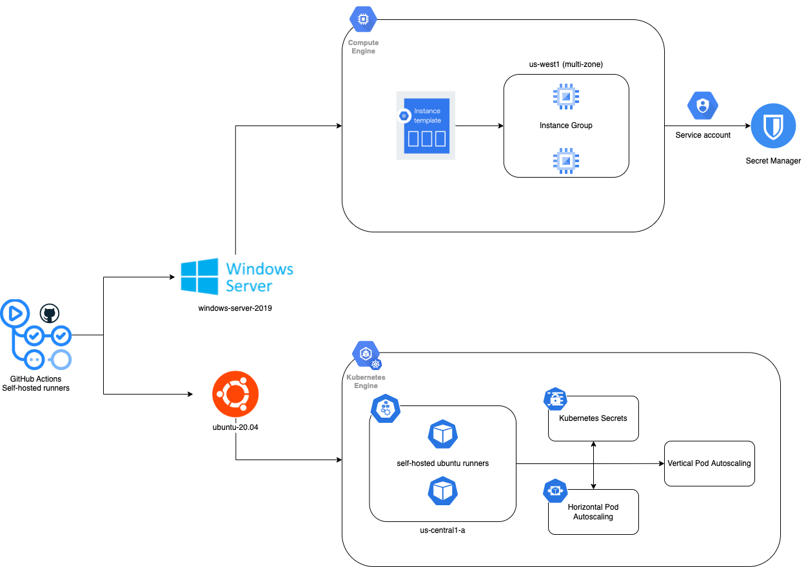
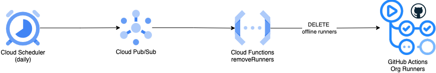

<!--
    Licensed to the Apache Software Foundation (ASF) under one
    or more contributor license agreements.  See the NOTICE file
    distributed with this work for additional information
    regarding copyright ownership.  The ASF licenses this file
    to you under the Apache License, Version 2.0 (the
    "License"); you may not use this file except in compliance
    with the License.  You may obtain a copy of the License at

      http://www.apache.org/licenses/LICENSE-2.0

    Unless required by applicable law or agreed to in writing, software
    distributed under the License is distributed on an "AS IS" BASIS,
    WITHOUT WARRANTIES OR CONDITIONS OF ANY KIND, either express or implied.
    See the License for the specific language governing permissions and
    limitations under the License.
-->
# GitHub Actions - Self-hosted Runners
The current GitHub Actions workflows are being tested on multiple operating systems, such as Ubuntu, Windows and MacOS. The way to migrate these runners from GitHub to GCP is by implementing self-hosted runners, so we have started implementing them in both Ubuntu and Windows environments, going with Google Kubernetes Engine and Google Cloud Compute VMs instances respectively.

In addition, we are working on researching the best way to implement the MacOS self-hosted runners.

## Ubuntu
Ubuntu Self-hosted runners are implemented using Google Kubernetes Engine with the following specifications:

#### Node
* Machine Type: 2-custom-6-18432
* Disk Size: 100 GB
* CPU: 6 vCPUs
* Memory : 18 GB

#### Pod
* Image: $LOCAL_IMAGE_NAME LOCATION-docker.pkg.dev/PROJECT-ID/REPOSITORY/IMAGE:latest
* CPU: 2
* Memory: 1028 Mi
* Volumes: docker.sock
* Secret env variables: Kubernetes Secrets

#### AutoScaling
* Horizontal Pod Autoscaling
  * 4-8 nodes
  * HorizontalPodAutoscaler
    * Min replicas: 4 
    * Max replicas: 14 
    * CPU utilization: 70%
* Vertical Pod Autoscaling: updateMode: "Auto"

## Windows

## Self-Hosted Runners Architecture

## Cronjob - Delete Unused Self-hosted Runners

