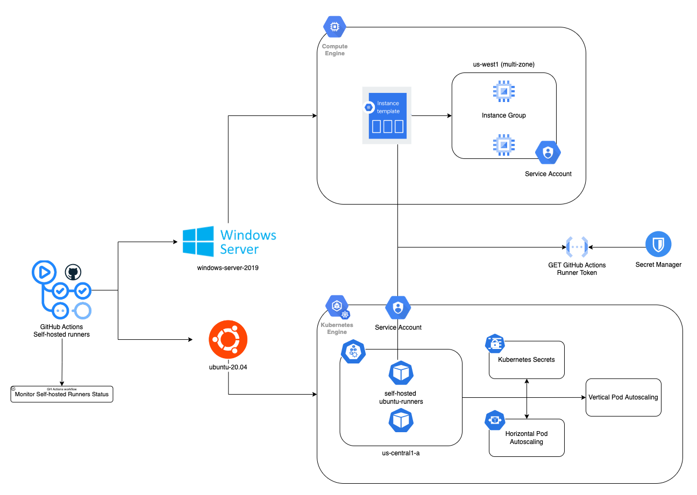
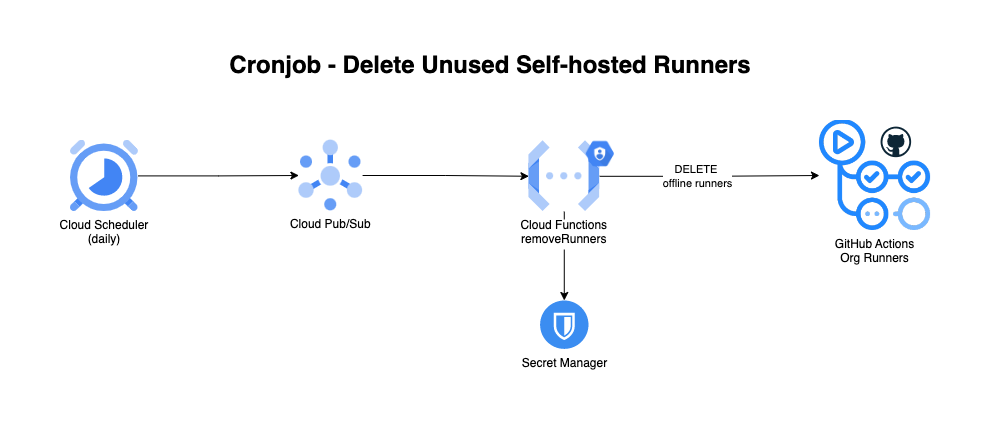

<!--
    Licensed to the Apache Software Foundation (ASF) under one
    or more contributor license agreements.  See the NOTICE file
    distributed with this work for additional information
    regarding copyright ownership.  The ASF licenses this file
    to you under the Apache License, Version 2.0 (the
    "License"); you may not use this file except in compliance
    with the License.  You may obtain a copy of the License at

      http://www.apache.org/licenses/LICENSE-2.0

    Unless required by applicable law or agreed to in writing, software
    distributed under the License is distributed on an "AS IS" BASIS,
    WITHOUT WARRANTIES OR CONDITIONS OF ANY KIND, either express or implied.
    See the License for the specific language governing permissions and
    limitations under the License.
-->
# GitHub Actions - Self-hosted Runners
The current GitHub Actions workflows are being tested on multiple operating systems, such as Ubuntu, Windows and MacOS. The way to migrate these runners from GitHub to GCP is by implementing self-hosted runners, so we implemented them in both Ubuntu and Windows environments, going with Google Kubernetes Engine and Google Cloud Compute VMs instances respectively.

On the other hand, we will rely on GitHub-hosted runners for MacOS builds until a straightforward implementation approach comes out.

## Ubuntu
Ubuntu Self-hosted runners are stored in Artifact Registry and implemented using Google Kubernetes Engine with the following specifications:

#### Cluster
* Cluster: [gh-actions-linux-runners](https://console.cloud.google.com/kubernetes/clusters/details/us-central1-a/gh-actions-linux-runners/details?project=apache-beam-testing)
* Image: [linux-github-actions-runner](https://console.cloud.google.com/artifacts/docker/apache-beam-testing/us-central1/beam-github-actions/linux-github-actions-runner?project=apache-beam-testing)

#### Pool
* Number of nodes: 5
* Cluster Autoscaler: ON
    * Minimum number of nodes: 5
    * Maximum number of nodes: 10

#### Node
* Machine Type: e2-custom-6-18432
* Disk Size: 100 GB
* CPU: 6 vCPUs
* Memory : 18 GB

#### Pod
##### Container 1: gh-actions-runner
* Image: $LOCAL_IMAGE_NAME LOCATION-docker.pkg.dev/PROJECT-ID/REPOSITORY/IMAGE:latest
* CPU: 2
* Memory: 1028 Mi
* Volumes
    * gcloud-key
    * docker-certs-client
* Environment variables
    * Container variables
        * GOOGLE_APPLICATION_CREDENTIALS
        * DOCKER_HOST
        * DOCKER_TLS_VERIFY
        * DOCKER_CERT_PATH
    * Kubernetes secret env variables
        * github-actions-secrets
        * gcloud-key

##### Container 2: dind
* Image: `docker:20.10.17-dind`
* Volumes
    * dind-storage
    * docker-certs-client

###### Pod Diagram

#### AutoScaling
* Horizontal Pod Autoscaling
    * 5-10 nodes (From Pool Cluster Autoscaler)
    * HorizontalPodAutoscaler
        * Min replicas: 10
        * Max replicas: 20
        * CPU utilization: 70%
* Vertical Pod Autoscaling
    * updateMode: "Auto"

## Windows
Windows Virtual machines have the following specifications

#### VM specifications
* Instance Template: windows_github_actions_runner
* Machine Type: n2-standard-2
* Disk Size: 70 GB
* Disk Image: [disk-image-windows-runner](https://console.cloud.google.com/compute/imagesDetail/projects/apache-beam-testing/global/images/disk-image-windows-runner?project=apache-beam-testing)
* CPU: 2 vCPUs
* Memory : 8 GB

#### Instance group settings
* Region: us-west1 (multizone)
* Scale-out metric: 70% of CPU Usage.
* Cooldown period: 300s

#### Notes:
At first glance we considered implementing Windows runners using K8s, however this was not optimal because of the following reasons:

* VS Build tools are required for certain workflows, unfortunately official images that support this dependency are huge in size, reaching 20GB easily which is not an ideal case for k8S management.
* Windows Subsystem For Linux(WSL) is a feature that allows to execute bash scripts inside Windows which removes tech debt by avoiding writing steps in powershell, but this feature is disabled with payload removed in Windows containers.

## Self-Hosted Runners Architecture

## GitHub Actions Workflow - Monitor Self-hosted Runners

In order to monitor the Self-hosted Runners status, we have implemented a separate GitHub Actions workflow using GitHub-hosted runners, this workflow periodically calls a Cloud Function that serves data regarding the number of `active` and `offline` runners. In case of failure this workflow will send an email
alert to the dev distribution email `dev@beam.apache.org`.

The Cloud Function uses the endpoints provided by the installed GitHub App to retrieve information about the runners.

## Cronjob - Delete Unused Self-hosted Runners

Depending on the termination event, sometimes the removal script for offline runners is not triggered correctly from inside the VMs or K8s pod, because of that an additional pipeline was created in order to clean up the list of GitHub runners in the group.

This was implemented using a [GCP Cloud Function](https://console.cloud.google.com/functions/details/us-central1/remove-self-hosted-runners-group?env=gen1&project=apache-beam-testing&tab=source) [[code]](./helper-functions/cloud-functions/removeOfflineRunners) subscribed to a [Pub/Sub](https://console.cloud.google.com/cloudpubsub/topic/detail/remove-runners?referrer=search&project=apache-beam-testing) topic, the topic is triggered through a [Cloud Scheduler](https://console.cloud.google.com/cloudscheduler/jobs/edit/us-central1/runners-clean-up-schedule?project=apache-beam-testing) that is executed once per day, the function consumes a [GitHub API](https://docs.github.com/en/rest/reference/actions#delete-a-self-hosted-runner-from-an-organization) to delete offline self-hosted runners from the organization retrieving the token with its service account to secrets manager.

