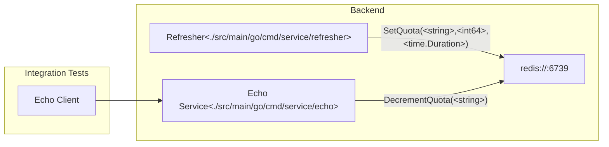

<!--
    Licensed to the Apache Software Foundation (ASF) under one
    or more contributor license agreements.  See the NOTICE file
    distributed with this work for additional information
    regarding copyright ownership.  The ASF licenses this file
    to you under the Apache License, Version 2.0 (the
    "License"); you may not use this file except in compliance
    with the License.  You may obtain a copy of the License at

      http://www.apache.org/licenses/LICENSE-2.0

    Unless required by applicable law or agreed to in writing,
    software distributed under the License is distributed on an
    "AS IS" BASIS, WITHOUT WARRANTIES OR CONDITIONS OF ANY
    KIND, either express or implied.  See the License for the
    specific language governing permissions and limitations
    under the License.
-->

# Overview

This directory holds code and related artifacts to support API related
integration tests.

## System review

The diagram below summarizes the system design. Integration tests use an API
client that makes calls to a backend service. Prior to fulfilling the response,
the service checks and decrements a quota. Said quota persists in a backend
redis instance that is refreshed on an interval by the
[Refresher](./src/main/go/cmd/service/refresher).

## Echo Service

The [Echo Service](./src/main/go/cmd/service/echo) implements a simple gRPC
service that echos a payload. See [echo.proto](./proto/echo/v1/echo.proto)
for details.



# Writing Integration Tests

TODO: See https://github.com/apache/beam/issues/28859

# Development Dependencies

| Dependency                                          | Reason                                                                                 |
|-----------------------------------------------------|----------------------------------------------------------------------------------------|
| [go](https://go.dev)                                | For making code changes in this directory. See [go.mod](go.mod) for required version.  |
| [buf](https://github.com/bufbuild/buf#installation) | Optional for when making changes to proto.                                             |
| [ko](https://ko.build/install/)                     | To easily build Go container images.                                                   |
| [poetry](https://python-poetry.org/)                     | To manage python dependencies.                                                   |

# Testing

## Unit

To run unit tests in this project, execute the following command:

```
go test ./src/main/go/internal/...
```

## Integration

TODO: See https://github.com/apache/beam/issues/28859

# Local Usage

## Requirements

To execute the services on your local machine, you'll need [redis](https://redis.io/docs/getting-started/installation/).

## Execute services

Follow these steps to run the services on your local machine.


1. Start redis

    Start redis using the following command.
    ```
    redis-server
    ```

1. Start the refresher service in a new terminal.
    ```
    export CACHE_HOST=localhost:6379; \
    export QUOTA_ID=$(uuidgen); \
    export QUOTA_REFRESH_INTERVAL=10s; \
    export QUOTA_SIZE=100; \
    go run ./src/main/go/cmd/service/refresher
    ```
1. Start the echo service in a new terminal.
    ```
    export HTTP_PORT=8080; \
    export GRPC_PORT=50051; \
    export CACHE_HOST=localhost:6379; \
    go run ./src/main/go/cmd/service/echo
    ```

# Deployment

TODO: See https://github.com/apache/beam/issues/28709
