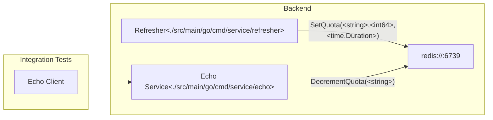

<!--
    Licensed to the Apache Software Foundation (ASF) under one
    or more contributor license agreements.  See the NOTICE file
    distributed with this work for additional information
    regarding copyright ownership.  The ASF licenses this file
    to you under the Apache License, Version 2.0 (the
    "License"); you may not use this file except in compliance
    with the License.  You may obtain a copy of the License at

      http://www.apache.org/licenses/LICENSE-2.0

    Unless required by applicable law or agreed to in writing,
    software distributed under the License is distributed on an
    "AS IS" BASIS, WITHOUT WARRANTIES OR CONDITIONS OF ANY
    KIND, either express or implied.  See the License for the
    specific language governing permissions and limitations
    under the License.
-->

# Overview

This directory holds code and related artifacts to support API related
integration tests.

## System review

The diagram below summarizes the system design. Integration tests use an API
client that makes calls to a backend service. Prior to fulfilling the response,
the service checks and decrements a quota. Said quota persists in a backend
redis instance that is refreshed on an interval by the
[Refresher](./src/main/go/cmd/service/refresher).

## Echo Service

The [Echo Service](./src/main/go/cmd/service/echo) implements a simple gRPC
service that echos a payload. See [echo.proto](./proto/echo/v1/echo.proto)
for details.



# Writing Integration Tests

TODO: See https://github.com/apache/beam/issues/28859

# Development Dependencies

| Dependency                                          | Reason                                                                                 |
|-----------------------------------------------------|----------------------------------------------------------------------------------------|
| [go](https://go.dev)                                | For making code changes in this directory. See [go.mod](go.mod) for required version.  |
| [buf](https://github.com/bufbuild/buf#installation) | Optional for when making changes to proto.                                             |
| [ko](https://ko.build/install/)                     | To easily build Go container images.                                                   |

# Testing

## Unit

To run unit tests in this project, execute the following command:

```
go test ./src/main/go/internal/...
```

## Integration

TODO: See https://github.com/apache/beam/issues/28859

# Local Usage

## Requirements

To execute the services on your local machine, you'll need [redis](https://redis.io/docs/getting-started/installation/).

## Execute services

Follow these steps to run the services on your local machine.


1. Start redis

    Start redis using the following command.
    ```
    redis-server
    ```

1. Start the refresher service in a new terminal.
    ```
    export CACHE_HOST=localhost:6379; \
    export QUOTA_ID=$(uuidgen); \
    export QUOTA_REFRESH_INTERVAL=10s; \
    export QUOTA_SIZE=100; \
    go run ./src/main/go/cmd/service/refresher
    ```
1. Start the echo service in a new terminal.
    ```
    export HTTP_PORT=8080; \
    export GRPC_PORT=50051; \
    export CACHE_HOST=localhost:6379; \
    go run ./src/main/go/cmd/service/echo
    ```

# Deployment

The following has already been performed for the `apache-beam-testing` project
and only needs to be done for a different Google Cloud project.

To deploy the APIs and dependent services, run the following commands.

## 1. Provision dependent resources in Google Cloud.

```
terraform -chdir=infrastructure/terraform init
terraform -chdir=infrastructure/terraform apply -var-file=apache-beam-testing.tfvars
```

## 2. Set the KO_DOCKER_REPO environment variable.

After the terraform module completes, you will need to set the following:

```
export KO_DOCKER_REPO=<region>-docker.pkg.dev/<project>/<repository>
```

where:

- `region` - is the GCP compute region
- `project` - is the GCP project id i.e. `apache-beam-testing`
- `repository` - is the repository name created by the terraform module. To
find this run:
`gcloud artifacts repositories list --project=<project> --location=<region>`.
For example,
`gcloud artifacts repositories list --project=apache-beam-testing --location=us-west1`

## 3. Connect to the Kubernetes cluster

Run the following command to setup credentials to the Kubernetes cluster.

```
gcloud container clusters get-credentials <cluster> --region <region> --project <project>
```

where:
- `region` - is the GCP compute region
- `project` - is the GCP project id i.e. `apache-beam-testing`
- `<cluster>` - is the name of the cluster created by the terraform module.
You can find this by running `gcloud container clusters list --project=<project> --region=<region>`

## 4. Provision the Redis instance

```
kubectl kustomize --enable-helm infrastructure/kubernetes/redis | kubectl apply -f -
```

**You will initially see "Unschedulable" while the cluster is applying the helm
chart. It's important to wait until the helm chart completely provisions resources
before proceeding. Using Google Kubernetes Engine (GKE) autopilot may take some
time before this autoscales appropriately. **

## 5. Provision the Echo service

Run the following command to provision the Echo service.

```
kubectl kustomize infrastructure/kubernetes/echo | ko resolve -f - | kubectl apply -f -
```

Like previously, you may see "Does not have minimum availability" message
showing on the status. It may take some time for GKE autopilot
to scale the node pool.

## 6. Provision the Refresher services

The Refresher service relies on [kustomize](https://kustomize.io) overlays
which are located at [infrastructure/kubernetes/refresher/overlays](infrastructure/kubernetes/refresher/overlays).

Each folder contained in [infrastructure/kubernetes/refresher/overlays](infrastructure/kubernetes/refresher/overlays)
corresponds to an individual Refresher instance that is identified by the UUID.
You will need to deploy each one individually.

For example:
```
kubectl kustomize infrastructure/kubernetes/refresher/overlays/f588787b-28f8-4e5f-8335-f862379daf59 | ko resolve -f - | kubectl apply -f -
```

Like previously, you may see "Does not have minimum availability" message
showing on the status. It may take some time for GKE autopilot
to scale the node pool.

## Additional note for creating a new Refresher service instance

Each Refresher service instance relies on a unique UUID, where
the [kustomize](https://kustomize.io) overlay replaces in the
[infrastructure/kubernetes/refresher/base](infrastructure/kubernetes/refresher/base)
template.

You can copy the entire folder and paste into a new one with a unique UUID
and then perform a find-replace of the old UUID with the new one.
