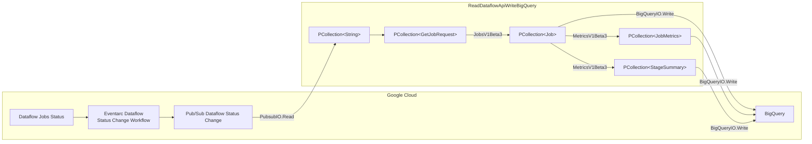

<!--
    Licensed to the Apache Software Foundation (ASF) under one
    or more contributor license agreements.  See the NOTICE file
    distributed with this work for additional information
    regarding copyright ownership.  The ASF licenses this file
    to you under the Apache License, Version 2.0 (the
    "License"); you may not use this file except in compliance
    with the License.  You may obtain a copy of the License at

      http://www.apache.org/licenses/LICENSE-2.0

    Unless required by applicable law or agreed to in writing,
    software distributed under the License is distributed on an
    "AS IS" BASIS, WITHOUT WARRANTIES OR CONDITIONS OF ANY
    KIND, either express or implied.  See the License for the
    specific language governing permissions and limitations
    under the License.
-->

# Overview

This directory holds pipelines that support testing infrastructure and are meant for internal use.

# Infrastructure

Some pipelines require provisioning of resources prior to execution. See
[.test-infra/pipelines/infrastructure](infrastructure) for details.

# Usage

Pipelines depend on
[Dataflow Flex Templates](https://cloud.google.com/dataflow/docs/guides/templates/using-flex-templates)
for execution. See [.test-infra/pipelines/infrastructure/04.template](infrastructure/04.template)
for details.

# Existing pipelines

Below is a more in-depth review of pipelines supported by this directory. If you are adding a new pipeline, please
add the appropriate section below.

## Dataflow API to BigQuery

The
[.test-infra/pipelines/src/main/java/org/apache/beam/testinfra/pipelines/ReadDataflowApiWriteBigQuery.java](.test-infra/pipelines/src/main/java/org/apache/beam/testinfra/pipelines/ReadDataflowApiWriteBigQuery.java)
pipeline reads from the [Dataflow API](https://cloud.google.com/dataflow/docs/reference/rpc) and writes to
[BigQuery](https://cloud.google.com/bigquery/docs).
The pipeline's design goals are to collect available data from Beam Jobs running on Dataflow for data exploration and comparisons,
such as metrics and execution details.

The pipeline relies on Dataflow Job status changes received from a Pub/Sub subscription, whose topic receives event payloads
from an [Workflow of Dataflow Job status changes](https://cloud.google.com/eventarc/docs/workflows/route-trigger-dataflow).
The pipeline processes the status change events into API requests, writing the API responses to BigQuery.

The following directories are relevant to the build, deployment, and execution of this pipeline.
1. [.test-infra/pipelines/infrastructure/01.setup](infrastructure/01.setup) sets up the Google Cloud project
2. [.test-infra/pipelines/infrastructure/02.network](infrastructure/02.network) sets up the Google Cloud project network
3. [.test-infra/pipelines/infrastructure/03.io/dataflow-to-bigquery](infrastructure/03.io/dataflow-to-bigquery) sets up pipeline IO dependencies
4. [.test-infra/pipelines/infrastructure/04.template/dataflow-to-bigquery](infrastructure/04.template/dataflow-to-bigquery) builds the Dataflow template

The following is a diagram that summarizes the pipeline and related infrastructure.

## API Overuse

API Overuse is a series of pipelines whose purpose is to collect data in support
of the study
[Exploring existing Beam features to prevent web service API overuse](https://docs.google.com/document/d/1VZ9YphDO7kewBSz5oMXVPHWaib3S03Z6aZ66BhciB3E/edit?usp=sharing&resourcekey=0-ItxMSG72EzfSwVedSz-Zeg).

A gRPC endpoint simply echos requests. Upon receipt of a request, the endpoint
checks available quota and responds with either a successful message or
failure, if the client exceeds the quota. A separate gRPC endpoint manages
the quota and handles refresh on configured intervals and sizes. Both gRPC
endpoints rely on a [redis](https://redis.io) cache deployed on Kubernetes.

Each pipeline calls the echo gRPC endpoint as any API based BeamIO via an
EchoIO PTransform. Both successful and overuse failure requests increment
respective Beam [Counter](https://beam.apache.org/releases/javadoc/current/org/apache/beam/sdk/metrics/Counter.html)s.
This allows us to evaluate various Beam patterns aimed at preventing API
overuse. See the aforementioned study for details.

The following directories are relevant to the build, deployment, and execution
of these pipelines.

### Google Cloud resources
1. [.test-infra/pipelines/infrastructure/01.setup](infrastructure/01.setup) sets up the Google Cloud project
2. [.test-infra/pipelines/infrastructure/02.network](infrastructure/02.network) sets up the Google Cloud project network

### Kubernetes resources
1. [.test-infra/pipelines/infrastructure/03.io/api-overuse-study/01.setup](infrastructure/03.io/api-overuse-study/01.setup) sets up the Kubernetes environment
2. [.test-infra/pipelines/infrastructure/03.io/api-overuse-study/02.redis](infrastructure/03.io/api-overuse-study/02.redis) installs redis on the Kubernetes cluster
3. [.test-infra/pipelines/infrastructure/03.io/api-overuse-study/03.deployment](infrastructure/03.io/api-overuse-study/03.deployment) deploys the gRPC endpoints and related resources
4. [.test-infra/pipelines/infrastructure/03.io/api-overuse-study/04.ingress](infrastructure/03.io/api-overuse-study/04.ingress) exposes the gRPC endpoints

### Pipeline resources

TODO: provide link to the flex template
