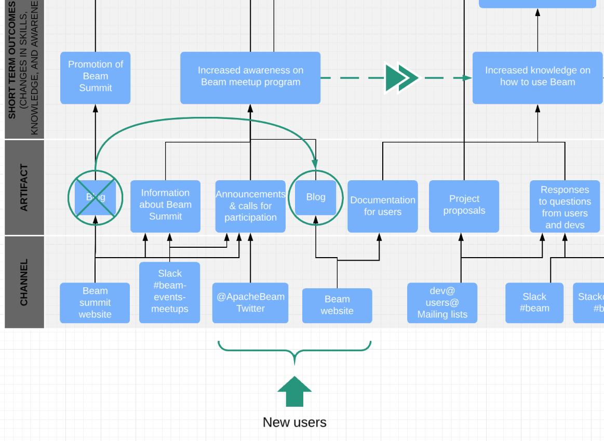
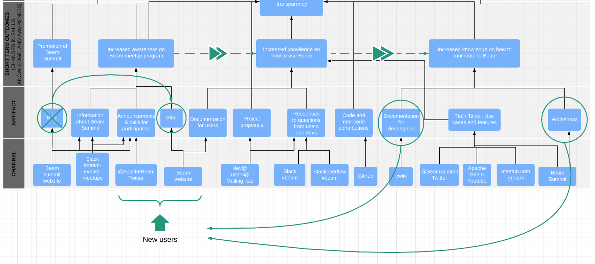

# Apache Beam communication strategy

## This map describes how each communication channel contributes to the growth of Apache Beam project.  

While all the channels are connected to a specific function in the short, medium, and long term, some areas have redundancies, and some other areas could use more exposure. In order to continue to grow the project, there are 3 proposals we need to focus on (click on the link on each section to read more):

**1. [Blog post categories, frequency and distribution.](#proposal-1-blog-post-categories-frequency-and-distribution)** 
Reduce to one blogging space (on Beam Website). Incorporate 3 categories to the blog: Apache Beam summit, Apache Beam use cases, and Your journey as a contributor. 

**2. [Develop more in-person and digital workshops.](#proposal-2-develop-more-in-person-and-digital-workshops)**
Two workshop types: how to use Beam, and how to contribute to Beam. 

**3. [Increase distribution of tech talks.](#proposal-3-distribution-of-tech-talks)**
   - Embed tech talks in the Beam website, and the Beam Summit website,
   - Share talks on @ApacheBeam Twitter handle
   - Curate a list of talks by topic, and write blog posts to share curated talks (1 blog every 3 months), 
   - Distribute copy via email to users@ and dev@ mailing lists.
   - Create playlists on YouTube channel. Create one view for subscribed users (featuring latest content), and one for non-subscribed users (featuring most popular content). One playlist per event, plus 1 playlist for use cases.

## Where should I share new content about Apache Beam?

<table border="1">
			<tr>
        <td> </td>
        <td colspan="4"> 
<b>Main outreach channels</b>
</td>
			</tr>
			<tr>
        <td> </td>
        <td> 
<b>Beam Website</b>
</td>
        <td> 
<b>Beam website blog</b>
</td>
        <td> 
<b>Twitter handles (x2)</b>
</td>
        <td> 
<b>Mailing lists (x2)</b>
</td>
			</tr>
			<tr>
        <td><b>Blogpost</b></td>
        <td>
✓
</td>
        <td>
✓
</td>
        <td>
✓
</td>
        <td>
✓ (share first paragraph in the   email, and link to blog)
</td>
			</tr>
			<tr>
				<td><b>Tech talk</b></td>
        <td>
✓ (special section  for tech talks)
</td>
        <td>
✓ (curate tech talks  quarterly in a blog)
</td>
        <td>
✓
</td>
        <td>
✓ (share blogs on a quarterly  basis when published)
</td>
			</tr>
			<tr>
				<td><b>Trainings</b></td>
        <td> 
✓ (under section “Get started”)
</td>
				<td> </td>
        <td>
✓
</td>
        <td>
✓
</td>
			</tr>
     
 
		</table>

If you have any questions or comments about this logic model, please add them [here](https://github.com/macruzbar/beam/issues/4).

## Appendix

### Proposal 1: Blog post categories, frequency and distribution
**Current status:** there are currently 2 blogging spaces, (a) on beam.apache.org, and (b) in beamsummit.org. On blog (a), there is a blog published every month, except for months where there are new releases or Beam summits, when the frequency increases to 3 blog posts a month. On blog (b) there were 3 blog posts published. 

**Proposed change:** remove blogging space (b) and focus on maintaining blogging space (a). In addition, incorporate the following categories for blogging:
- Blogs about Beam Summit. The goal is to accelerate the transition of new users from awareness to usage of Apache Beam. 

  - Reasoning: This is working on the assumption that community members who attend a Beam event are likely to adopt the product faster than those who don’t, because they are exposed to use cases, features, and people that can respond to questions in person. 
  - Frequency: Publish 1 blog when the summit is announced, 1 blog for first round of speakers,  1 blog for second round of speakers, 1 blog describing the impact of the summit and sharing highlighted talks in video format. 4 blog posts over the course of 4-5 months for each summit,  ~8 blog posts a year. 

- Apache Beam use cases. The goal is to give more visibility to different use cases for Beam. 
  - Reasoning: currently, the only medium for Beam use cases are videos. By sharing use cases in blog format, we make this content more accessible for users, as well as discoverable to search queries. 
  - Frequency: 1 blog post every three months, 4 blog posts a year. 

- Your journey as a contributor. The goal is to increase the visibility on Beam contributors, and shed light on how the transition takes place from users to contributors. 
  - Reasoning: by describing the change from a role to another, we make this journey more relatable and accessible to new users, motivating them to become contributors sooner. At the moment, all the content connected to raising awareness about contributing to the project is rather dry and impersonal. By featuring a contributor, we bring this role closer to the community of users. 
  - Frequency: 1 blog post every two months, 6 blog posts a year. 

### Proposal 2: Develop more in-person and digital workshops
**Current status:** Up until now, workshops have been tested only in in-person events at Beam Summit NA 2019, and Cumbre de Contribuidores de Open Source Software 2019 (CCOSS) in Mexico. Workshops are also in high demand for meetups and more informal events. 

**Proposed change:** develop content for workshops that focus on how to use Beam, and workshops that focus on how to contribute to Beam. 
- Reasoning: at the moment, there is very little content supporting the conversion of users into contributors. Furthermore, workshops are only in-person, which means that only people who attend Apache Beam events can access these resources. By digitizing this content, and distributing it on the front page of the project (Apache Beam website), we make it more accessible to users, supporting the short term outcome of increasing awareness on how to contribute to the project, and accelerating the journey from user to contributor. 

- Distribution: Document workshops on Github repository, record workshops and publish on Youtube. Publish Github and Youtube links on Beam Website, and distribute them frequently on @ApacheBeam Twitter handle. 

### Proposal 3: Distribution of tech talks
**Current status:** at the moment, tech talks take place at in-person events (Apache Beam meetups, and Apache Beam Summit), and distributed only on 2 channels (@BeamSummit Twitter handle, and Apache Beam Youtube channel). 

**Proposed change:** Increase distribution of tech talks. 
- Reasoning: tech talks are one of the biggest assets the project has. They describe the latest innovation using Apache Beam, new features, and releases. By increasing their distribution, we raise awareness about how and why to use Beam, and position the product in certain trending topic areas in data streaming. 
- Distribution: 
  - Embed tech talks in the Beam website, and the Beam Summit website,
  - Share talks on @ApacheBeam Twitter handle
  - Curate a list of talks by topic, and write blog posts to share curated talks (1 blog every 3 months), 
  - Distribute copy via email to users@ and dev@ mailing lists.
  - Create playlists and curated content on YouTube channel, for subscribed users, and for non-subscribed users. One playlist per event, plus 1 playlist for use cases. 
 
