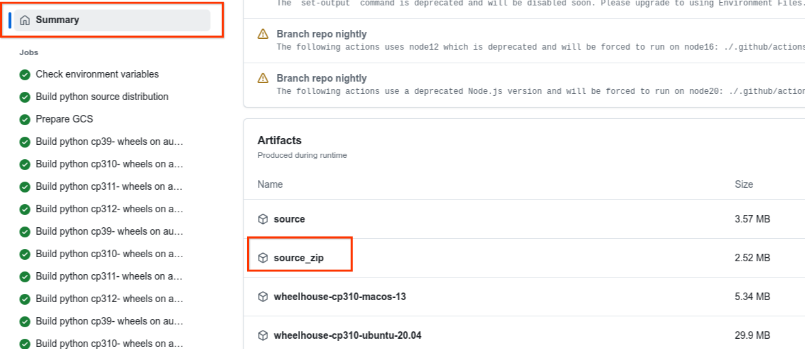

<!--
    Licensed to the Apache Software Foundation (ASF) under one
    or more contributor license agreements.  See the NOTICE file
    distributed with this work for additional information
    regarding copyright ownership.  The ASF licenses this file
    to you under the Apache License, Version 2.0 (the
    "License"); you may not use this file except in compliance
    with the License.  You may obtain a copy of the License at

      http://www.apache.org/licenses/LICENSE-2.0

    Unless required by applicable law or agreed to in writing,
    software distributed under the License is distributed on an
    "AS IS" BASIS, WITHOUT WARRANTIES OR CONDITIONS OF ANY
    KIND, either express or implied.  See the License for the
    specific language governing permissions and limitations
    under the License.
-->

# Python Tips

* [Installing Python interpreters](#installing-python-interpreters)
* [Developing the Python SDK](#developing-the-python-sdk)
* [Virtual Environment Setup](#virtual-environment-setup)
* [Virtual Environments with pyenv](#virtual-environments-with-pyenv)
    * [How to setup pyenv (with pyenv-virtualenv plugin)](#how-to-setup-pyenvwith-pyenv-virtualenv-plugin)
* [Running Tests](#running-tests)
    * [Running Tests Using pytest](#running-tests-using-pytest)
    * [Running Integration Tests Using pytest](#running-integration-tests-usingpytest)
    * [Running Unit Tests Using tox](#running-unit-tests-using-tox)
    * [Running Tests Using gradle](#running-tests-using-gradle)
* [Lint and Formatting Checks](#lint-and-formatting-checks)
    * [Running lint and yapf Automatically on Each Commit with pre-commit Hooks](#running-lint-and-yapfautomatically-on-each-commit-with-pre-commit-hooks)
    * [Running yapf formatter manually](#running-yapf-formatter-manually)
* [Run a wordcount pipeline with a portable runner and modified SDK Harness container](#run-a-wordcount-pipeline-with-a-portable-runner-and-modified-sdk-harness-container)
* [Run a wordcount pipeline on Dataflow with a modified Beam SDK](#run-a-wordcount-pipeline-on-dataflow-with-a-modified-beam-sdk)
* [Run Integration Test from IDE (TODO: please revise these instructions now that we migrated to PyTest)](#run-integration-test-from-ide-todo-please-revise-these-instructions-now-that-we-migrated-to-pytest)
* [Run a screen diff integration Test for Interactive Beam](#run-a-screen-diff-integrationtest-for-interactive-beam)
* [How to run a pipeline with unreleased changes from a pull request](#how-to-run-a-pipeline-with-unreleased-changes-from-a-pull-request)
* [How to install an unreleased Python SDK without building it](#how-to-install-an-unreleased-python-sdk-without-building-it)
* [How to update dependencies that are installed in Python container images](#how-to-update-dependencies-that-are-installed-in-python-container-images)
    * [Errors](#errors)

## Installing Python interpreters

Apache Beam supports [multiple Python versions](https://beam.apache.org/get-started/quickstart-py/). You might be able to iterate on the Beam code using one Python version provided by your OS, assuming this version is also supported by Beam. However you will need to have interpreters for all supported versions to be able to run test suites locally using Gradle, and to work on Beam releases. Therefore, we recommend installing a Python interpreter for each supported version or launching a docker-based development environment that should have these interpreters preinstalled using: [start-build-env.sh](https://github.com/apache/beam/blob/release-2.35.0/start-build-env.sh).

There are several ways how you might install multiple Python versions.

* You can download, build and [install CPython from sources](https://docs.python.org/3/using/unix.html#building-python).
* If you are an Ubuntu user, you could add a third-party repository '[Deadsnakes](https://launchpad.net/~deadsnakes/+archive/ubuntu/ppa)' and install the missing versions via `apt`. If you install from Deadsnakes, make sure to also install `python#.#-dev`, `python#.#-venv` and `python#.#-distutils` packages.
* You can use [PyEnv](https://github.com/pyenv/pyenv) to download and install Python versions (**Recommended**).

Installation steps may look as follows:
1. Follow the steps below in How to setup pyenv.

2. Install Python intepreter for each supported Python minor version. Leaving out the patch version will install the latest.

```bash
pyenv install 3.9
pyenv install 3.10
pyenv install 3.11
pyenv install 3.12
```

3. Make installed interpreters available in your shell by first running:

```bash
pyenv global 3.9 3.10 3.11 3.12
```

4. (**OPTIONAL**) Pyenv will sometimes [fail to make these interpreters directly available](https://github.com/pyenv/pyenv/issues/34) without a local configuration. If you see errors trying to use `python3.x`, then also run `pyenv local`  

```bash
pyenv local 3.9 3.10 3.11 3.12
```

After these steps, all `python3.x` interpreters should be available in your shell. The first version in the list passed to pyenv global will be used as default `python` / `python3` interpreter if the minor version is not specified.

Please contribute to these instructions if they didn't work for you.

## Developing the Python SDK
* Beam Gradle tooling can build and test Python SDK, and Jenkins jobs use it, so it needs to be maintained.
* You can directly use the Python toolchain instead of having Gradle orchestrate it, which may be faster for you, but it is your preference. If you want to use Python tools directly, we recommend setting up a virtual environment before testing your code.
* The commands below assume that you're in the SDKs/python directory.

## Virtual Environment Setup

Setting up a virtual environment is required for running tests directly, via pytest or an IDE like PyCharm. To create an environment and install the Python SDK from source with test and GCP dependencies, follow the below instructions:

### On macOS/Linux

Use the following code:

```bash
# Initialize virtual environment called "env" in ~/.virtualenvs or any other directory. (Consider using pyenv, to manage the python version as well as installed packages in your virtual environment)
$ python3 -m venv ~/.virtualenvs/env

# Activate virtual environment.
$ . ~/.virtualenvs/env/bin/activate

# Upgrade other tools. (Optional)
pip install --upgrade pip
pip install --upgrade setuptools

# Install Apache Beam package in editable mode.
(env) $ pip install -e .[gcp,test]
```

For certain systems, particularly Macs with M1 chips, this installation method may not generate urns correctly. If running `python gen_protos.py`  doesn't resolve the issue, consult https://github.com/apache/beam/issues/22742#issuecomment-1218216468 for further guidance.

### On Windows

Use the following code:

```sh
> c:\Python37\python.exe -m venv c:\path\to\env
> c:\path\to\env\Scripts\activate.bat
# Powershell users should run instead:
> c:\path\to\env\Scripts\activate.ps1

(env) > pip install -e .[gcp,test]
```

You can deactivate the `virtualenv` when done.

```bash
(env) $ deactivate
```

## Virtual Environments with pyenv
* A more advanced option, pyenv allows you to download, build, and install locally any version of Python, regardless of which versions your distribution supports.
* pyenv also has a virtualenv plugin, which manages the creation and activation of virtualenvs.
* The caveat is that you'll have to take care of any build dependencies, and those are probably still constrained by your distribution.
* **NOTE**: These instructions were made on a Linux/Debian system.

### How to setup pyenv (with [pyenv-virtualenv](https://github.com/pyenv/pyenv-virtualenv) plugin)

1. Install [prerequisites](https://github.com/pyenv/pyenv/wiki#suggested-build-environment) for your distribution.
2. `curl https://pyenv.run | bash`
3. Add the required lines to ~/.bashrc (as returned by the script).
Note (12/10/2021): You may have to manually modify .bashrc as described here: https://github.com/pyenv/pyenv-installer/issues/112#issuecomment-971964711. Remove this note if no longer applicable.
4. Open a new shell. If the `pyenv` command is still not available in PATH, you may need to restart the login session. 

#### Example on Ubuntu:

```bash
# Install pyenv deps
sudo apt-get install -y build-essential libssl-dev zlib1g-dev libbz2-dev \
libreadline-dev libsqlite3-dev wget curl llvm libncurses5-dev libncursesw5-dev \
xz-utils tk-dev libffi-dev liblzma-dev python3-openssl git

# Install pyenv, and pyenv-virtualenv plugin
curl https://pyenv.run | bash

# Run the outputted commands to initialize pyenv in .bashrc
```

#### Example: How to Run Unit Tests with PyCharm Using Python 3.9.4 in a virtualenv
1. Install Python 3.9.4 and create a virtualenv
```bash
pyenv install 3.9.4
pyenv virtualenv 3.9.4 ENV_NAME
pyenv activate ENV_NAME
```

2. Upgrade packages (recommended)
```bash
pip install --upgrade pip setuptools
```

3. Set up PyCharm
    * Start by adding a new project interpreter (from the bottom right or in Settings).
    * Select Existing environment and the interpreter, which should be under ~/.pyenv/versions/3.9.4/envs/ENV_NAME/bin/python or ~/.pyenv/versions/ENV_NAME/bin/python.
    * Switch interpreters at the bottom right.

#### Cleaning up environments

To delete all environments created with pyenv, run:
```bash
pyenv virtualenvs --bare --skip-aliases | xargs -n 1 pyenv virtualenv-delete -f
```

#### Troubleshooting

If you have issues, find troubleshooting at [pyenv's common build problems page](https://github.com/pyenv/pyenv/wiki/Common-build-problems).


As of 23/07/2021, users of some versions of Debian are currently experiencing the error "ModuleNotFoundError: No module named 'distutils.util'" when using the Python Beam SDK. This is typically because a desired version of Python interpreter is no longer available in the distribution. This can be fixed by installing Python via pyenv, rather than relying on the packages included with the Debian distribution.  See Installing Python interpreters above. 

The error may also manifest in environments created with virtualenv  tool even with Python interpreters installed via pyenv. The workaround can be to downgrade to virtualenv==16.1 or use pyenv or venv to create virtual environments. You will also likely need to clean the previously created environment: rm -rf /path/to/beam/build/gradlenv


## Running Tests

If you update any of the [cythonized](https://cython.org/) files in the Python SDK, you must first install the `cython` package, and run the following command before testing your changes:

```bash
python setup.py build_ext --inplace
```

### Running Tests Using pytest

If you've set up a `virtualenv` above, you can now run tests directly using `pytest`.

```bash
(env) $ pytest  # all tests

# You can also select specific tests. Try out these examples.
(env) $ pytest -v -k test_progress
(env) $ pytest -v -k TextSourceTest
(env) $ pytest -v apache_beam/io/textio_test.py::TextSourceTest::test_progress
(env) $ pytest -v apache_beam/io/textio_test.py
```

### Running Integration Tests Using pytest

To run an integration test you may need to specify additional parameters for the runner.

Unless you are using the Python Direct runner, you must build the Beam SDK tarball. To do so, run the following commands from the root of the git repository.

```bash
cd sdks/python/
pip install build && python -m build --sdist
```

We will use the tarball built by this command in the `--sdk_location` parameter.

It is helpful to emit the test logs to console immediately when they occur. You can do so with the  `-o log_cli=True` option. You could additionally customize the logging level with the log_level option.

Sample invocation:
```bash
python -m pytest  -o log_cli=True -o log_level=Info apache_beam/ml/gcp/cloud_dlp_it_test.py::CloudDLPIT::test_inspection  --test-pipeline-options='--runner=TestDataflowRunner --project=<project> --temp_location=gs://<bucket>/tmp --sdk_location=dist/apache-beam-2.35.0.dev0.tar.gz --region=us-central1' --timeout=36000
```

#### Timeouts in Integration Tests

While integration tests running on Jenkins have timeouts that are set with an adequate buffer (4500 secs), tests that are invoked locally via `python -m pytest ...` may encounter timeout failures. This is because the timeout property defined in our [pytest.ini](https://github.com/apache/beam/blob/4070b07c5adde840229f7b804acc77b88c1d3e4a/sdks/python/pytest.ini#L77) file is set to 600 secs, which may not be enough time for a particular integration test. To get around this, either change the value of timeout  to a higher number, or add a pytest timeout decorator above the function(s) inside your pytest class.

Example:
```py
class PubSubIntegrationTest(unittest.TestCase):

  @pytest.mark.timeout(1200)
  def test_streaming_with_attributes(self):
	# test logic here
```
For more information about timeouts in `pytest`, go to this [site](https://pypi.org/project/pytest-timeout/).

### Running Unit Tests Using tox

Here are some tips for running tests using tox:

* Tox does not require a virtualenv with Beam + dependencies installed. It creates its own.
* It also runs tests faster, utilizing multiple processes (via pytest-xdist).
* For a list of environments, run tox -l.
* tox also supports passing arguments after double dashes to pytest.

Execute the following code for running tests using tox:
```bash
(env) $ pip install tox
(env) $ tox -c tox.ini tox run -e py39-cloud  # all tests
(env) $ tox -c tox.ini run -e py39 -- -k test_progress
```

### Running Tests Using gradle

Integration tests suites on Jenkins are configured in groovy files that launch certain gradle tasks ([example](https://github.com/apache/beam/blob/0fd6a044df5b9f26d567e0f9a619a665a0f4043b/.test-infra/jenkins/job_PostCommit_Python.groovy#L43)). You could launch test suites locally by executing the gradle targets directly (for example: `./gradlew :sdks:python:test-suites:dataflow:py39:postCommitPy39`). This option may only be available to committers, as by default the test suites are configured to use the [`apache-beam-testing`](https://github.com/apache/beam/blob/0fd6a044df5b9f26d567e0f9a619a665a0f4043b/sdks/python/scripts/run_integration_test.sh#L70) project.

To run only a subset of tests using this approach, you could adjust the test label in the test (such as [it_postcommit](https://github.com/apache/beam/blob/25e6008e8919c2f31eaebae2662b44e02f9f37a1/sdks/python/apache_beam/io/gcp/pubsub_integration_test.py#L211)) and the [selector](https://github.com/apache/beam/blob/25e6008e8919c2f31eaebae2662b44e02f9f37a1/sdks/python/test-suites/dataflow/common.gradle#L117) where the test suite is defined.

## Lint and Formatting Checks

Beam codebase enforces consistency of the code style and formatting rules using linters and an autoformatting tool [`yapf`](https://github.com/google/yapf).

* To run all consistency checks, run the following commands:

```bash
pip install tox
../../gradlew lint       # Runs several linter checks
tox -e py3-yapf-check    # Runs code formatting checks
```

* To auto-format the code in place, run:

```bash
tox -e py3-yapf
```

### Running lint and yapf Automatically on Each Commit with pre-commit Hooks

The [pre-commit](https://github.com/pre-commit/) tool allows you to run [pre-configured](https://github.com/apache/beam/blob/master/.pre-commit-config.yaml) checks automatically when you commit changes with `git commit`.

* To enable pre-commit, run: 

```bash
pip install pre-commit
pre-commit install
```

When the pre-commit hook for yapf  applies formatting changes in place, the check fails with an error: "files were modified by this hook, and you have to re-run `git commit`."

* To disable the pre-commit, run: 

```bash
pre-commit uninstall
```

### Running yapf formatter manually

To run manually:

1. Install [`yapf`](https://github.com/google/yapf).  

```bash
pip install yapf==0.43.0
```

For consistency, use the current version of yapf in https://github.com/apache/beam/blob/master/sdks/python/tox.ini

2. To format changed files in your branch:

```bash
# Run from root beam repo dir
git diff master --name-only | grep "\.py$" | xargs yapf --in-place
```

3. To format just a single directory:

```bash
yapf --in-place --parallel --recursive apache_beam/path/to/files
```

4. To format files with uncommitted changes, run: 

```bash
git diff --name-only | grep "\.py$" | xargs yapf --in-place
```

5. If you need to exclude one particular file or pattern from formatting, add it to the `.yapfignore` file (sdks/python/.yapfignore).

## Run a wordcount pipeline with a portable runner and modified SDK Harness container

To run a hello world against modified SDK Harness, execute the following code:

```bash
# Build the Flink job server (default job server for PortableRunner) that stores the container locally.
./gradlew :runners:flink:1.7:job-server:container:docker


# Build portable SDK Harness, which builds and stores the container locally.
# Build for all python versions
./gradlew :sdks:python:container:buildAll
# Or build for a specific python version, such as py39
./gradlew :sdks:python:container:py39:docker


# Run the pipeline.
python -m apache_beam.examples.wordcount --runner PortableRunner --input <local input file> --output <local output file>
```

## Run a wordcount pipeline on Dataflow with a modified Beam SDK 

To run a hello world against modified Dataflow Fn API Runner Harness and SDK Harness, execute the following code:

```bash
# Create a venv if necessary
$ python3 -m venv ~/.virtualenvs/env

# Activate virtual environment.
$ . ~/.virtualenvs/env/bin/activate

# Install Apache Beam package in editable mode.
(env) $ pip install -e .[gcp,test]

# Build a source distribution of Beam SDK
pip install build && python -m build --sdist

# run the pipeline with a modified SDK.
python -m apache_beam.examples.wordcount   --runner DataflowRunner   --num_workers 1   --project <gcp_project_name>   --output <gs://path>   --temp_location <gs://path>   --sdk_location build/apache-beam-2.12.0.dev0.tar.gz
```

## Run Integration Test from IDE (TODO: please revise these instructions now that we migrated to PyTest)

To run an integration test from an IDE in a debug mode, you can create a Nosetests configuration. For example, to run a VR test on Dataflow runner from IntelliJ/PyCharm, you can adjust the configuration as follows:

1. Set **Target** to Module and point to the test file. 

2. Set **Additional arguments** (sample, adjust as needed):  

```bash
--test-pipeline-options="--runner=TestDataflowRunner --project=<YOUR PROJECT> --region=us-central1 --temp_location=gs://your_bucket/tmp --sdk_location=./dist/apache-beam-<version>.dev0.tar.gz  --requirements_file=./postcommit_requirements.txt --num_workers=1 --sleep_secs=20" --attr=ValidatesRunner1 --nocapture
```

3. Set Working directory to /path/to/beam/sdks/python. 

## Run a screen diff integration Test for Interactive Beam

For Interactive Beam/Notebooks, we need to verify if the visual presentation of executing a notebook is stable. A screen diff integration test that executes a test notebook and compares results with a golden screenshot does the trick. To run a screen diff integration Test for Interactive Beam:

1. Execute the following code for preparation work:

```bash
# Install additional Python dependencies if absent, under beam/sdks/python, run:
pip install -e .[interactive,interactive_test,test]

# The tests use headless chrome to render visual elements, make sure the machine has chrome executable installed.
# If you're reading this document in a chrome browser, you're good to go for this step.
# Otherwise, e.g., on a Linux machine, you might want to do:
wget --quiet https://dl.google.com/linux/direct/google-chrome-stable_current_amd64.deb && \
    apt install -y ./google-chrome-stable_current_amd64.deb

# As chrome version advances/differs, the chromedriver-binary needs to stay in sync with chrome.
# Below is a bash example to dynamically install the correct chromedriver-binary.
google_chrome_version=$(google-chrome --product-version)
chromedriver_lower_version=${google_chrome_version%.*.*.*}
chromedriver_upper_version=$(($chromedriver_lower_version+1))
pip install "chromedriver-binary>=${chromedriver_lower_version},<${chromedriver_upper_version}"

# For consistency of screenshots, roboto-mono font should have been installed.
# You can download the font from https://fonts.google.com/specimen/Roboto+Mono.
# Otherwise, you can install through CLI, e.g., on Linux:
wget --content-disposition -P /usr/share/fonts/truetype/robotomono \
    https://github.com/google/fonts/blob/master/apache/robotomono/static/RobotoMono-{Bold,BoldItalic,Italic,Light,LightItalic,Medium,MediumItalic,Regular,Thin,ThinItalic}.ttf?raw=true
```

2. To run the tests:

``` bash
# Under beam/sdks/python, run:
pytest -v apache_beam/runners/interactive/testing/integration/tests


# TL;DR: you can use other test modules, such as nosetests and unittest:
nosetests apache_beam/runners/interactive/testing/integration/tests
python -m unittest apache_beam/runners/interactive/testing/integration/tests/init_square_cube_test.py
# To generate new golden screenshots for screen diff comparison:
nosetests apache_beam/runners/interactive/testing/integration/tests --with-save-baseline
```

3. Golden screenshots are temporarily taken and stored by the system platform. The currently supported platforms are Darwin (macOS) and Linux.

4. Each test will generate a stable unique hexadecimal id. The golden screenshots are named after that id.

5. To add new tests, put a new test notebook file (.ipynb) under the apache_beam/runners/interactive/testing/integration/test_notebooks directory.

6. Add a single test under apache_beam/runners/interactive/testing/integration/tests directory. A test is simple as:

```py
from apache_beam.runners.interactive.testing.integration.screen_diff import BaseTestCase

class SimpleTest(BaseTestCase):
  def test_simple_notebook(self):
    self.assert_notebook('simple_notebook')  # Just put the notebook file name here, e.g., 'simple_notebook'.
```

## How to run a pipeline with unreleased changes from a pull request 

For every pull request, we create SDK source distribution and wheels. Beam users may use these artifacts to run their pipelines.

To use the source distribution, find the "Build python source distribution and wheels"  Github action run for the pull request from [this list](https://github.com/apache/beam/actions/workflows/build_wheels.yml?query=event%3Apull_request), or open the Github action status page from the link in the pull request, and navigate to the Github Actions Summary  tab.

Then, locate the source_zip artifact, as shown below: 



Normally, pull requests are created against Beam master branch. If you'd like to use an unreleased SDK where a patch is applied to the released SDK, you must create a pull request that targets the release branch  for the desired version, such as release-2.46.0.

Using source distribution as opposed to the wheel (binary distribution) removes the need to reason about the target platform and Python minor version. 

It is important to install the same version of Beam SDK in the submission environment and runtime environment. 

To use Beam Python SDK from built in Github Actions workflow with the code changes in the pull request, do the following: 

1. Download the artifact named source_zip
2. Unpack the source_zip.zip file and locate the Beam source distribution tarball, which might look like the following:  apache-beam-2.63.0.dev0.tar.gz
3. Install the downloaded zip file in your runtime environment. For example:

```bash
pip install apache-beam-2.63.0.dev0.tar.gz[gcp]
```

4. When you run your Beam pipeline, pass the --sdk_location flag pointed at the same ZIP file. 

```bash
--sdk_location=apache-beam-2.63.0.dev0.tar.gz
```

## How to install an unreleased Python SDK without building it

SDK source distribution and wheels are continuously built whenever developers merge commits to https://github.com/apache/beam. To use these artifacts to run your pipeline on the most recent Apache Beam code find a recent "Build python source distribution and wheels job" that ran successfully on the [github.com/apache/beam](https://github.com/apache/beam) master branch from [this list](https://github.com/apache/beam/actions?query=workflow%3A%22Build+python+source+distribution+and+wheels%22+branch%3Amaster+is%3Asuccess), and follow the steps from the section [above](#how-to-run-a-pipeline-with-unreleased-changes-from-a-pull-request) to download and use a Beam Python SDK built in a Github Actions workflow.

## How to update dependencies that are installed in Python container images 

When we build Python [container images for the Apache Beam SDK](https://beam.apache.org/documentation/runtime/environments/), we install PyPI packages of Apache Beam and some additional PyPi dependencies that will likely benefit users. The complete list of  dependencies is specified in [base_image_requirements.txt](https://github.com/apache/beam/blob/release-2.35.0/sdks/python/container/py37/base_image_requirements.txt) files, for each Python minor version. These files are generated from Beam SDK [requirements, specified in setup.py](https://github.com/apache/beam/blob/release-2.35.0/sdks/python/setup.py#L126), and a short list of additional dependencies specified in [base_image_requirements_manual.txt](https://github.com/apache/beam/blob/release-2.35.0/sdks/python/container/base_image_requirements_manual.txt).

We [expect](https://github.com/apache/beam/blob/release-2.35.0/sdks/python/container/Dockerfile#L41-L42) all Beam dependencies (including transitive dependencies, and deps for some of the 'extra's, like [gcp]) to be specified with exact versions in the requirements files. When you modify the Python SDK's dependencies in setup.py, you might need to regenerate the requirements files when or wait until a [PR updating Python dependency files](https://github.com/apache/beam/pulls?q=is%3Apr+author%3Aapp%2Fgithub-actions) is merged.

Regenerate the requirements files by running: `./gradlew :sdks:python:container:generatePythonRequirementsAll` and commiting the changes. Execution can take up to 5 min per Python version and is somewhat resource-demanding. You can also regenerate the dependencies individually per version with targets like `./gradlew :sdks:python:container:py38:generatePythonRequirements`.

To run the command successfully, you will need  Python interpreters for all versions supported by Beam. See: [Installing Python Interpreters](#installing-python-interpreters).

Updating dependencies can potentially break Beam. Core dependencies should preferably be updated only after a [release branch is cut](https://calendar.google.com/calendar/u/0/embed?src=0p73sl034k80oob7seouanigd0@group.calendar.google.com&ctz=America/Los_Angeles), but not immediately before a release branch is cut. This will allow for a longer timeframe to exercise new dependencies in tests. 

NOTE for RELEASE MANAGERS: We should update dependencies at least once per release. Verify that a [PR updating Python dependency files](https://github.com/apache/beam/pulls?q=is%3Apr+author%3Aapp%2Fgithub-actions) has been merged into Beam's master. Any PRs that are open too close to release cut date should preferably merged into master after release branch is cut. In some cases, we should prioritize dependency upgrade to pick up fixes for security vulnerabilities.  

### Errors 

You may see that the pip command will lead to segmentation fault as well. If this happens, remove the python version from pyenv, and reinstall the version like this.

```bash
CFLAGS="-O2" pyenv install 3.9.4
```

There have been issues with older Python versions. See [here](https://github.com/pyenv/pyenv/issues/2046) for details.