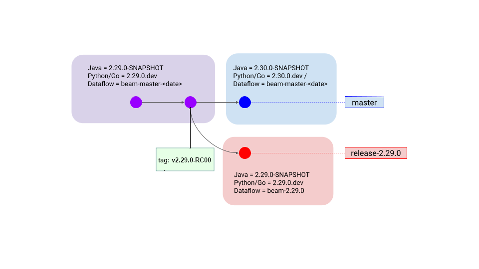
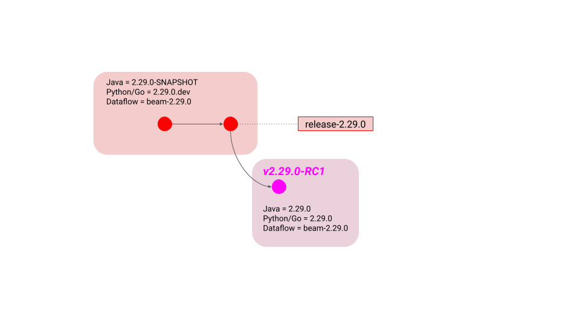

<!--
Licensed under the Apache License, Version 2.0 (the "License");
you may not use this file except in compliance with the License.
You may obtain a copy of the License at

http://www.apache.org/licenses/LICENSE-2.0

Unless required by applicable law or agreed to in writing, software
distributed under the License is distributed on an "AS IS" BASIS,
WITHOUT WARRANTIES OR CONDITIONS OF ANY KIND, either express or implied.
See the License for the specific language governing permissions and
limitations under the License.
-->

# Apache Beam Release Guide

## Introduction

The Beam community treats releases with great importance. They are a public
face of the project and most users interact with the project only through the
releases. Releases are signed off by the entire Beam community in a public
vote.

Each release is executed by a *Release Manager*, who is selected among the Beam
committers.  This document describes the process that the Release Manager
follows to perform a release.

Please remember that publishing software has legal consequences. This guide
complements the foundation-wide guides:

 - [Product Release Policy](https://www.apache.org/dev/release.html)
 - [Release Distribution
   Policy](https://www.apache.org/dev/release-distribution).

### What is in a Beam release

A Beam release consists of the following:

 - ASF source zips archived on
   [dist.apache.org](https://dist.apache.org/repos/dist/release/beam/) (later archived to
   [archive.apache.org](https://archive.apache.org/dist/beam)
 - Java jars and poms published to [Maven
   Central](https://mvnrepository.com/artifact/org.apache.beam)
 - Python wheels published to [pypi](https://pypi.org/project/apache-beam/)
 - Go artifacts published to
   [pkg.go.dev](https://pkg.go.dev/github.com/apache/beam)
 - Docker images published to
   [dockerhub](https://hub.docker.com/search?q=apache%2Fbeam&type=image)
 - A tag on GitHub indicating the commit from which the release was built

In addition, each release is accompanied by:

 - A blog post announcing the release and describing the changes
 - An update to the webpage to indicate the latest version

### Phases of the release process

The release process consists of several phases:

1. Prepare for release
2. Stabilize the release branch / burn down release-blocking issues
3. Build a release candidate
4. Validate and approve the release candidate
5. Finalize the release
6. Promote the release
7. Post-release tasks

------------

## Prepare for release (~1 week before release cut)

The following steps take place before the release branch is cut.

### Decide to release

Deciding to release and selecting a Release Manager is the first step of the
release process. This is a consensus-based decision of the entire community.
Anybody can propose a release on the `dev@` list. There is no formal process,
no vote requirements, and no timing requirements. A committer must be
identified to be the Release Manager. In practice, most often a committer both
proposes to release and volunteers themselves as Release Manager.

-------

### Create a new milestone in GitHub for the next release

When contributors resolve an issue in GitHub, they are tagging it with a
release that will contain their changes. With the release currently underway,
new issues should be resolved against a subsequent future release. Therefore,
you should create a release item for this subsequent release, as follows:

In GitHub, navigate to [`Issues > Milestones > New
Milestone`](https://github.com/apache/beam/milestones) and add a new
release for the next minor version after the version you are preparing
to release.

----

### Prepare accounts, etc

Before your first release, you need to make sure you have all the necessary
accounts, keys, and access for publishing the release. The release process also
requires a variety of API tokens, which you can generate now or later when they
are needed.

These are the credentials you will need:

 - Apache ID and Password
 - GitHub ID, Password, and Personal Access Token
 - PyPi account with beam maintainer access and API Token
 - Access to Beam's Apache Nexus repository
 - Account to access to apache-beam-testing Google Cloud Platform project. The
   account must have permissions to start Cloud Build triggers. Required for
   Playground environment update. (E-mail at dev@ mailing list to request
   access)

#### Apache ID and Password

This is your Apache committer user name and password. You selected these when
you became an Apache Beam Committer.

#### Github ID, Password, and Personal Access Token

 - [ ] If you are using [GitHub two-factor
   authentication](https://help.github.com/articles/securing-your-account-with-two-factor-authentication-2fa/)
   and haven't configure HTTPS access, please follow [the
   guide](https://help.github.com/articles/creating-a-personal-access-token-for-the-command-line/)
   to configure command line access.
 - [ ] Generate a Personal Access Token with `repo` and `workflow` permissions.
   They can be generated from this page: https://github.com/settings/tokens.
   See
   https://docs.github.com/en/authentication/keeping-your-account-and-data-secure/managing-your-personal-access-tokens
   for details.

#### PyPI account and API token

 - [ ] [Create an account with PyPI](https://pypi.python.org/account/register/)
   if you don't have one already.
 - [ ] Become a maintainer (or an owner) of the
   [apache-beam](https://pypi.python.org/pypi/apache-beam) package.
 - [ ] Generate a [PyPI APIToken](https://pypi.org/help/#apitoken) for use
   during the release.

#### Access to Apache Nexus repository

Configure access to the [Apache Nexus
repository](https://repository.apache.org/), which enables final deployment of
releases to the Maven Central Repository.

1. Log in with your Apache account.
2. Confirm you have appropriate access by finding `org.apache.beam` under
   `Staging Profiles`.

----

### Dependency checks

Each language has routine dependency maintenance that you should check now.

#### Update Go version used for container builds

Go makes security patch releases of their tooling.  This potentially affects
container bootloader security, and at the least can cause false positives when
an default-configuration scanner is pointed at our containers.  Ideally, we
upgrade as soon as possible, but it is also good to ensure we are up to date
for each release.

See if https://go.dev/doc/devel/release has a newer release. Update throughout
Beam. See example at https://github.com/apache/beam/pull/27900/files

### Cut the release branch

> **Note**
> Wait until the proposed branch cut day!

We cut the release branch on time and do not block/delay branch cut for incoming
fixes. This is because bugs are always being introduced as part of normal
development. We cut the branch to prevent new bugs being introduced and _then_
we fix and cherrypick any truly release-blocking problems.

- [ ] Run
  [cut_release_branch](https://github.com/apache/beam/actions/workflows/cut_release_branch.yml)
  (click `run workflow`)

The final state of the repository after release branch is cut should match this
diagram:



This should be accomplished by the
[cut_release_branch](https://github.com/apache/beam/actions/workflows/cut_release_branch.yml)
workflow.

The following must be manually done or confirmed:

- [ ] The `master` branch has the SNAPSHOT/dev version incremented.
- [ ] The release branch has the SNAPSHOT/dev version to be released.
- [ ] The Dataflow container image should be modified to the version to be released.
- [ ] Due to current limitation in the workflow, you must navigate to https://github.com/apache/beam/actions/workflows/beam_Release_NightlySnapshot.yml and click "Run workflow" and select the branch just created (release-2.xx.0) to build a snapshot.
- [ ] Manually update `CHANGES.md` on `master` by adding a new section for the
  next release
  ([example](https://github.com/apache/beam/commit/96ab1fb3fe07acf7f7dc9d8c829ae36890d1535c)).

#### Inform the mailing list

The dev@ mailing list should be informed about the release branch being cut.
Alongside with this note, a list of pending issues and to-be-triaged issues
should be included.  Afterwards, this list can be refined and updated by the
release manager and the Beam community.


### Checklist to proceed to the next phase

- [ ] Community agrees to release
- [ ] Community selects a committer (you) as Release Manager
- [ ] Next release has a milestone in github.
- [ ] You have your various account credentials prepared.
- [ ] You checked the dependency maintenance for each language.
- [ ] The release branch is created.
- [ ] The `master` branch is moved along to the next release.
- [ ] You have informed `dev@beam.apache.org` that you have cut the branch and
      are proceeding to stabilization

-------

## Stabilize the release branch

Once the release branch is cut, your job is to make sure tests pass, fix bugs,
confirm performance, defer feature requests, etc, until the branch is ready for
the work of building a release candidate.

### Verify release branch

After the release branch is cut, make sure it builds and has no significant
issues that would block the creation of the release candidate.

> **NOTE**
> Dataflow tests will fail if the Dataflow worker container is not created and
> published by this time.  Should be done by Google, in response to the
> creation of the release branch, and docker images are hosted.  This should
> not block creation of the first release candidate, but should block approval
> of the release.

- **Script:**
  [verify_release_build.sh](https://github.com/apache/beam/blob/master/release/src/main/scripts/verify_release_build.sh)

- **Usage**
    1. Create a personal access token from your Github account.
       See instruction [here](https://help.github.com/en/articles/creating-a-personal-access-token-for-the-command-line).
       It'll be used by the script for accessing Github API.
       You need to enable `repo` and `workflow` permissions for this token.
    2. Update required configurations listed in `RELEASE_BUILD_CONFIGS` in [script.config](https://github.com/apache/beam/blob/master/release/src/main/scripts/script.config)
    3. Then run
       ```
       (cd release/src/main/scripts && ./verify_release_build.sh)
       ```
    4. Trigger all Github Action jobs from the PR created by the previous step.
       For GitHub Action jobs, they should be triggered by the pull_request_target event of a specific placeholder file
       added to the PR (`release/trigger_all_tests.json`), so no additional action should be needed.

- **Tasks included in the script**
   - Installs `hub` with your agreement and setup local git repo;
   - Create a test PR against release branch;

There are some projects that don't produce the artifacts, e.g.
`beam-test-tools`, you may be able to ignore failures there.

To triage the failures and narrow things down you may want to look at
`settings.gradle.kts` and run the build only for the projects you're interested
at the moment, e.g. `./gradlew :runners:java-fn-execution`.

The `verify_release_build.sh` script may include failing or flaky tests.  For
each of the failing tests create a GitHub Issue with the following properties:

* **Issue Type:** Bug

* **Summary:** Name of failing gradle task and name of failing test (where applicable) in form of :MyGradleProject:SomeGradleTask NameOfFailedTest: Short description of failure

* **Priority:** P1

* **Component:** "test-failures"

* **Milestone:** Release number of verified release branch

* **Description:** Description of failure

### Investigate performance regressions

Check the Beam load tests for possible performance regressions.  Measurements
are available on [metrics.beam.apache.org](http://metrics.beam.apache.org).

All Runners which publish data should be checked for the following, in both
*batch* and *streaming* mode:

- [ParDo](http://metrics.beam.apache.org/d/MOi-kf3Zk/pardo-load-tests) and
  [GBK](http://metrics.beam.apache.org/d/UYZ-oJ3Zk/gbk-load-test): Runtime,
  latency, checkpoint duration
- [Nexmark](http://metrics.beam.apache.org/d/ahudA_zGz/nexmark): Query runtime
  for all queries
- [IO](http://metrics.beam.apache.org/d/bnlHKP3Wz/java-io-it-tests-dataflow): Runtime

If regressions are found, the release branch can still be created, but the
regressions should be investigated and fixed as part of the release process.
The role of the release manager is to file GitHub issues for each regression
with the milestone set to the to-be-released version.  The release manager
oversees these just like any other issue marked with the milestone of the
release.

The mailing list should be informed to allow fixing the regressions in the
course of the release. Issues should be filed and tagged with the milestone.

### Triage release-blocking issues in GitHub

There could be outstanding release-blocking issues, which should be triaged
before proceeding to build a release candidate.  We track them by assigning the
blocked release to the issue's milestone before the issue is resolved.

The release manager should triage what does and does not block a release.  The
list of release-blocking issues is available at the [milestone status
page](https://github.com/apache/beam/milestones).  Triage each unresolved issue
with one of the following resolutions:

 - An issue should not block the release if the problem exists in the current
   released version or is a bug in new functionality that does not exist in the
   current released version.
 - An issue should be a blocker if the problem is a regression between the
   currently released version and the release in progress and has no easy
   workaround.

For all GitHub issues:

 -  If the issue has been resolved and the GitHub issue was not updated,
    resolve it accordingly.

For issues with type "Bug" or labeled "flaky":

 -  If the issue is a known continuously failing test, it is not acceptable to
    defer this until the next release.  Please work with the Beam community to
    resolve the issue.
 -  If the issue is a known flaky test, make an attempt to delegate a fix.
    However, if the issue may take too long to fix (to the discretion of the
    release manager):
     - Delegate manual testing of the flaky issue to ensure no release blocking issues.
     - Update the milestone to the version of the next release.
      Please consider discussing this with stakeholders and the dev@ mailing
      list, as appropriate.

For all other GitHub issues:

 - If the issue has not been resolved and it is acceptable to defer this until the next release, update the milestone to the new version you just created.
  Please consider discussing this with stakeholders and the dev@ mailing list, as appropriate.
 - If the issue has not been resolved and it is not acceptable to release until it is fixed, the release cannot proceed.
  Instead, work with the Beam community to resolve the issue.

If there is a bug found in the RC creation process/tools, those issues should
be considered high priority and fixed in 7 days.

### Review cherry-picks

The release manager is empowered to triage issues, and accept or reject
cherry-picks to the release branch.  Cherry picks are necessary if there are
outstanding issues at time of the release branch cut, or issues were found in
verification.

Check if there are outstanding cherry-picks into the release branch, [e.g. for
`2.14.0`](https://github.com/apache/beam/pulls?utf8=%E2%9C%93&q=is%3Apr+base%3Arelease-2.14.0).
Make sure they have blocker Issues attached and are OK to get into the release
by checking with community if needed.

You are encouraged to ask the following questions to be answered on each
cherry-pick PR and you can choose to reject cherry-pick requests if these
questions are not satisfactorily answered:

 - Is this a regression from a previous release? (If no, fix could go to a
   newer version.)
 - Is this a new feature or related to a new feature? (If yes, fix could go to
   a new version.)
 - Would this impact production workloads for users? (E.g. if this is a direct
   runner only fix it may not need to be a cherry pick.)
 - What percentage of users would be impacted by this issue if it is not fixed?
   (E.g. If this is predicted to be a small number it may not need to be a
   cherry pick.)
 - Would it be possible for the impacted users to skip this version? (If users
   could skip this version, fix could go to a newer version.)

It is important to accept major/blocking fixes to isolated issues to make a
higher quality release. However, beyond that each cherry pick will increase
the time required for the release and add more last minute code to the release
branch. Neither late releases nor not fully tested code will provide positive
user value.

> **Tip**: Another tool in your toolbox is the known issues section of the
> release blog. Consider adding known issues there for minor issues instead of
> accepting cherry picks to the release branch.

## Build a release candidate

From the release branch, building a candidate involves selecting a commit,
tagging that commit, and building the various artifacts against that commit.
You can also run verifications against the RC commit (verification will also
occur during voting phase).

#### Checklist before proceeding

- [ ] There are no release blocking GitHub issues.
- [ ] There are no open pull requests to release branch.
- [ ] Release Manager’s GPG key is published to `dist.apache.org`.
- [ ] Release Manager’s GPG key is configured in `git` configuration.
- [ ] Set `SIGNING_KEY` to the public key of the Manager's GPG key.
- [ ] Release Manager has `org.apache.beam` listed under `Staging Profiles` in Nexus.
- [ ] Release Manager’s Nexus User Token is configured in `settings.xml`.
- [ ] Set `JAVA_HOME` to JDK 8 (Example: `export JAVA_HOME=/example/path/to/java/jdk8`).
- [ ] Have Java 11 installed.

### Tag a chosen commit for the RC

Release candidates are built from single tagged commits off the release branch.
When you have identified a good commit on the release branch, run
[choose_rc_commit.sh](https://github.com/apache/beam/blob/master/release/src/main/scripts/choose_rc_commit.sh)
to set it up correctly.

      ./release/src/main/scripts/choose_rc_commit.sh \
          --release "${RELEASE_VERSION}" \
          --rc "${RC_NUM}" \
          --commit "${COMMIT_REF}" \
          --clone \
          --push-tag

You can do a dry run by omitting the `--push-tag` flag. Then it will only clone
the repo, adjust the version, and add the tag locally. If it looks good, run it
again with `--push-tag`.  If you already have a clone that includes the
`${COMMIT_REF}` then you can omit `--clone`. This is perfectly safe since the
script does not depend on the current working tree.

See the source of the script for more details, or to run commands manually in
case of a problem.

The final state of the repository after an RC commit is chosen should match
this diagram:



The following should be confirmed:

- [ ] The release branch is unchanged.
- [ ] There is a commit not on the release branch with the version adjusted.
- [ ] The RC tag points to that commit.

### Create a draft, pre-release Github release for the RC Tag

TODO: Automate these steps as a github action.

If this is for the first release candidate, create a new, draft, pre-release Github release.

* Go to https://github.com/apache/beam/releases/new to start creating a Github release.

If this is for subsequent release candidates re-use the existing Github release for this version.

* Do not create a new release if one already exists, navigate to the existing Github release for the previous RC.

Once on the release page:

* Update the Release tag to the current RC Tag.
* Title the release "Beam ${RELEASE_VERSION} release".
* The description may remain empty for now, but will eventually contain the release blog post.
* Set this release as a pre-release, by checking the `Set as pre-release` box below the description box.

Once configured properly, press the `Save draft` button.

The following should be confirmed:

- [ ] The Github release is configured as a draft, pre-release.
- [ ] The Github release points to the current RC tag.

### Run build_release_candidate GitHub Action to create a release candidate

**Action** [build_release_candidate](https://github.com/apache/beam/actions/workflows/build_release_candidate.yml) (click `run workflow`)
and update the JSON configuration fields with "yes".

**The action will:**

1. Clone the repo at the selected RC tag.
2. Run gradle publish to push java artifacts into Maven staging repo.
3. Build and push java and python source distribution into [dist.apache.org](https://dist.apache.org/repos/dist/dev/beam).
4. Stage SDK docker images to [docker hub Apache
   organization](https://hub.docker.com/search?q=apache%2Fbeam&type=image).
5. Build javadoc, pydoc, typedocs for a PR to update beam-site.
    - **NOTE**: Do not merge this PR until after an RC has been approved (see
      "Finalize the Release").
6. Build Prism binaries for various platforms, and upload them into [dist.apache.org](https://dist.apache.org/repos/dist/dev/beam)
   and the Github Release with the matching RC tag.

### Verify source and artifact distributions

 - [ ] Verify that the source zip of the whole project is present in [dist.apache.org](https://dist.apache.org/repos/dist/dev/beam).
 - [ ] Verify that the Python binaries are present in [dist.apache.org](https://dist.apache.org/repos/dist/dev/beam).
 - [ ] Verify that the Prism binaries are present in [dist.apache.org](https://dist.apache.org/repos/dist/dev/beam).
 - [ ] Verify that the Prism binaries are attached to the Github Release created in the previous step.

### Verify docker images

At
[https://hub.docker.com/u/apache](https://hub.docker.com/search?q=apache%2Fbeam&type=image),
visit each repository and navigate to "tags" tab.  Verify images are pushed
with tags: `${RELEASE_VERSION}rc${RC_NUM}`

Verify that third party licenses are included in Docker. You can do this with a simple script:

    RC_TAG=${RELEASE_VERSION}rc${RC_NUM}
    for pyver in 3.9 3.10 3.11 3.12; do
      docker run --rm --entrypoint sh \
          apache/beam_python${pyver}_sdk:${RC_TAG} \
          -c 'ls -al /opt/apache/beam/third_party_licenses/ | wc -l'
    done

    for javaver in 8 11 17; do
      docker run --rm --entrypoint sh \
          apache/beam_java${javaver}_sdk:${RC_TAG} \
          -c 'ls -al /opt/apache/beam/third_party_licenses/ | wc -l'
    done

And you may choose to log in to the containers and inspect:

      docker run --rm -it --entrypoint=/bin/bash \
        apache/beam_java${ver}_sdk:${RC_TAG}
      ls -al /opt/apache/beam/third_party_licenses/

### Publish Java staging artifacts (manual)

  1. Log in to the [Apache Nexus](https://repository.apache.org/#stagingRepositories) website.
  2. Navigate to Build Promotion -> Staging Repositories (in the left sidebar).
  3. Select repository `orgapachebeam-NNNN`.
  4. Click the Close button.
  5. When prompted for a description, enter “Apache Beam, version X, release candidate Y”.
  6. Review all staged artifacts on `https://repository.apache.org/content/repositories/orgapachebeam-NNNN/`.
     They should contain all relevant parts for each module, including `pom.xml`, jar, test jar, javadoc, etc.
     Artifact names should follow [the existing format](https://search.maven.org/#search%7Cga%7C1%7Cg%3A%22org.apache.beam%22) in which artifact name mirrors directory structure, e.g., `beam-sdks-java-io-kafka`.
     Carefully review any new artifacts.
     Some additional validation should be done during the rc validation step.


### Upload `rc` artifacts to PyPI

This step uploads artifacts such as `apache-beam-${RELEASE_VERSION}rc${RC_NUM}`
to PyPI, so the RC artifacts can be depended upon directly by consumers, for
ease of RC verification.

**Action** [deploy_release_candidate_pypi](https://github.com/apache/beam/actions/workflows/deploy_release_candidate_pypi.yaml) (click `run workflow`)

**The Action will:**

Download previously build python binary artifacts Deploy release candidate
to PyPI with an `rc` suffix.

__Attention:__ Verify that:
- [ ] The File names version include ``rc-#`` suffix
- [ ] [Download Files](https://pypi.org/project/apache-beam/#files) have:
      - [ ] All wheels uploaded as artifacts
      - [ ] Release source's zip published
      - [ ] Signatures and hashes do not need to be uploaded

### Propose pull requests for website updates

Beam publishes API reference manuals for each release on the website.  For Java
and Python SDKs, that’s Javadoc and PyDoc, respectively.  The final step of
building the candidate is to propose website pull requests that update these
manuals. The first pr will get created by the build_release_candidate action,
you will need to create the second one manually

Merge the pull requests only after finalizing the release.  To avoid invalid
redirects for the 'current' version, merge these PRs in the order listed.  Once
the PR is merged, the new contents will get picked up automatically and served
to the Beam website, usually within an hour.  A committer can manually trigger
the
[beam_PostCommit_Website_Publish](https://ci-beam.apache.org/job/beam_PostCommit_Website_Publish/)
task in Jenkins to avoid waiting.

**PR 1: apache/beam-site**

This pull request is against the `apache/beam-site` repo, on the `release-docs`
branch ([example](https://github.com/apache/beam-site/pull/603)).  It is
created by the `build_release_candidate` workflow (see above).

**PR 2: apache/beam**

This pull request is against the `apache/beam` repo, on the `master` branch
([example](https://github.com/apache/beam/pull/17378)).

- Update `CHANGES.md` to update release date and remove template.
- Update release version in `website/www/site/config.toml`.
- Add new release in `website/www/site/content/en/get-started/downloads.md`.
   - Download links will not work until the release is finalized.
- Update links to prior releases to point to https://archive.apache.org (see
  example PR).
- Create the Blog post:

#### Blog post

Use the template below to write a blog post for the release.  See
[beam-2.31.0.md](https://github.com/apache/beam/commit/a32a75ed0657c122c6625aee1ace27994e7df195#diff-1e2b83a4f61dce8014a1989869b6d31eb3f80cb0d6dade42fb8df5d9407b4748)
as an example.

- Copy the changes for the current release from `CHANGES.md` to the blog post
  and edit as necessary.
- Be sure to add yourself to
  [authors.yml](https://github.com/apache/beam/blob/master/website/www/site/data/authors.yml)
  if necessary.

> **TIP**
> Use git log to find contributors to the releases. (e.g: `git fetch
> origin --tags; git log --pretty='%aN' ^v2.10.0 v2.11.0-RC1 | sort | uniq | tr '\n' ',' | sed 's/,/, /g' | sed 's/..$/\n/'`).
> Make sure to clean it up, as there may be duplicate or incorrect user names.
>
> The command gets all pretty printed names from git, sorts them, de-duplicates them,
> replaces newlines with commas, replaces all commas with a comma and a space, and
> and finally strips the trailing comma, and adds a final line break for easier copying.

> **NOTE**
> Make sure to include any breaking changes, even to `@Experimental`
> features, all major features and bug fixes, and all known issues.

**Template:**

    ---
    title:  "Apache Beam {$RELEASE_VERSION}"
    date:   YYYY-MM-DD H:MM:00 Z
    categories:
      - blog
      - release
    authors:
      - {$RELEASE_MANAGER}
    ---
    <!--
    Licensed under the Apache License, Version 2.0 (the "License");
    you may not use this file except in compliance with the License.
    You may obtain a copy of the License at
    http://www.apache.org/licenses/LICENSE-2.0
    Unless required by applicable law or agreed to in writing, software
    distributed under the License is distributed on an "AS IS" BASIS,
    WITHOUT WARRANTIES OR CONDITIONS OF ANY KIND, either express or implied.
    See the License for the specific language governing permissions and
    limitations under the License.
    -->

    We are happy to present the new {$RELEASE_VERSION} release of Beam.
    This release includes both improvements and new functionality.
    See the [download page](/get-started/downloads/{$DOWNLOAD_ANCHOR}) for this release.

    <{$REMOVE_FOR_VALID_SUMMARY_BREAK}!--more-->

    For more information on changes in {$RELEASE_VERSION}, check out the [detailed release notes]({$LINK_TO_GITHUB_MILESTONE}).

    ## Highlights

      * New highly anticipated feature X added to Python SDK ([#X](https://github.com/apache/beam/issues/X)).
      * New highly anticipated feature Y added to Java SDK ([#Y](https://github.com/apache/beam/issues/Y)).

    {$TOPICS e.g.:}
    ### I/Os
    * Support for X source added (Java) ([#X](https://github.com/apache/beam/issues/X)).
    {$TOPICS}

    ### New Features / Improvements

    * X feature added (Python) ([#X](https://github.com/apache/beam/issues/X)).
    * Y feature added (Java) [#Y](https://github.com/apache/beam/issues/Y).

    ### Breaking Changes

    * X behavior was changed ([#X](https://github.com/apache/beam/issues/X)).
    * Y behavior was changed ([#Y](https://github.com/apache/beam/issues/Y)).

    ### Deprecations

    * X behavior is deprecated and will be removed in X versions ([#X](https://github.com/apache/beam/issues/X)).

    ### Bugfixes

    * Fixed X (Python) ([#X](https://github.com/apache/beam/issues/X)).
    * Fixed Y (Java) ([#Y](https://github.com/apache/beam/issues/Y)).

    ### Known Issues

    * {$KNOWN_ISSUE_1}
    * {$KNOWN_ISSUE_2}

    For the most up to date list of known issues, see https://github.com/apache/beam/blob/master/CHANGES.md

    ## List of Contributors

    According to git shortlog, the following people contributed to the {$RELEASE_VERSION} release. Thank you to all contributors!

    ${CONTRIBUTORS}


### Update the Github Release with the Blog post content

Use the content of the blog post as the description of the release.

You may now also uncheck the "draft" checkbox.
This allows it to be visible to non-committers, and makes the assets publically accessible.

Be sure the release is still marked as a pre-release (not as latest).

### Checklist to proceed to the next phase

- [ ] Maven artifacts deployed to the staging repository of
  [repository.apache.org](https://repository.apache.org/content/repositories/)
- [ ] Source distribution deployed to the dev repository of
  [dist.apache.org](https://dist.apache.org/repos/dist/dev/beam/)
- [ ] Website pull request proposed to list the
  [release](/get-started/downloads/), publish the [Java API reference
  manual](https://beam.apache.org/releases/javadoc/), and publish the [Python
  API reference manual](https://beam.apache.org/releases/pydoc/).
- [ ] Docker images are published to
  [DockerHub](https://hub.docker.com/search?q=apache%2Fbeam&type=image) with
  tags: `{RELEASE_VERSION}rc{RC_NUM}`.
- [ ] Github Release page contains the blog post.

You can (optionally) also do additional verification by:

- [ ] Check that Python zip file contains the `README.md`, `NOTICE`, and
  `LICENSE` files.
- [ ] Check hashes (e.g. `md5sum -c *.md5` and `sha1sum -c *.sha1`. Note that
  signature/checksum files of Java artifacts may not contain filenames. Hence
  you might need to compare checksums/signatures manually or modify the files by
  appending the filenames.)
- [ ] Check signatures (e.g. `gpg --verify apache-beam-1.2.3-python.tar.gz.asc
  apache-beam-1.2.3-python.tar.gz`)
- [ ] `grep` for legal headers in each file.
- [ ] Run all jenkins suites and include links to passing tests in the voting
  email.
- [ ] Pull docker images to make sure they are pullable. (e.g. `docker pull apache/beam_python3.7_sdk:2.39.0rc1`

**********

## Vote and validate the release candidate

Once you have built and individually reviewed the release candidate, please
share it for the community-wide review.  Please review foundation-wide [voting
guidelines](https://www.apache.org/foundation/voting.html) for more
information.

Start the review-and-vote thread on the dev@ mailing list.  Here’s an email
template; please adjust as you see fit.

    From: Release Manager
    To: dev@beam.apache.org
    Subject: [VOTE] Release 1.2.3, release candidate #3

    Hi everyone,
    Please review and vote on the release candidate #3 for the version 1.2.3, as follows:
    [ ] +1, Approve the release
    [ ] -1, Do not approve the release (please provide specific comments)


    Reviewers are encouraged to test their own use cases with the release candidate, and vote +1 if
    no issues are found. Only PMC member votes will count towards the final vote, but votes from all
    community members is encouraged and helpful for finding regressions; you can either test your own
    use cases [13] or use cases from the validation sheet [10].

    The complete staging area is available for your review, which includes:
    * GitHub Release notes [1],
    * the official Apache source release to be deployed to dist.apache.org [2], which is signed with the key with fingerprint FFFFFFFF (D20316F712213422 if automated) [3],
    * all artifacts to be deployed to the Maven Central Repository [4],
    * source code tag "v1.2.3-RC3" [5],
    * website pull request listing the release [6], the blog post [6], and publishing the API reference manual [7].
    * Python artifacts are deployed along with the source release to the dist.apache.org [2] and PyPI[8].
    * Go artifacts and documentation are available at pkg.go.dev [9]
    * Validation sheet with a tab for 1.2.3 release to help with validation [10].
    * Docker images published to Docker Hub [11].
    * PR to run tests against release branch [12].
    * Github Release pre-release page for v1.2.3-RC3 [13].

    The vote will be open for at least 72 hours. It is adopted by majority approval, with at least 3 PMC affirmative votes.

    For guidelines on how to try the release in your projects, check out our RC testing guide [13].

    Thanks,
    Release Manager

    [1] https://github.com/apache/beam/milestone/1...
    [2] https://dist.apache.org/repos/dist/dev/beam/1.2.3/
    [3] https://dist.apache.org/repos/dist/release/beam/KEYS
    [4] https://repository.apache.org/content/repositories/orgapachebeam-NNNN/
    [5] https://github.com/apache/beam/tree/v1.2.3-RC3
    [6] https://github.com/apache/beam/pull/...
    [7] https://github.com/apache/beam-site/pull/...
    [8] https://pypi.org/project/apache-beam/1.2.3rc3/
    [9] https://pkg.go.dev/github.com/apache/beam/sdks/v2@v1.2.3-RC3/go/pkg/beam
    [10] https://docs.google.com/spreadsheets/d/1qk-N5vjXvbcEk68GjbkSZTR8AGqyNUM-oLFo_ZXBpJw/edit#gid=...
    [11] https://hub.docker.com/search?q=apache%2Fbeam&type=image
    [12] https://github.com/apache/beam/pull/...
    [13] https://github.com/apache/beam/releases/tag/v1.2.3-RC3
    [14] https://github.com/apache/beam/blob/master/contributor-docs/rc-testing-guide.md

If there are any issues found in the release candidate, reply on the vote
thread to cancel the vote.  There’s no need to wait 72 hours. Go back to
["Stabilize the Release Branch"](#stabilize-the-release-branch) and address the problem.  However, some issues
don’t require cancellation.  For example, if an issue is found in the website
pull request, just correct it on the spot and the vote can continue as-is.

### Run validation tests

The community is responsible for performing validation, but as release manager
you are expected to contribute as well. Please see the [RC Testing Guide](https://github.com/apache/beam/blob/master/contributor-docs/rc-testing-guide.md)
for ideas on helping validate testing on downstream projects.

Before accepting an RC, as a community we try to exercise most (if not all) of
the tests listed in this
[spreadsheet](https://s.apache.org/beam-release-validation), and those are good
validations for you to try out as release manager.  The goal of these tests is
to validate that we're able to run basic pipelines from a variety of
environments (not just our CI environment).

Since there are many tests, we recommend you running some validations using an
automation script.  In case of script failure, you can still run all of them
manually.

You may need to have Python interpreters for all supported Python minor
versions to run all of the tests. See Python installation tips in [Developer
Wiki](https://cwiki.apache.org/confluence/display/BEAM/Python+Tips#PythonTips-InstallingPythoninterpreters).

> **Note**
> The community's validation means more than just running the tests
> that we have already run. It includes users trying out the RC on their own
> downstream tests. It also includes double checking that our human-language
> instructions actually still correspond to the automation that we have built.

#### Run validations using run_rc_validation.sh

**Script:** [run_rc_validation.sh](https://github.com/apache/beam/blob/master/release/src/main/scripts/run_rc_validation.sh)

**Usage**
  1. First update required configurations listed in `RC_VALIDATE_CONFIGS` in
     [script.config](https://github.com/apache/beam/blob/master/release/src/main/scripts/script.config)
  2. Then run
      ```
      ./release/src/main/scripts/run_rc_validation.sh
      ```

**Note:** running the validations requires the ability to do the following in your GCP account: start pipelines,
write to BigQuery, and create a cluster of machines for running containers (for x-lang validation).

**Tasks included**
  1. Create a PR to trigger Python validation job, including
     * Python quickstart in batch and streaming mode with direct runner and Dataflow runner.
     * Python Mobile Games(UserScore, HourlyTeamScore) with direct runner and Dataflow runner.
  2. Run Python Streaming MobileGames, includes
     * Start a new terminal to run Java Pubsub injector.
     * Start a new terminal to run Python LeaderBoard with Direct Runner.
     * Start a new terminal to run Python LeaderBoard with Dataflow Runner.
     * Start a new terminal to run Python GameStats with Direct Runner.
     * Start a new terminal to run Python GameStats with Dataflow Runner.
  3. Multi-language pipelines validation, includes
     * Running the Python quickstart example using Python portable DirectRunner. This will start a new terminal for the Java expansion service.
     * Running the Java quickstart example using Python portable DirectRunner. This will start new terminals for the Python expansion service and the job server.
     * Start a new terminal to run Python multi-language Java kafka validation with Dataflow Runner.
     * Start a new terminal to run Python multi-language Java sql validation with Dataflow Runner.

* **Tasks you need to do manually**.

- [ ] Check whether validations succeed by following console output instructions.
- [ ] Terminate streaming jobs and java injector.
- [ ] Run Java quickstart (wordcount) and mobile game examples with the staged artifacts. The easiest way to do this is by running the tests on GitHub Actions.

- Other manual validation will follow, but this will at least validate that the staged artifacts can be used.
     * Go to https://github.com/apache/beam/actions/workflows/beam_PostRelease_NightlySnapshot.yml/.
     * Click "Run Workflow".
     * Set `RELEASE` to `2.xx.0`, and set `SNAPSHOT_URL` to point to the staged artifacts in Maven central (https://repository.apache.org/content/repositories/orgapachebeam-NNNN/).
     * Click "Build".
- [ ] Sign up [spreadsheet](https://s.apache.org/beam-release-validation).
- [ ] Vote in the release thread.

#### Run validations manually

> **Note**
> `-Prepourl` and `-Pver` can be found in the RC vote email sent by Release Manager.

* **Java Quickstart Validation**

  **Direct Runner**
  ```
  ./gradlew :runners:direct-java:runQuickstartJavaDirect \
  -Prepourl=https://repository.apache.org/content/repositories/orgapachebeam-${KEY} \
  -Pver=${RELEASE_VERSION}
  ```
  **Flink Local Runner**
  ```
  ./gradlew :runners:flink:1.18:runQuickstartJavaFlinkLocal \
  -Prepourl=https://repository.apache.org/content/repositories/orgapachebeam-${KEY} \
  -Pver=${RELEASE_VERSION}
  ```
  **Spark Local Runner**
  ```
  ./gradlew :runners:spark:3:runQuickstartJavaSpark \
  -Prepourl=https://repository.apache.org/content/repositories/orgapachebeam-${KEY} \
  -Pver=${RELEASE_VERSION}
  ```
  **Dataflow Runner**
  ```
  ./gradlew :runners:google-cloud-dataflow-java:runQuickstartJavaDataflow \
  -Prepourl=https://repository.apache.org/content/repositories/orgapachebeam-${KEY} \
  -Pver=${RELEASE_VERSION} \
  -PgcpProject=${YOUR_GCP_PROJECT} \
  -PgcsBucket=${YOUR_GCP_BUCKET}
  ```
* **Java Mobile Game(UserScore, HourlyTeamScore, Leaderboard)**

  **Prerequisites**
  * **Create your own BigQuery dataset**
    ```
    bq mk --project_id=${YOUR_GCP_PROJECT} ${YOUR_DATASET}
    ```
  * **Create your PubSub topic**
    ```
    gcloud alpha pubsub topics create --project=${YOUR_GCP_PROJECT} ${YOUR_PROJECT_PUBSUB_TOPIC}
    ```
  * **Setup your service account**

    Goto IAM console in your project to create a service account as `project owner`, then run

    ```
    gcloud iam service-accounts keys create ${YOUR_KEY_JSON} --iam-account ${YOUR_SERVICE_ACCOUNT_NAME}@${YOUR_PROJECT_NAME}
    export GOOGLE_APPLICATION_CREDENTIALS=${PATH_TO_YOUR_KEY_JSON}
    ```
  **Run**
  ```
  ./gradlew :runners:google-cloud-dataflow-java:runMobileGamingJavaDataflow \
   -Prepourl=https://repository.apache.org/content/repositories/orgapachebeam-${KEY} \
   -Pver=${RELEASE_VERSION} \
   -PgcpProject=${YOUR_GCP_PROJECT} \
   -PgcsBucket=${YOUR_GCP_BUCKET} \
   -PbqDataset=${YOUR_DATASET} -PpubsubTopic=${YOUR_PROJECT_PUBSUB_TOPIC}
  ```
* **Python Quickstart(batch & streaming), MobileGame(UserScore, HourlyTeamScore)**

  Create a new PR in apache/beam.

  In comment area, type in `Run Python ReleaseCandidate` to trigger validation.

* **Python Leaderboard & GameStats**
  * **Get staging RC** `wget https://dist.apache.org/repos/dist/dev/beam/2.XX.0/* `
  * **Verify the hashes**

    ```
    sha512sum -c apache_beam-2.XX.0-python.tar.gz.sha512
    sha512sum -c apache_beam-2.XX.0-source-release.tar.gz.sha512
    ```
  * **Build SDK**

    ```
    sudo apt-get install unzip
    unzip apache_beam-2.XX.0-source-release.tar.gz
    python setup.py sdist
    ```
  * **Setup virtual environment**

    ```
    python3 -m venv beam_env
    . ./beam_env/bin/activate
    pip install --upgrade pip setuptools wheel
    ```
  * **Install SDK**

    ```
    pip install dist/apache_beam-2.XX.0.tar.gz
    pip install dist/apache_beam-2.XX.0.tar.gz[gcp]
    ```
  * **Setup GCP**

    Please repeat following steps for every following test.

    ```
    bq rm -rf --project=${YOUR_PROJECT} ${USER}_test
    bq mk --project_id=${YOUR_PROJECT} ${USER}_test
    gsutil rm -rf ${YOUR_GS_STORAGE]
    gsutil mb -p ${YOUR_PROJECT} ${YOUR_GS_STORAGE}
    gcloud alpha pubsub topics create --project=${YOUR_PROJECT} ${YOUR_PUBSUB_TOPIC}
    ```
    Setup your service account as described in ```Java Mobile Game``` section above.

  * **Produce data by using java injector:**

    Configure your ~/.m2/settings.xml as following:
    ```
    <settings>
      <profiles>
        <profile>
          <id>release-repo</id>
          <activation>
            <activeByDefault>true</activeByDefault>
          </activation>
          <repositories>
            <repository>
              <id>Release 2.4.0 RC3</id>
              <name>Release 2.4.0 RC3</name>
              <url>https://repository.apache.org/content/repositories/orgapachebeam-1031/</url>
            </repository>
          </repositories>
        </profile>
      </profiles>
    </settings>
    ```
    __Note__: You can found the latest  ```id```, ```name``` and ```url``` for one RC in the vote email thread sent out by Release Manager.

    Run
    ```
    mvn archetype:generate \
          -DarchetypeGroupId=org.apache.beam \
          -DarchetypeArtifactId=beam-sdks-java-maven-archetypes-examples \
          -DarchetypeVersion=${RELEASE_VERSION} \
          -DgroupId=org.example \
          -DartifactId=word-count-beam \
          -Dversion="0.1" \
          -Dpackage=org.apache.beam.examples \
          -DinteractiveMode=false
          -DarchetypeCatalog=internal

    mvn compile exec:java -Dexec.mainClass=org.apache.beam.examples.complete.game.injector.Injector \
      -Dexec.args="${YOUR_PROJECT} ${YOUR_PUBSUB_TOPIC} none"
    ```
  * **Run Leaderboard with Direct Runner**
    ```
    python -m apache_beam.examples.complete.game.leader_board \
    --project=${YOUR_PROJECT} \
    --topic projects/${YOUR_PROJECT}/topics/${YOUR_PUBSUB_TOPIC} \
    --dataset ${USER}_test
    ```
    Inspect results:
    * Check whether there is any error messages in console.
    * Goto your BigQuery console and check whether your ${USER}_test has leader_board_users and leader_board_teams table.
    * bq head -n 10 ${USER}_test.leader_board_users
    * bq head -n 10 ${USER}_test.leader_board_teams

  * **Run Leaderboard with Dataflow Runner**
    ```
    python -m apache_beam.examples.complete.game.leader_board \
    --project=${YOUR_PROJECT} \
    --region=${GCE_REGION} \
    --topic projects/${YOUR_PROJECT}/topics/${YOUR_PUBSUB_TOPIC} \
    --dataset ${USER}_test \
    --runner DataflowRunner \
    --temp_location=${YOUR_GS_BUCKET}/temp/ \
    --sdk_location dist/*
    ```
    Inspect results:
    * Goto your Dataflow job console and check whether there is any error.
    * Goto your BigQuery console and check whether your ${USER}_test has leader_board_users and leader_board_teams table.
    * bq head -n 10 ${USER}_test.leader_board_users
    * bq head -n 10 ${USER}_test.leader_board_teams

  * **Run GameStats with Direct Runner**
    ```
    python -m apache_beam.examples.complete.game.game_stats \
    --project=${YOUR_PROJECT} \
    --topic projects/${YOUR_PROJECT}/topics/${YOUR_PUBSUB_TOPIC} \
    --dataset ${USER}_test \
    --fixed_window_duration ${SOME_SMALL_DURATION}
    ```
    Inspect results:
    * Check whether there is any error messages in console.
    * Goto your BigQuery console and check whether your ${USER}_test has game_stats_teams and game_stats_sessions table.
    * bq head -n 10 ${USER}_test.game_stats_teams
    * bq head -n 10 ${USER}_test.game_stats_sessions

  * **Run GameStats with Dataflow Runner**
    ```
    python -m apache_beam.examples.complete.game.game_stats \
    --project=${YOUR_PROJECT} \
    --region=${GCE_REGION} \
    --topic projects/${YOUR_PROJECT}/topics/${YOUR_PUBSUB_TOPIC} \
    --dataset ${USER}_test \
    --runner DataflowRunner \
    --temp_location=${YOUR_GS_BUCKET}/temp/ \
    --sdk_location dist/* \
    --fixed_window_duration ${SOME_SMALL_DURATION}
    ```
    Inspect results:
    * Goto your Dataflow job console and check whether there is any error.
    * Goto your BigQuery console and check whether your ${USER}_test has game_stats_teams and game_stats_sessions table.
    * bq head -n 10 ${USER}_test.game_stats_teams
    * bq head -n 10 ${USER}_test.game_stats_sessions


### Finalize the vote

Reply on the vote thread to close the voting once following conditions are met
for the current release candidate.

- [ ] At least 72 hours has passed since the voting email.
- [ ] No release blocking issues have been identified.
- [ ] Voting thread has at least three approving PMC votes.

Then, tally the votes in a separate email thread.  Here’s an email template;
please adjust as you see fit.

    From: Release Manager
    To: dev@beam.apache.org
    Subject: [RESULT] [VOTE] Release 1.2.3, release candidate #3

    I'm happy to announce that we have unanimously approved this release.

    There are XXX approving votes, XXX of which are binding:
    * approver 1
    * approver 2
    * approver 3
    * approver 4

    There are no disapproving votes.

    Thanks everyone!

### Checklist to proceed to the next step

- [ ] Issues identified during vote have been resolved, with fixes committed to the release branch.
- [ ] All issues in the current release's milestone should be closed.
- [ ] Community votes to release the proposed candidate, with at least three approving PMC votes.


----

## Finalize the release

Once the release candidate has been reviewed and approved by the community, the release should be finalized.
This involves the final deployment of the release candidate to the release repositories, merging of the website changes, etc.

This does not take very long, and can be accomplished within hours of the vote being finalized.

### Deploy artifacts to Maven Central Repository

Use the [Apache Nexus repository manager](https://repository.apache.org/#stagingRepositories) to release the staged binary artifacts to the Maven Central repository.
In the `Staging Repositories` section, find the relevant release candidate `orgapachebeam-XXX` entry and click `Release`.
Drop all other release candidates that are not being released.

### Deploy Python artifacts to PyPI, Docker Images to DockerHub, and Tag Release

* **GitHub Action:** [finalize_release](https://github.com/apache/beam/actions/workflows/finalize_release.yml)

After running the action, perform the following checks:
* Verify that the files at https://pypi.org/project/apache-beam/#files are correct.
All wheels should be published, in addition to the zip of the release source.
(Signatures and hashes do _not_ need to be uploaded.)
* Images are published at [DockerHub](https://hub.docker.com/search?q=apache%2Fbeam&type=image) with tags {RELEASE_VERSION} and *latest*.
* Images with *latest* tag are pointing to current release by confirming the digest of the image with *latest* tag is the same as the one with {RELEASE_VERSION} tag.
* `v{RELEASE_VERSION}` and `sdks/v{RELEASE_VERSION}` tags should be visible on Github's [Tags](https://github.com/apache/beam/tags) page.

### Merge Website pull requests

Merge all of the website pull requests
- [listing the release](/get-started/downloads/)
- publishing the [Python API reference manual](https://beam.apache.org/releases/pydoc/) and the [Java API reference manual](https://beam.apache.org/releases/javadoc/), and
- adding the release blog post.

### Publish the Github Release page

Once the tag is uploaded, update the page with the final release tag, and publish the release notes to Github.

* From the [Beam release page on Github](https://github.com/apache/beam/releases)
find and open the release for the final RC tag for for editing.
* Update the release with the final version tag created above.
* Set this version as the latest release, and publish it.

The release notes should now be visible on Github's [Releases](https://github.com/apache/beam/releases) page with the correct version.

### Mark the version as released in GitHub

In GitHub, in the [milestone page](https://github.com/apache/beam/milestones), click close on the current release.

### PMC-Only Finalization
There are a few release finalization tasks that only PMC members have permissions to do.
Ping [dev@](mailto:dev@beam.apache.org) mailing list for assistance if you need it.

#### Deploy source release to dist.apache.org

Copy the source release from the `dev` repository to the `release` repository at `dist.apache.org` using Subversion.

```
export RELEASE_VERSION=<set the release version>
export OLD_RELEASE_VERSION=<set the previous release version>

svn co https://dist.apache.org/repos/dist/dev/beam dev  # Checkout the `dev` artifact repo.

svn co https://dist.apache.org/repos/dist/release/beam release  # Checkout the `release` artifact repo.

mkdir release/$RELEASE_VERSION

cp -R dev/$RELEASE_VERSION/* release/$RELEASE_VERSION/

cd release

svn add $RELEASE_VERSION

svn rm $OLD_RELEASE_VERSION   # Delete all artifacts from old releases.

svn commit -m "Adding artifacts for the ${RELEASE_VERSION} release and removing old artifacts"
```

Make sure the last release's artifacts have been copied from `dist.apache.org` to `archive.apache.org`.
This should happen automatically: [dev@ thread](https://lists.apache.org/thread.html/39c26c57c5125a7ca06c3c9315b4917b86cd0e4567b7174f4bc4d63b%40%3Cdev.beam.apache.org%3E) with context.

#### Recordkeeping with ASF

Use [reporter.apache.org](https://reporter.apache.org/addrelease.html?beam) to seed the information about the release into future project reports.

### Checklist to proceed to the next step

- [ ] Maven artifacts released and indexed in the [Maven Central Repository](https://search.maven.org/#search%7Cga%7C1%7Cg%3A%22org.apache.beam%22)
- [ ] Source distribution available in the release repository of [dist.apache.org](https://dist.apache.org/repos/dist/release/beam/)
- [ ] Source distribution removed from the dev repository of [dist.apache.org](https://dist.apache.org/repos/dist/dev/beam/)
- [ ] Website pull request to [list the release](/get-started/downloads/) and publish the [API reference manual](https://beam.apache.org/releases/javadoc/) merged.
- [ ] The release is tagged on Github's [Tags](https://github.com/apache/beam/tags) page.
- [ ] The release notes are published on Github's [Releases](https://github.com/apache/beam/releases) page.
- [ ] Release version finalized in GitHub.
- [ ] Release version is listed at reporter.apache.org


**********

## Promote the release

Once the release has been finalized, the last step of the process is to promote the release within the project and beyond.

### Apache mailing lists

Announce on the dev@ mailing list that the release has been finished.

Announce on the release on the user@ mailing list, listing major improvements and contributions.

Announce the release on the announce@apache.org mailing list.
__NOTE__: This can only be done from `@apache.org` email address. This email has to be in plain text (no HTML tags).

### Social media

Tweet, post on Facebook, LinkedIn, and other platforms.
Ask other contributors to do the same.

Also, update [the Wikipedia article on Apache Beam](https://en.wikipedia.org/wiki/Apache_Beam).

### Checklist to declare the process completed

- [ ] Release announced on the user@ mailing list.
- [ ] Blog post published, if applicable.
- [ ] Release recorded in reporter.apache.org.
- [ ] Release announced on social media.
- [ ] Completion declared on the dev@ mailing list.
- [ ] Update Wikipedia Apache Beam article.

**********

## Post-Release Tasks

At the end of the release, go to the GitHub milestones page and mark the recently released version as closed.

#### Update the Java BOM

Google releases a BOM that pins compatible versions of their Java libraries.
After the release, try updating the BOM to the latest version.

To do so, create a draft PR and run test suites following the instructions at
https://github.com/apache/beam/blob/master/contributor-docs/java-dependency-upgrades.md.

Triage the test failures and rerun any tests that seem potentially unrelated to the upgrade.
If there are no test failures due to the BOM upgrade, request review and merge the PR as normal.

If there are test failures due to the BOM upgrade, email the dev list and ask for a volunteer to take the update forward.
It is not your responsibility to fix the BOM issues or to find a volunteer (though you are welcome to take it forward).
If nobody volunteers, that is OK and this issue can roll forward to the next release.
You can optionally use the following template for your email to the dev list:

```
From: Release Manager
To: dev@beam.apache.org
Subject: Java BOM Update X.Y.Z

Hi everyone,

Following the instructions in https://github.com/apache/beam/blob/master/contributor-docs/release-guide.md#post-release-tasks
I've attempted to update the Java Google BOM and have run into test issues caused by the upgrade [1].
Since the Java Google BOM update is best effort for a release manager, I'm handing this piece off to the community.
If you would like to volunteer to help, you can get started by following the instructions in
https://github.com/apache/beam/blob/master/contributor-docs/java-dependency-upgrades.md#google-cloud-related-dependency-upgrades
otherwise this will roll over to the next release.

Thanks,
Release Manager

[1] https://github.com/apache/beam/pull/123
```

#### Update Python Dependencies

A PR should have already been created (and possibly merged) by github-actions bot, you should verify that this was done correctly
by looking at open PRs from that bot - https://github.com/apache/beam/pulls/app%2Fgithub-actions

If a PR has not been merged, drive it to completion.
If no PR was created, triage any failures in https://github.com/apache/beam/actions/workflows/beam_Publish_Website.yml and manually regenerate dependencies,
following https://cwiki.apache.org/confluence/display/BEAM/Python+Tips#PythonTips-HowtoupdatedependenciesthatareinstalledinPythoncontainerimages

### Update the Java starter repo

After the new Beam release is published, the Java starter project needs to have its version manually upgraded.
To do this, create a PR like https://github.com/apache/beam-starter-java/pull/94 (with the appropriate version
number).

#### (Optional) Update the remaining starter repos

You can also update the versions in https://github.com/apache/beam-starter-python and
https://github.com/apache/beam-starter-go if you would like. This is optional because dependabot will automatically
open a PR to do this if you don't.

### Update Beam Playground

After new Beam Release is published, Beam Playground can be updated following the steps below. If any steps fail, make
sure that the triggers are correctly configured as described in
https://github.com/apache/beam/blob/master/playground/terraform/infrastructure/cloudbuild-manual-setup/README.md#deploy-playgorund-environment-from-cloud-build-triggers:

1. Open the [Cloud Build triggers in apache-beam-testing](https://console.cloud.google.com/cloud-build/triggers?project=apache-beam-testing) GCP project.
2. Find the trigger "Deploy-Update-Playground-environment-stg":
    1. Click on the trigger name to open its settings
    2. Change the value for _SDK_TAG variable (Advanced -> Substitution Variables) to the actual version of Beam SDK (e.g. 2.47.0)
    3. Click the Save button. The settings window should close without any errors
    4. Click the RUN button next to the trigger name
    5. In the panel that opened, set the value for the _CONTAINER_TAG variable in format DD-MM-vXX (DD - day, MM - month, XX - version, e.g., 20-12-v01)
    6. Click the Run Trigger button
    7. Open the [Trigger History](https://console.cloud.google.com/cloud-build/builds?project=apache-beam-testing) and wait for the job completion. Ensure  that the job completed successfully (Status field shows a green tick)
3. Find the trigger "Playground-CD-stable-manual-stg", it will be run twice, once with default variables, and once with some overridden:
    1. Click the RUN button next to the trigger name
    2. In the panel that opened, click the Run Trigger button (with default variable values)
    3. Open the [Trigger History](https://console.cloud.google.com/cloud-build/builds?project=apache-beam-testing) and wait for the job completion. Ensure  that the job completed successfully (Status field shows a green tick)
    4. Click the RUN button next to the trigger name
    5. In the panel that opened, change values for the variables:
        * _ORIGIN = PG_BEAMDOC
        * _SUBDIRS = ./learning/beamdoc
    6. Click the Run Trigger button
    7. Open the [Trigger History](https://console.cloud.google.com/cloud-build/builds?project=apache-beam-testing) and wait for the job completion. Ensure  that the job completed successfully (Status field shows a green tick)
4. Test updated [staging Playground](https://play-dev.beam.apache.org/) in a browser
    1. Open the menu (represented by '...' in the right top corner) and click on Versions. Validate that commit is the same for all listed containers, and the hash belongs to a [recent master branch commit](https://github.com/apache/beam/commits/master)
    2. For each of the supported SDKs (Java, Python, Go, SCIO):
        * Switch to the SDK
        * Make any changes to the loaded default example
        * Click the Run button
        * Wait for successful completion
        * Click "Share My Code" to ensure that the link is generated
5. Repeat the same steps for "Deploy-Update-Playground-environment-prod" trigger as for "Deploy-Update-Playground-environment-stg" trigger
6. Repeat the same steps for "Playground-CD-stable-manual-prod" trigger as for "Playground-CD-stable-manual-stg" trigger
7. Test updated [prod Playground](https://play.beam.apache.org/) in a browser. The process is similar to the staging environment.
8. Find the trigger "Playground-CI-stable"
    1. Click on the trigger name to open its settings
    2. Set the value for the _BEAM_VERSION variable (Advanced -> Substitution Variables) to the actual version of Beam SDK (e.g., 2.47.0)
    3. Click the Save button. Click the Save button. The settings window should close without any errors

### Improve the process

It is important that we improve the release processes over time.
Once you’ve finished the release, please take a step back and look what areas of this process and be improved. Perhaps some part of the process can be simplified.
Perhaps parts of this guide can be clarified.

If we have specific ideas, please start a discussion on the dev@ mailing list and/or propose a pull request to update this guide.
Thanks!

# Emergency Patch Releases

While Beam normally releases on a 6 week cadence, with a minor version bump for each release, it is sometimes necessary to make an emergency patch release. One of the following criteria must be met to consider a patch release:

- A significant new bug was released in the last release. This could include major losses of functionality for a runner, an SDK bug breaking a feature, or a transform/IO which no longer works under certain conditions. Regressions which have been around for multiple releases do not meet this bar.
- A major bug was discovered in a previous release which causes data corruption or loss
- A critical vulnerability was discovered which exposes users to significant security risk.

Additionally, a committer must be willing to sponsor/run the release. To kick off a patch release, send an email to dev@beam.apache.org with the following content:

```
From: Proposer
To: dev@beam.apache.org
Subject: [Proposal] Release 2.XX.1, patch release

Hi everyone,
We have discovered an issue in the most recent version of the Beam release: <describe issue>

I would like to <volunteer | ask for a committer to volunteer> to run this patch release. I believe this meets the bar [1] required for performing a patch release because <describe justification>.

Thanks,
Proposer
```

At this point, any committer (possibly the proposer) may volunteer to kick off the patch release.
If the committer has not run release before, they may need to go through the [initial setup steps](#prepare-accounts-etc) before volunteering.
To drive down time to resolution, this can happen in parallel to any discussion the community may have about the necessity of the patch release.


## Patch Release Process

The above document assumes a minor version bump cut off of the master branch. If you want to do a patch release cut off of a previous release branch, use the following steps instead:

- Create a new release branch:

```
git clone https://github.com/apache/beam
cd beam
git fetch origin release-2.XX.0
git checkout release-2.XX.0
git checkout -b release-2.XX.1
git push origin release-2.XX.1
```

- Add a PR to add the new release branch to the set of protected branches in .asf.yml - [example PR](https://github.com/apache/beam/pull/30832)
- Add a PR to bump the Dataflow containers versions - [example PR](https://github.com/apache/beam/pull/30827)
- Create PRs to cherry-pick any desired commits to the release branch
- Follow the normal release steps, starting with [release branch stabilization](#stabilize-the-release-branch), to build/vote/validate/finalize the release candidate that are listed above. See Voting and Finalization of a Patch Release to see differences in the voting process.
- Depending on the nature of the issue, certain post-release finalization steps may be skipped. For example, if an issue doesn’t dramatically impact the Beam Playground, consider skipping that step

## Voting and Finalization of a Patch Release

Because of the time-sensitive nature of emergency patch releases, voting does not require a 3 day finalization period. However, it does still require the following:

- 3 approving binding (PMC) votes
- 0 disapproving (binding or non-binding) votes, or explicit acknowledgement from the binding voters that it is safe to ignore the disapproving votes.

There are no minimum time requirements on how long the vote must be open, however the releaser must include their target timeline in their release candidate email so that voters can respond accordingly; for example:

```
Hi everyone,
Please review and vote on the release candidate #1 for the version 2.XX.1. Given the time sensitive nature of patch releases, I will finalize the release as soon as I have 3 binding approvals.
…
```

Or:

```
Hi everyone,
Please review and vote on the release candidate #1 for the version 2.XX.1. Given the time sensitive nature of patch releases, I will finalize the release as soon as I have 3 binding approvals AND at least 24 hours have passed.
…
```
