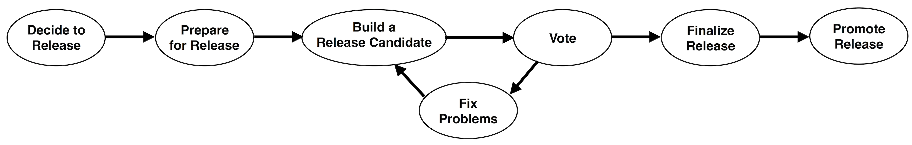

<!--
Licensed under the Apache License, Version 2.0 (the "License");
you may not use this file except in compliance with the License.
You may obtain a copy of the License at

http://www.apache.org/licenses/LICENSE-2.0

Unless required by applicable law or agreed to in writing, software
distributed under the License is distributed on an "AS IS" BASIS,
WITHOUT WARRANTIES OR CONDITIONS OF ANY KIND, either express or implied.
See the License for the specific language governing permissions and
limitations under the License.
-->

# Apache Beam Release Guide

## Introduction

The Apache Beam project periodically declares and publishes releases.  A
release is one or more packages of the project artifact(s) that are approved
for general public distribution and use.  They may come with various degrees of
caveat regarding their perceived quality and potential for change, such as
“alpha”, “beta”, “incubating”, “stable”, etc.

The Beam community treats releases with great importance.  They are a public
face of the project and most users interact with the project only through the
releases. Releases are signed off by the entire Beam community in a public
vote.

Each release is executed by a *Release Manager*, who is selected among the Beam
committers.  This document describes the process that the Release Manager
follows to perform a release.  Any changes to this process should be discussed
and adopted on the [dev@ mailing list](/get-started/support/).

Please remember that publishing software has legal consequences.  This guide
complements the foundation-wide [Product Release
Policy](https://www.apache.org/dev/release.html) and [Release Distribution
Policy](https://www.apache.org/dev/release-distribution).

### Overview



The release process consists of several steps:

1. Decide to release
2. Prepare for the release
3. Build a release candidate
4. Verify & vote on the release candidate
5. If necessary, fix any issues and go back to "Build a release candidate"
6. Finalize the release
7. Promote the release

------------

## 1. Decide to release

Deciding to release and selecting a Release Manager is the first step of the release process.
This is a consensus-based decision of the entire community.

Anybody can propose a release on the dev@ mailing list, giving a solid argument and nominating a committer as the Release Manager (including themselves).
There’s no formal process, no vote requirements, and no timing requirements. Any objections should be resolved by consensus before starting the release.

In general, the community prefers to have a rotating set of 3-5 Release Managers.
Keeping a small core set of managers allows enough people to build expertise in this area and improve processes over time, without Release Managers needing to re-learn the processes for each release.
That said, if you are a committer interested in serving the community in this way, please reach out to the community on the dev@ mailing list.

### Checklist to proceed to the next step

- [ ] Community agrees to release
- [ ] Community selects a committer as Release Manager

-------

## 2. Prepare for the release (~1 week before branch cut)

Before your first release, you should perform one-time configuration steps.
This will set up your security keys for signing the release and access to various release repositories.

To prepare for each release, you should audit the project status in the GitHub issue tracker, and do necessary bookkeeping.
Finally, create a release branch from which individual release candidates will be built.

__NOTE__: If you are using [GitHub two-factor authentication](https://help.github.com/articles/securing-your-account-with-two-factor-authentication-2fa/) and haven't configure HTTPS access,
please follow [the guide](https://help.github.com/articles/creating-a-personal-access-token-for-the-command-line/) to configure command line access.

### Create a new milestone in GitHub for the next release

When contributors resolve an issue in GitHub, they are tagging it with a release that will contain their changes.
With the release currently underway, new issues should be resolved against a subsequent future release.
Therefore, you should create a release item for this subsequent release, as follows:

1. In GitHub, navigate to [`Issues > Milestones > New Milestone`](https://github.com/apache/beam/milestones).
2. Add a new release. Choose the next minor version number after the version currently underway, select the next release due date (generally 6 weeks from today’s date) as the `Start Date`, and choose `Create Milestone`.
3. At the end of the release, go to the same page and mark the recently released version as closed.

### Accounts

Please have these credentials ready at hand, you will likely need to enter them multiple times:

* Apache ID and Password;
* GitHub ID, Password, and Personal Access Token.
* PyPi account and apitoken
* DockerHub ID and Password with beam maintainer access
* GPG pass phrase & 16-digit key ID
* Access to Beam's Apache Nexus repository
* Account to access to apache-beam-testing Google Cloud Platform project. The account must have permissions to start Cloud Build triggers. Required for Playground environment update. (E-mail at dev@ mailing list to request access)

If you don't have a given credential, follow the 'one-time' instructions below.

----

### One-time setup instructions

#### Apache ID and Password

This is your Apache committer user name and password. You selected these when you became an Apache Beam Committer.

#### Github ID, Password, and Personal Access Token

For some scripts, you need a Personal Access Token with `repo` and `workflow` permissions.
They can be generated from this page: https://github.com/settings/tokens.
See https://docs.github.com/en/authentication/keeping-your-account-and-data-secure/managing-your-personal-access-tokens for details.

#### Register to PyPI

Release manager needs to have an account with PyPI.
If you need one, [register at PyPI](https://pypi.python.org/account/register/).
You also need to be a maintainer (or an owner) of the [apache-beam](https://pypi.python.org/pypi/apache-beam) package in order to push a new release.
Ask on the mailing list for assistance.

Generate a [PyPI APIToken](https://pypi.org/help/#apitoken) for use during the release.

#### Login to DockerHub
If you are a member of the [`beam` DockerHub team](https://hub.docker.com/orgs/apache/teams/beam), run the following command manually.
It will ask you to input your DockerHub ID and password if authorization info cannot be found from ~/.docker/config.json file.

```
docker login docker.io
```

After successful login, authorization info will be stored at ~/.docker/config.json file.
For example,
```
"https://index.docker.io/v1/": {
   "auth": "xxxxxx"
}
```

If you are not already a member of the `beam` team, please email `dev@` mailing list for help with any DockerHub related tasks. We are not able
to add more members to the DockerHub team because [the ASF has a limited number of seats available](https://infra.apache.org/docker-hub-policy.html).

#### GPG Key

You need to have a GPG key to sign the release artifacts.
Please be aware of the ASF-wide [release signing guidelines](https://www.apache.org/dev/release-signing.html).
If you don’t have a GPG key associated with your Apache account, please create one according to the guidelines.

There are 2 ways to configure your GPG key for release, either using release automation script(which is recommended), or running all commands manually.

##### Use preparation_before_release.sh to setup GPG
* **Script:** [preparation_before_release.sh](https://github.com/apache/beam/blob/master/release/src/main/scripts/preparation_before_release.sh)

* **Usage**
  ```
  ./release/preparation_before_release.sh
  ```
* **Tasks included**
  1. Help you create a new GPG key if you want.
  2. Configure ```git user.signingkey``` with chosen pubkey.
  3. Add chosen pubkey into [dev KEYS](https://dist.apache.org/repos/dist/dev/beam/KEYS)  and [release KEYS](https://dist.apache.org/repos/dist/release/beam/KEYS)

     **NOTES**: Only PMC can write into [release repo](https://dist.apache.org/repos/dist/release/beam/).
  4. Start GPG agents.

__NOTE__: When generating the key, please make sure you choose the key type as __RSA and RSA (default)__ and key size as __4096 bit__.

* To run the commands manually, refer to the contents of `preparation_before_release.sh`.

##### Key ID

* You may need your Key ID for future steps. Determine your Apache GPG Key and Key ID as follows:

      gpg --list-sigs --keyid-format LONG

  This will list your GPG keys. One of these should reflect your Apache account, for example:

      --------------------------------------------------
      pub   rsa4096/845E6689845E6689 2016-02-23
      uid                  Nomen Nescio <anonymous@apache.org>
      sub   rsa4096/BA4D50BEBA4D50BE 2016-02-23

  Here, the key ID is the 16-digit hex string in the `pub` line: `845E6689845E6689`.

##### Submit your GPG public key into Ubuntu OpenPGP Key Server
In order to make yourself have right permission to stage java artifacts in Apache Nexus staging repository,
please submit your GPG public key into the [Ubuntu OpenPGP Key Server](https://keyserver.ubuntu.com/).

You will need to use an ascii-armored version of your key.
This can be obtained by running `gpg --export --armor` and copying the whole block
(including `-----<START/END> PGP PUBLIC KEY BLOCK-----`).

#### Access to Apache Nexus repository

Configure access to the [Apache Nexus repository](https://repository.apache.org/), which enables final deployment of releases to the Maven Central Repository.

1. You log in with your Apache account.
2. Confirm you have appropriate access by finding `org.apache.beam` under `Staging Profiles`.
3. Navigate to your `Profile` (top right dropdown menu of the page).
4. Choose `User Token` from the dropdown, then click `Access User Token`. Copy a snippet of the Maven XML configuration block.
5. Insert this snippet twice into your global Maven `settings.xml` file, typically `${HOME}/.m2/settings.xml`. The end result should look like this, where `TOKEN_NAME` and `TOKEN_PASSWORD` are your secret tokens:

        <!-- make sure you have the root `settings node: -->
        <settings>
          <servers>
            <server>
              <id>apache.releases.https</id>
              <username>TOKEN_NAME</username>
              <password>TOKEN_PASSWORD</password>
            </server>
            <server>
              <id>apache.snapshots.https</id>
              <username>TOKEN_NAME</username>
              <password>TOKEN_PASSWORD</password>
            </server>
          </servers>
        </settings>

**********

### Handle Per Release tasks

#### Update base image dependencies for Python container images

Tracked in Github issue https://github.com/apache/beam/issues/27944

See instructions at: https://s.apache.org/beam-python-requirements-generate

Ideally, do the update at least a week before the release cut, so that any issues
related to the update have time to surface.

#### Update Go version used for container builds

Tracked in Github issue https://github.com/apache/beam/issues/27897

Ideally, do the update at least a week before the release cut, so that any issues
related to the update have time to surface.

#### Update the Java BOM

Tracked in Github issue https://github.com/apache/beam/issues/28379

Ideally, do the update at least a week before the release cut, so that any issues
related to the update have time to surface.

#### Investigate performance regressions

Check the Beam load tests for possible performance regressions.
Measurements are available on [metrics.beam.apache.org](http://metrics.beam.apache.org).

All Runners which publish data should be checked for the following, in both *batch* and *streaming* mode:

- [ParDo](http://metrics.beam.apache.org/d/MOi-kf3Zk/pardo-load-tests) and [GBK](http://metrics.beam.apache.org/d/UYZ-oJ3Zk/gbk-load-test): Runtime, latency, checkpoint duration
- [Nexmark](http://metrics.beam.apache.org/d/ahudA_zGz/nexmark): Query runtime for all queries
- [IO](http://metrics.beam.apache.org/d/bnlHKP3Wz/java-io-it-tests-dataflow): Runtime

If regressions are found, the release branch can still be created, but the regressions should be investigated and fixed as part of the release process.
The role of the release manager is to file GitHub issues for each regression with the milestone set to the to-be-released version.
The release manager oversees these just like any other issue marked with the milestone of the release.

The mailing list should be informed to allow fixing the regressions in the course of the release. Issues should be filed and tagged with the milestone.

#### Triage release-blocking issues in GitHub

There could be outstanding release-blocking issues, which should be triaged before proceeding to build a release candidate.
We track them by assigning the blocked release to the issue's milestone before the issue is resolved.

The release manager should triage what does and does not block a release.
The list of release-blocking issues is available at the [milestone status page](https://github.com/apache/beam/milestones).
Triage each unresolved issue with one of the following resolutions:

* An issue should not block the release if the problem exists in the current released version or is a bug in new functionality that does not exist in the current released version.
* An issue should be a blocker if the problem is a regression between the currently released version and the release in progress and has no easy workaround.

For all GitHub issues:

* If the issue has been resolved and the GitHub issue was not updated, resolve it accordingly.

For issues with type "Bug" or labeled "flaky":

* If the issue is a known continuously failing test, it is not acceptable to defer this until the next release.
  Please work with the Beam community to resolve the issue.
* If the issue is a known flaky test, make an attempt to delegate a fix.
  However, if the issue may take too long to fix (to the discretion of the release manager):
  * Delegate manual testing of the flaky issue to ensure no release blocking issues.
  * Update the milestone to the version of the next release.
    Please consider discussing this with stakeholders and the dev@ mailing list, as appropriate.

For all other GitHub issues:

* If the issue has not been resolved and it is acceptable to defer this until the next release, update the milestone to the new version you just created.
  Please consider discussing this with stakeholders and the dev@ mailing list, as appropriate.
* If the issue has not been resolved and it is not acceptable to release until it is fixed, the release cannot proceed.
  Instead, work with the Beam community to resolve the issue.

If there is a bug found in the RC creation process/tools, those issues should be considered high priority and fixed in 7 days.

### Checklist to proceed to the next step

- [ ] Next release has a milestone in github.
- [ ] You have your various account credentials prepared.
- [ ] Per Release tasks for the current release have been handled.
- [ ] Open issues/PRs against the current release have been notified.
- [ ] Performance Regressions have been investigated and had issues filed.
- [ ] It is the proposed branch cut day.

**********

## 3. Build a release candidate

Building a release candidate involves creating a release branch, running validation tests against the branch, filing issues, cherry picking fixes,
making a release candidate tag, and building all artifacts from that tag.

### Create a release branch in apache/beam repository

As a final step in preparation for the release, you should create the release branch, and update version information on the original branch.
This should happen once per release. If additional release candidates are required, they are built from later versions of this branch.

The final state of the repository should match this diagram:


The key points to know:

- The `master` branch has the SNAPSHOT/dev version incremented.
- The release branch has the SNAPSHOT/dev version to be released.
- The Dataflow container image should be modified to the version to be released.

This will all be accomplished by the [cut_release_branch](https://github.com/apache/beam/actions/workflows/cut_release_branch.yml)
workflow. This workflow will also update [mass_comment.py](https://github.com/apache/beam/blob/master/release/src/main/scripts/mass_comment.py)
to contain all of the active Jenkins jobs.

After updating the master branch, the workflow will also start a build of
[the nightly snapshot](https://ci-beam.apache.org/job/beam_Release_NightlySnapshot/) against master branch.
Some processes, including our archetype tests, rely on having a live SNAPSHOT of the current version from the `master` branch.
Once the release branch is cut, these SNAPSHOT versions are no longer found, so builds will be broken until a new snapshot is available.
The workflow starts the nightly snapshot by creating an empty PR against apache:master (which will be linked to in the logs).

#### Use cut_release_branch workflow to cut a release branch

* **Action:** [cut_release_branch](https://github.com/apache/beam/actions/workflows/cut_release_branch.yml) (click `run workflow`)

In order to run this workflow, you will need to provide a Apache ID and Jenkins API token.
Your Jenkins API token can be generated by visiting https://ci-beam.apache.org, signing in with your Apache credentials,
then going to `https://ci-beam.apache.org/user/<your ID username>/configure` and clicking `Add new token` in the API token section.

* Tasks you need to do manually to __verify the SNAPSHOT build__
  1. Check whether the Jenkins job gets triggered. If not, please comment ```Run Gradle Publish``` into the generated PR.
  2. After verifying build succeeded, you need to close PR manually.
  3. Manually update `CHANGES.md` on `master` by adding a new section for the next release ([example](https://github.com/apache/beam/commit/96ab1fb3fe07acf7f7dc9d8c829ae36890d1535c)).

### Verify release branch

After the release branch is cut you need to make sure it builds and has no significant issues that would block the creation of the release candidate.
There are 2 ways to perform this verification, either running automation script(recommended), or running all commands manually.

> Dataflow tests will fail if the Dataflow worker container is not created and published by this time.
> Should be done by Google, in response to the creation of the release branch, and docker images are hosted.
> This should not block creation of the first release candidate, but should block approval of the release.

#### Run automation script (verify_release_build.sh)
* **Script:** [verify_release_build.sh](https://github.com/apache/beam/blob/master/release/src/main/scripts/verify_release_build.sh)

* **Usage**
  1. Create a personal access token from your Github account.
  See instruction [here](https://help.github.com/en/articles/creating-a-personal-access-token-for-the-command-line).
     It'll be used by the script for accessing Github API.
     You need to enable `repo` and `workflow` permissions for this token.
  2. Update required configurations listed in `RELEASE_BUILD_CONFIGS` in [script.config](https://github.com/apache/beam/blob/master/release/src/main/scripts/script.config)
  3. Then run
     ```
     (cd release/src/main/scripts && ./verify_release_build.sh)
     ```
  4. Trigger all Jenkins PostCommit jobs from the PR created by the previous step.
     You can run [mass_comment.py](https://github.com/apache/beam/blob/master/release/src/main/scripts/mass_comment.py) to do that.
     Or manually add one trigger phrase per PR comment.
     See [jenkins_jobs.txt](https://github.com/apache/beam/blob/master/release/src/main/scripts/jenkins_jobs.txt)
     for a full list of phrases.

* **Tasks included in the script**
  5. Installs `hub` with your agreement and setup local git repo;
  6. Create a test PR against release branch;

#### Verify the build succeeds

* Tasks you need to do manually to __verify the build succeed__:
  1. Check the build result.
  2. If build failed, scan log will contain all failures.
  3. You should stabilize the release branch until release build succeeded.

There are some projects that don't produce the artifacts, e.g. `beam-test-tools`, you may be able to ignore failures there.

To triage the failures and narrow things down you may want to look at `settings.gradle.kts` and run the build only for the projects you're interested at the moment, e.g. `./gradlew :runners:java-fn-execution`.

#### (Alternative) Run release build locally
You will need to have Python interpreters for all supported Python minor
versions to run Python tests. See Python installation tips in [Developer Wiki](https://cwiki.apache.org/confluence/display/BEAM/Python+Tips#PythonTips-InstallingPythoninterpreters).

* **Run gradle release build**

  1. Clean current workspace

      ```
      git clean -fdx
      ./gradlew clean
      ```

  2. Unlock the secret key
      ```
      gpg --output ~/doc.sig --sign ~/.bashrc
      ```

  3.  Run build command
      ```
      ./gradlew build -PisRelease --no-parallel --scan --stacktrace --continue
      ```

      To speed things up locally you might want to omit `--no-parallel`. You can also omit `--continue`
      if you want build fails after the first error instead of continuing, it may be easier and faster
      to find environment issues this way without having to wait until the full build completes.

#### Create release-blocking issues in GitHub

The verify_release_build.sh script may include failing or flaky tests.
For each of the failing tests create a GitHub Issue with the following properties:

* **Issue Type:** Bug

* **Summary:** Name of failing gradle task and name of failing test (where applicable) in form of :MyGradleProject:SomeGradleTask NameOfFailedTest: Short description of failure

* **Priority:** P1

* **Component:** "test-failures"

* **Milestone:** Release number of verified release branch

* **Description:** Description of failure

#### Inform the mailing list

The dev@ mailing list should be informed about the release branch being cut.
Alongside with this note, a list of pending issues and to-be-triaged issues should be included.
Afterwards, this list can be refined and updated by the release manager and the Beam community.

### Review cherry-picks

The release manager is empowered to triage issues, and accept or reject cherry-picks to the release branch.
Cherry picks are necessary if there are outstanding issues at time of the release branch cut, or issues were found in verification.

Check if there are outstanding cherry-picks into the release branch, [e.g. for `2.14.0`](https://github.com/apache/beam/pulls?utf8=%E2%9C%93&q=is%3Apr+base%3Arelease-2.14.0).
Make sure they have blocker Issues attached and are OK to get into the release by checking with community if needed.

You are encouraged to ask the following questions to be answered on each cherry-pick PR and you can choose to reject cherry-pick requests if these questions are not satisfactorily answered:

* Is this a regression from a previous release? (If no, fix could go to a newer version.)
* Is this a new feature or related to a new feature? (If yes, fix could go to a new version.)
* Would this impact production workloads for users? (E.g. if this is a direct runner only fix it may not need to be a cherry pick.)
* What percentage of users would be impacted by this issue if it is not fixed? (E.g. If this is predicted to be a small number it may not need to be a cherry pick.)
* Would it be possible for the impacted users to skip this version? (If users could skip this version, fix could go to a newer version.)

It is important to accept major/blocking fixes to isolated issues to make a higher quality release.
However, beyond that each cherry pick will increase the time required for the release and add more last minute code to the release branch.
Neither late releases nor not fully tested code will provide positive user value.

__Tip__: Another tool in your toolbox is the known issues section of the release blog.
Consider adding known issues there for minor issues instead of accepting cherry picks to the release branch.

### Build release artifacts

Once the branch is verified, it's time to build

#### Checklist before proceeding

- [ ] Release Manager’s GPG key is published to `dist.apache.org`;
- [ ] Release Manager’s GPG key is configured in `git` configuration;
- [ ] Set `SIGNING_KEY` to the public key of the Manager's GPG key;
- [ ] Release Manager has `org.apache.beam` listed under `Staging Profiles` in Nexus;
- [ ] Release Manager’s Nexus User Token is configured in `settings.xml`;
- [ ] GitHub issue release item for the subsequent release has been created;
- [ ] All test failures from branch verification have associated GitHub issues;
- [ ] There are no release blocking GitHub issues;
- [ ] Release branch has been created;
- [ ] There are no open pull requests to release branch;
- [ ] Originating branch has the version information updated to the new version;
- [ ] Nightly snapshot is in progress (do revisit it continually);
- [ ] Set `JAVA_HOME` to JDK 8 (Example: `export JAVA_HOME=/example/path/to/java/jdk8`).
- [ ] Have Java 11 installed.

The core of the release process is the build-vote-fix cycle.
Each cycle produces one release candidate.
The Release Manager repeats this cycle until the community approves one release candidate, which is then finalized.

For this step, we recommend you using automation script to create a RC, but you still can perform all steps manually if you want.

#### Tag a chosen commit for the RC

Release candidates are built from single commits off the release branch.
Before building, the version must be set to a non-SNAPSHOT, non-dev version.
The final state of the repository should match this diagram:


- The release branch is unchanged.
- There is a commit not on the release branch with the version adjusted.
- The RC tag points to that commit.

* **Script:** [choose_rc_commit.sh](https://github.com/apache/beam/blob/master/release/src/main/scripts/choose_rc_commit.sh)

* **Usage**

      ./release/src/main/scripts/choose_rc_commit.sh \
          --release "${RELEASE_VERSION}" \
          --rc "${RC_NUM}" \
          --commit "${COMMIT_REF}" \
          --clone \
          --push-tag

You can do a dry run by omitting the `--push-tag` flag. Then it will only clone the repo,
adjust the version, and add the tag locally. If it looks good, run it again with `--push-tag`.
If you already have a clone that includes the `${COMMIT_REF}` then you can omit `--clone`. This
is perfectly safe since the script does not depend on the current working tree.

See the source of the script for more details, or to run commands manually in case of a problem.

#### Run build_release_candidate GitHub Action to create a release candidate

Note: This step is partially automated (in progress), so part of the rc creation is done by GitHub Actions and the rest is done by a script.
You don't need to wait for the action to complete to start running the script.

* **Action** [build_release_candidate](https://github.com/apache/beam/actions/workflows/build_release_candidate.yml) (click `run workflow`)

* **The script will:**
  1. Clone the repo at the selected RC tag.
  2. Run gradle publish to push java artifacts into Maven staging repo.
  3. Stage SDK docker images to [docker hub Apache organization](https://hub.docker.com/search?q=apache%2Fbeam&type=image).
  4. Build javadoc, pydoc, typedocs for a PR to update beam-site.
     * **NOTE**: Do not merge this PR until after an RC has been approved (see "Finalize the Release").

##### Tasks you need to do manually

Publish staging artifacts
  1. Log in to the [Apache Nexus](https://repository.apache.org/#stagingRepositories) website.
  2. Navigate to Build Promotion -> Staging Repositories (in the left sidebar).
  3. Select repository `orgapachebeam-NNNN`.
  4. Click the Close button.
  5. When prompted for a description, enter “Apache Beam, version X, release candidate Y”.
  6. Review all staged artifacts on `https://repository.apache.org/content/repositories/orgapachebeam-NNNN/`.
     They should contain all relevant parts for each module, including `pom.xml`, jar, test jar, javadoc, etc.
     Artifact names should follow [the existing format](https://search.maven.org/#search%7Cga%7C1%7Cg%3A%22org.apache.beam%22) in which artifact name mirrors directory structure, e.g., `beam-sdks-java-io-kafka`.
     Carefully review any new artifacts.
     Some additional validation should be done during the rc validation step.

#### Run build_release_candidate.sh to create a release candidate

* **Script:** [build_release_candidate.sh](https://github.com/apache/beam/blob/master/release/src/main/scripts/build_release_candidate.sh)

* **Usage**

      ./release/src/main/scripts/build_release_candidate.sh --release "${RELEASE_VERSION}" --rc "${RC_NUM}" --github-user "${GITHUB_USER}" --java11-home "${JAVA11_HOME}" --signing-key "${SIGNING_KEY}"

* **The script will:**
  1. Clone the repo at the selected RC tag.
  2. Stage source release into dist.apache.org dev [repo](https://dist.apache.org/repos/dist/dev/beam/).
Skip this step if you already did it with the build_release_candidate GitHub Actions workflow.
  3. Stage, sign and hash python source distribution and wheels into dist.apache.org dev repo python dir
  4. Stage SDK docker images to [docker hub Apache organization](https://hub.docker.com/search?q=apache%2Fbeam&type=image).
Skip this step if you already did it with the build_release_candidate GitHub Actions workflow.
Note: if you are not a member of the [`beam` DockerHub team](https://hub.docker.com/orgs/apache/teams/beam) you will need
help with this step. Please email `dev@` mailing list and ask a member of the `beam` DockerHub team for help.
  5. Create a PR to update beam-site, changes includes:
     * Copy python doc into beam-site
     * Copy java doc into beam-site
     * **NOTE**: Do not merge this PR until after an RC has been approved (see "Finalize the Release").
Skip this step if you already did it with the build_release_candidate GitHub Actions workflow.

##### Tasks you need to do manually

Verify the script worked.

  1. Verify that the source and Python binaries are present in [dist.apache.org](https://dist.apache.org/repos/dist/dev/beam).
  2. Verify Docker images are published. How to find images:
      1. Visit [https://hub.docker.com/u/apache](https://hub.docker.com/search?q=apache%2Fbeam&type=image)
      2. Visit each repository and navigate to *tags* tab.
      3. Verify images are pushed with tags: ${RELEASE_VERSION}_rc{RC_NUM}
  3. Verify that third party licenses are included in Docker containers by logging in to the images.
      - For Python SDK images, there should be around 80 ~ 100 dependencies.
        Please note that dependencies for the SDKs with different Python versions vary.
        Need to verify all Python images by replacing `${ver}` with each supported Python version `X.Y`.
        ```
        docker run --rm -it --entrypoint=/bin/bash apache/beam_python${ver}_sdk:${RELEASE_VERSION}rc${RC_NUM}
        ls -al /opt/apache/beam/third_party_licenses/ | wc -l
        ```
      - For Java SDK images, there should be around 200 dependencies.
        ```
        docker run --rm -it --entrypoint=/bin/bash apache/beam_java${ver}_sdk:${RELEASE_VERSION}rc${RC_NUM}
        ls -al /opt/apache/beam/third_party_licenses/ | wc -l
        ```

#### Upload release candidate to PyPi

* **Script:** [deploy_release_candidate_pypi.sh](https://github.com/apache/beam/blob/master/release/src/main/scripts/deploy_release_candidate_pypi.sh)

* **Usage**

		./release/src/main/scripts/deploy_release_candidate_pypi.sh \
		    --release "${RELEASE_VERSION}" \
		    --rc "${RC_NUM}" \
		    --user "${GITHUB_USER}" \
		    --deploy

* **The script will:**

1. Download python binary artifacts
2. Deploy release candidate to PyPI

__Attention:__ Verify that:
* The File names version include ``rc-#`` suffix
* [Download Files](https://pypi.org/project/apache-beam/#files) have:
  * All wheels uploaded as artifacts
  * Release source's zip published
  * Signatures and hashes do not need to be uploaded

You can do a dry run by omitting the `--deploy` flag. Then it will only download the release candidate binaries. If it looks good, rerun it with `--deploy`.

See the source of the script for more details or to run commands manually in case of a problem.

### Propose pull requests for website updates

Beam publishes API reference manuals for each release on the website.
For Java and Python SDKs, that’s Javadoc and PyDoc, respectively.
The final step of building the candidate is to propose website pull requests that update these manuals.

Merge the pull requests only after finalizing the release.
To avoid invalid redirects for the 'current' version, merge these PRs in the order listed.
Once the PR is merged, the new contents will get picked up automatically and served to the Beam website, usually within an hour.
A committer can manually trigger the [beam_PostCommit_Website_Publish](https://ci-beam.apache.org/job/beam_PostCommit_Website_Publish/) task in Jenkins to avoid waiting.

**PR 1: apache/beam-site**

This pull request is against the `apache/beam-site` repo, on the `release-docs` branch ([example](https://github.com/apache/beam-site/pull/603)).
It is created by the `build_release_candidate` workflow (see above).

**PR 2: apache/beam**

This pull request is against the `apache/beam` repo, on the `master` branch ([example](https://github.com/apache/beam/pull/17378)).

* Update `CHANGES.md` to update release date and remove template.
* Update release version in `website/www/site/config.toml`.
* Add new release in `website/www/site/content/en/get-started/downloads.md`.
  * Download links will not work until the release is finalized.
* Update links to prior releases to point to https://archive.apache.org (see
  example PR).
* Create the Blog post:

#### Blog post

Use the template below to write a blog post for the release.
See [beam-2.31.0.md](https://github.com/apache/beam/commit/a32a75ed0657c122c6625aee1ace27994e7df195#diff-1e2b83a4f61dce8014a1989869b6d31eb3f80cb0d6dade42fb8df5d9407b4748) as an example.
- Copy the changes for the current release from `CHANGES.md` to the blog post and edit as necessary.
- Be sure to add yourself to [authors.yml](https://github.com/apache/beam/blob/master/website/www/site/data/authors.yml) if necessary.

__Tip__: Use git log to find contributors to the releases. (e.g: `git fetch origin --tags; git log --pretty='%aN' ^v2.10.0 v2.11.0-RC1 | sort | uniq`).
Make sure to clean it up, as there may be duplicate or incorrect user names.

__NOTE__: Make sure to include any breaking changes, even to `@Experimental` features,
all major features and bug fixes, and all known issues.

**Template:**

    ---
    title:  "Apache Beam {$RELEASE_VERSION}"
    date:   YYYY-MM-DD H:MM:00 Z
    categories:
      - blog
      - release
    authors:
      - {$RELEASE_MANAGER}
    ---
    <!--
    Licensed under the Apache License, Version 2.0 (the "License");
    you may not use this file except in compliance with the License.
    You may obtain a copy of the License at
    http://www.apache.org/licenses/LICENSE-2.0
    Unless required by applicable law or agreed to in writing, software
    distributed under the License is distributed on an "AS IS" BASIS,
    WITHOUT WARRANTIES OR CONDITIONS OF ANY KIND, either express or implied.
    See the License for the specific language governing permissions and
    limitations under the License.
    -->

    We are happy to present the new {$RELEASE_VERSION} release of Beam.
    This release includes both improvements and new functionality.
    See the [download page](/get-started/downloads/{$DOWNLOAD_ANCHOR}) for this release.

    <{$REMOVE_FOR_VALID_SUMMARY_BREAK}!--more-->

    For more information on changes in {$RELEASE_VERSION}, check out the [detailed release notes]({$LINK_TO_GITHUB_MILESTONE}).

    ## Highlights

      * New highly anticipated feature X added to Python SDK ([#X](https://github.com/apache/beam/issues/X)).
      * New highly anticipated feature Y added to Java SDK ([#Y](https://github.com/apache/beam/issues/Y)).

    {$TOPICS e.g.:}
    ### I/Os
    * Support for X source added (Java) ([#X](https://github.com/apache/beam/issues/X)).
    {$TOPICS}

    ### New Features / Improvements

    * X feature added (Python) ([#X](https://github.com/apache/beam/issues/X)).
    * Y feature added (Java) [#Y](https://github.com/apache/beam/issues/Y).

    ### Breaking Changes

    * X behavior was changed ([#X](https://github.com/apache/beam/issues/X)).
    * Y behavior was changed ([#Y](https://github.com/apache/beam/issues/Y)).

    ### Deprecations

    * X behavior is deprecated and will be removed in X versions ([#X](https://github.com/apache/beam/issues/X)).

    ### Bugfixes

    * Fixed X (Python) ([#X](https://github.com/apache/beam/issues/X)).
    * Fixed Y (Java) ([#Y](https://github.com/apache/beam/issues/Y)).

    ### Known Issues

    * {$KNOWN_ISSUE_1}
    * {$KNOWN_ISSUE_2}

    ## List of Contributors

    According to git shortlog, the following people contributed to the {$RELEASE_VERSION} release. Thank you to all contributors!

    ${CONTRIBUTORS}


### Checklist to proceed to the next step

- [ ] Maven artifacts deployed to the staging repository of [repository.apache.org](https://repository.apache.org/content/repositories/)
. Source distribution deployed to the dev repository of [dist.apache.org](https://dist.apache.org/repos/dist/dev/beam/)
- [ ] Website pull request proposed to list the [release](/get-started/downloads/), publish the [Java API reference manual](https://beam.apache.org/releases/javadoc/), and publish the [Python API reference manual](https://beam.apache.org/releases/pydoc/).
- [ ] Docker images are published to [DockerHub](https://hub.docker.com/search?q=apache%2Fbeam&type=image) with tags: {RELEASE_VERSION}_rc{RC_NUM}.

You can (optionally) also do additional verification by:
- [ ] Check that Python zip file contains the `README.md`, `NOTICE`, and `LICENSE` files.
- [ ] Check hashes (e.g. `md5sum -c *.md5` and `sha1sum -c *.sha1`. Note that signature/checksum files of Java artifacts may not contain filenames. Hence you might need to compare checksums/signatures manually or modify the files by appending the filenames.)
- [ ] Check signatures (e.g. `gpg --verify apache-beam-1.2.3-python.zip.asc apache-beam-1.2.3-python.zip`)
- [ ] `grep` for legal headers in each file.
- [ ] Run all jenkins suites and include links to passing tests in the voting email.
- [ ] Pull docker images to make sure they are pullable.
```
docker pull {image_name}
docker pull apache/beam_python3.7_sdk:2.39.0rc1
```

**********

## 4. Vote and validate release candidate

Once you have built and individually reviewed the release candidate, please share it for the community-wide review.
Please review foundation-wide [voting guidelines](https://www.apache.org/foundation/voting.html) for more information.

Start the review-and-vote thread on the dev@ mailing list.
Here’s an email template; please adjust as you see fit.

    From: Release Manager
    To: dev@beam.apache.org
    Subject: [VOTE] Release 1.2.3, release candidate #3

    Hi everyone,
    Please review and vote on the release candidate #3 for the version 1.2.3, as follows:
    [ ] +1, Approve the release
    [ ] -1, Do not approve the release (please provide specific comments)


    Reviewers are encouraged to test their own use cases with the release candidate, and vote +1 if
    no issues are found. Only PMC member votes will count towards the final vote, but votes from all
    community members is encouraged and helpful for finding regressions; you can either test your own
    use cases or use cases from the validation sheet [10].

    The complete staging area is available for your review, which includes:
    * GitHub Release notes [1],
    * the official Apache source release to be deployed to dist.apache.org [2], which is signed with the key with fingerprint FFFFFFFF [3],
    * all artifacts to be deployed to the Maven Central Repository [4],
    * source code tag "v1.2.3-RC3" [5],
    * website pull request listing the release [6], the blog post [6], and publishing the API reference manual [7].
    * Java artifacts were built with Gradle GRADLE_VERSION and OpenJDK/Oracle JDK JDK_VERSION.
    * Python artifacts are deployed along with the source release to the dist.apache.org [2] and PyPI[8].
    * Go artifacts and documentation are available at pkg.go.dev [9]
    * Validation sheet with a tab for 1.2.3 release to help with validation [10].
    * Docker images published to Docker Hub [11].
    * PR to run tests against release branch [12].

    The vote will be open for at least 72 hours. It is adopted by majority approval, with at least 3 PMC affirmative votes.

    For guidelines on how to try the release in your projects, check out our blog post at /blog/validate-beam-release/.

    Thanks,
    Release Manager

    [1] https://github.com/apache/beam/milestone/1...
    [2] https://dist.apache.org/repos/dist/dev/beam/1.2.3/
    [3] https://dist.apache.org/repos/dist/release/beam/KEYS
    [4] https://repository.apache.org/content/repositories/orgapachebeam-NNNN/
    [5] https://github.com/apache/beam/tree/v1.2.3-RC3
    [6] https://github.com/apache/beam/pull/...
    [7] https://github.com/apache/beam-site/pull/...
    [8] https://pypi.org/project/apache-beam/1.2.3rc3/
    [9] https://pkg.go.dev/github.com/apache/beam/sdks/v2@v1.2.3-RC3/go/pkg/beam
    [10] https://docs.google.com/spreadsheets/d/1qk-N5vjXvbcEk68GjbkSZTR8AGqyNUM-oLFo_ZXBpJw/edit#gid=...
    [11] https://hub.docker.com/search?q=apache%2Fbeam&type=image
    [12] https://github.com/apache/beam/pull/...

If there are any issues found in the release candidate, reply on the vote thread to cancel the vote.
There’s no need to wait 72 hours.
Proceed to the `Fix issues` step below and address the problem.
However, some issues don’t require cancellation.
For example, if an issue is found in the website pull request, just correct it on the spot and the vote can continue as-is.

### Run validation tests
The community is responsible for performing validation, but as release manager you are expected to contribute as well.
Before accepting an RC, as a community we try to exercise most (if not all) of the tests listed in this
[spreadsheet](https://s.apache.org/beam-release-validation), and those are good validations for you to try out as release manager.
The goal of these tests is to validate that we're able to run basic pipelines from a variety of environments (not just our CI environment).

Since there are many tests, we recommend you running some validations using an automation script.
In case of script failure, you can still run all of them manually.

You may need to have Python interpreters for all supported Python minor
versions to run all of the tests. See Python installation tips in [Developer Wiki](https://cwiki.apache.org/confluence/display/BEAM/Python+Tips#PythonTips-InstallingPythoninterpreters).

#### Run validations using run_rc_validation.sh
* **Script:** [run_rc_validation.sh](https://github.com/apache/beam/blob/master/release/src/main/scripts/run_rc_validation.sh)

* **Usage**
  1. First update required configurations listed in `RC_VALIDATE_CONFIGS` in
     [script.config](https://github.com/apache/beam/blob/master/release/src/main/scripts/script.config)
  2. Then run
      ```
      ./release/src/main/scripts/run_rc_validation.sh
      ```

**Note:** running the validations requires the ability to do the following in your GCP account: start pipelines,
write to BigQuery, and create a cluster of machines for running containers (for x-lang validation).

* **Tasks included**
  1. Create a PR to trigger Python validation job, including
     * Python quickstart in batch and streaming mode with direct runner and Dataflow runner.
     * Python Mobile Games(UserScore, HourlyTeamScore) with direct runner and Dataflow runner.
  2. Run Python Streaming MobileGames, includes
     * Start a new terminal to run Java Pubsub injector.
     * Start a new terminal to run Python LeaderBoard with Direct Runner.
     * Start a new terminal to run Python LeaderBoard with Dataflow Runner.
     * Start a new terminal to run Python GameStats with Direct Runner.
     * Start a new terminal to run Python GameStats with Dataflow Runner.
  3. Multi-language pipelines validation, includes
     * Running the Python quickstart example using Python portable DirectRunner. This will start a new terminal for the Java expansion service.
     * Running the Java quickstart example using Python portable DirectRunner. This will start new terminals for the Python expansion service and the job server.
     * Start a new terminal to run Python multi-language Java kafka validation with Dataflow Runner.
     * Start a new terminal to run Python multi-language Java sql validation with Dataflow Runner.

* **Tasks you need to do manually**
  1. Check whether validations succeed by following console output instructions.
  1. Terminate streaming jobs and java injector.
  1. Run Java quickstart (wordcount) and mobile game examples with the staged artifacts. The easiest way to do this is by running the tests on Jenkins.
Other manual validation will follow, but this will at least validate that the staged artifacts can be used.
     * Log in to Jenkins.
     * Go to https://ci-beam.apache.org/job/beam_PostRelease_NightlySnapshot/.
     * Click "Build with Parameters".
     * Set `snapshot_version` to `2.xx.0`, and set `snapshot_url` to point to the staged artifacts in Maven central (https://repository.apache.org/content/repositories/orgapachebeam-NNNN/).
     * Click "Build".
  1. Sign up [spreadsheet](https://s.apache.org/beam-release-validation).
  1. Vote in the release thread.

#### Run validations manually

_Note_: -Prepourl and -Pver can be found in the RC vote email sent by Release Manager.

* **Java Quickstart Validation**

  **Direct Runner**
  ```
  ./gradlew :runners:direct-java:runQuickstartJavaDirect \
  -Prepourl=https://repository.apache.org/content/repositories/orgapachebeam-${KEY} \
  -Pver=${RELEASE_VERSION}
  ```
  **Flink Local Runner**
  ```
  ./gradlew :runners:flink:1.13:runQuickstartJavaFlinkLocal \
  -Prepourl=https://repository.apache.org/content/repositories/orgapachebeam-${KEY} \
  -Pver=${RELEASE_VERSION}
  ```
  **Spark Local Runner**
  ```
  ./gradlew :runners:spark:3:runQuickstartJavaSpark \
  -Prepourl=https://repository.apache.org/content/repositories/orgapachebeam-${KEY} \
  -Pver=${RELEASE_VERSION}
  ```
  **Dataflow Runner**
  ```
  ./gradlew :runners:google-cloud-dataflow-java:runQuickstartJavaDataflow \
  -Prepourl=https://repository.apache.org/content/repositories/orgapachebeam-${KEY} \
  -Pver=${RELEASE_VERSION} \
  -PgcpProject=${YOUR_GCP_PROJECT} \
  -PgcsBucket=${YOUR_GCP_BUCKET}
  ```
* **Java Mobile Game(UserScore, HourlyTeamScore, Leaderboard)**

  **Prerequisites**
  * **Create your own BigQuery dataset**
    ```
    bq mk --project_id=${YOUR_GCP_PROJECT} ${YOUR_DATASET}
    ```
  * **Create your PubSub topic**
    ```
    gcloud alpha pubsub topics create --project=${YOUR_GCP_PROJECT} ${YOUR_PROJECT_PUBSUB_TOPIC}
    ```
  * **Setup your service account**

    Goto IAM console in your project to create a service account as `project owner`, then run

    ```
    gcloud iam service-accounts keys create ${YOUR_KEY_JSON} --iam-account ${YOUR_SERVICE_ACCOUNT_NAME}@${YOUR_PROJECT_NAME}
    export GOOGLE_APPLICATION_CREDENTIALS=${PATH_TO_YOUR_KEY_JSON}
    ```
  **Run**
  ```
  ./gradlew :runners:google-cloud-dataflow-java:runMobileGamingJavaDataflow \
   -Prepourl=https://repository.apache.org/content/repositories/orgapachebeam-${KEY} \
   -Pver=${RELEASE_VERSION} \
   -PgcpProject=${YOUR_GCP_PROJECT} \
   -PgcsBucket=${YOUR_GCP_BUCKET} \
   -PbqDataset=${YOUR_DATASET} -PpubsubTopic=${YOUR_PROJECT_PUBSUB_TOPIC}
  ```
* **Python Quickstart(batch & streaming), MobileGame(UserScore, HourlyTeamScore)**

  Create a new PR in apache/beam.

  In comment area, type in `Run Python ReleaseCandidate` to trigger validation.

* **Python Leaderboard & GameStats**
  * **Get staging RC** `wget https://dist.apache.org/repos/dist/dev/beam/2.5.0/* `
  * **Verify the hashes**

    ```
    sha512sum -c apache-beam-2.5.0-python.zip.sha512
    sha512sum -c apache-beam-2.5.0-source-release.zip.sha512
    ```
  * **Build SDK**

    ```
    sudo apt-get install unzip
    unzip apache-beam-2.5.0-source-release.zip
    python setup.py sdist
    ```
  * **Setup virtual environment**

    ```
    python3 -m venv beam_env
    . ./beam_env/bin/activate
    pip install --upgrade pip setuptools wheel
    ```
  * **Install SDK**

    ```
    pip install dist/apache-beam-2.5.0.tar.gz
    pip install dist/apache-beam-2.5.0.tar.gz[gcp]
    ```
  * **Setup GCP**

    Please repeat following steps for every following test.

    ```
    bq rm -rf --project=${YOUR_PROJECT} ${USER}_test
    bq mk --project_id=${YOUR_PROJECT} ${USER}_test
    gsutil rm -rf ${YOUR_GS_STORAGE]
    gsutil mb -p ${YOUR_PROJECT} ${YOUR_GS_STORAGE}
    gcloud alpha pubsub topics create --project=${YOUR_PROJECT} ${YOUR_PUBSUB_TOPIC}
    ```
    Setup your service account as described in ```Java Mobile Game``` section above.

  * **Produce data by using java injector:**

    Configure your ~/.m2/settings.xml as following:
    ```
    <settings>
      <profiles>
        <profile>
          <id>release-repo</id>
          <activation>
            <activeByDefault>true</activeByDefault>
          </activation>
          <repositories>
            <repository>
              <id>Release 2.4.0 RC3</id>
              <name>Release 2.4.0 RC3</name>
              <url>https://repository.apache.org/content/repositories/orgapachebeam-1031/</url>
            </repository>
          </repositories>
        </profile>
      </profiles>
    </settings>
    ```
    __Note__: You can found the latest  ```id```, ```name``` and ```url``` for one RC in the vote email thread sent out by Release Manager.

    Run
    ```
    mvn archetype:generate \
          -DarchetypeGroupId=org.apache.beam \
          -DarchetypeArtifactId=beam-sdks-java-maven-archetypes-examples \
          -DarchetypeVersion=${RELEASE_VERSION} \
          -DgroupId=org.example \
          -DartifactId=word-count-beam \
          -Dversion="0.1" \
          -Dpackage=org.apache.beam.examples \
          -DinteractiveMode=false
          -DarchetypeCatalog=internal

    mvn compile exec:java -Dexec.mainClass=org.apache.beam.examples.complete.game.injector.Injector \
      -Dexec.args="${YOUR_PROJECT} ${YOUR_PUBSUB_TOPIC} none"
    ```
  * **Run Leaderboard with Direct Runner**
    ```
    python -m apache_beam.examples.complete.game.leader_board \
    --project=${YOUR_PROJECT} \
    --topic projects/${YOUR_PROJECT}/topics/${YOUR_PUBSUB_TOPIC} \
    --dataset ${USER}_test
    ```
    Inspect results:
    * Check whether there is any error messages in console.
    * Goto your BigQuery console and check whether your ${USER}_test has leader_board_users and leader_board_teams table.
    * bq head -n 10 ${USER}_test.leader_board_users
    * bq head -n 10 ${USER}_test.leader_board_teams

  * **Run Leaderboard with Dataflow Runner**
    ```
    python -m apache_beam.examples.complete.game.leader_board \
    --project=${YOUR_PROJECT} \
    --region=${GCE_REGION} \
    --topic projects/${YOUR_PROJECT}/topics/${YOUR_PUBSUB_TOPIC} \
    --dataset ${USER}_test \
    --runner DataflowRunner \
    --temp_location=${YOUR_GS_BUCKET}/temp/ \
    --sdk_location dist/*
    ```
    Inspect results:
    * Goto your Dataflow job console and check whether there is any error.
    * Goto your BigQuery console and check whether your ${USER}_test has leader_board_users and leader_board_teams table.
    * bq head -n 10 ${USER}_test.leader_board_users
    * bq head -n 10 ${USER}_test.leader_board_teams

  * **Run GameStats with Direct Runner**
    ```
    python -m apache_beam.examples.complete.game.game_stats \
    --project=${YOUR_PROJECT} \
    --topic projects/${YOUR_PROJECT}/topics/${YOUR_PUBSUB_TOPIC} \
    --dataset ${USER}_test \
    --fixed_window_duration ${SOME_SMALL_DURATION}
    ```
    Inspect results:
    * Check whether there is any error messages in console.
    * Goto your BigQuery console and check whether your ${USER}_test has game_stats_teams and game_stats_sessions table.
    * bq head -n 10 ${USER}_test.game_stats_teams
    * bq head -n 10 ${USER}_test.game_stats_sessions

  * **Run GameStats with Dataflow Runner**
    ```
    python -m apache_beam.examples.complete.game.game_stats \
    --project=${YOUR_PROJECT} \
    --region=${GCE_REGION} \
    --topic projects/${YOUR_PROJECT}/topics/${YOUR_PUBSUB_TOPIC} \
    --dataset ${USER}_test \
    --runner DataflowRunner \
    --temp_location=${YOUR_GS_BUCKET}/temp/ \
    --sdk_location dist/* \
    --fixed_window_duration ${SOME_SMALL_DURATION}
    ```
    Inspect results:
    * Goto your Dataflow job console and check whether there is any error.
    * Goto your BigQuery console and check whether your ${USER}_test has game_stats_teams and game_stats_sessions table.
    * bq head -n 10 ${USER}_test.game_stats_teams
    * bq head -n 10 ${USER}_test.game_stats_sessions


### Fix issues

Any issues identified during the community review and vote should be fixed in this step.
Additionally, any GitHub issues created from the initial branch verification should be fixed.

Code changes should be proposed as standard pull requests to the `master` branch and reviewed using the normal contributing process.
Then, relevant changes should be cherry-picked into the release branch proposed as pull requests against the release branch, again reviewed and merged using the normal contributing process.

Once all issues have been resolved as in the `Verify release branch` step, you should go back and build a new release candidate with these changes.

### Finalize the vote

Reply on the vote thread to close the voting once following conditions are met for the current release candidate.
* At least 72 hours has passed since the voting email.
* No release blocking issues have been identified.
* Voting thread has at least three approving PMC votes.

Then, tally the votes in a separate email thread.
Here’s an email template; please adjust as you see fit.

    From: Release Manager
    To: dev@beam.apache.org
    Subject: [RESULT] [VOTE] Release 1.2.3, release candidate #3

    I'm happy to announce that we have unanimously approved this release.

    There are XXX approving votes, XXX of which are binding:
    * approver 1
    * approver 2
    * approver 3
    * approver 4

    There are no disapproving votes.

    Thanks everyone!

### Checklist to proceed to the next step

- [ ] Issues identified during vote have been resolved, with fixes committed to the release branch.
- [ ] All issues in the current release's milestone should be closed.
- [ ] Community votes to release the proposed candidate, with at least three approving PMC votes.


**********

## 5. Finalize the release

Once the release candidate has been reviewed and approved by the community, the release should be finalized.
This involves the final deployment of the release candidate to the release repositories, merging of the website changes, etc.

This does not take very long, and can be accomplished within hours of the vote being finalized.

### Deploy artifacts to Maven Central Repository

Use the [Apache Nexus repository manager](https://repository.apache.org/#stagingRepositories) to release the staged binary artifacts to the Maven Central repository.
In the `Staging Repositories` section, find the relevant release candidate `orgapachebeam-XXX` entry and click `Release`.
Drop all other release candidates that are not being released.

__NOTE__: If you are using [GitHub two-factor authentication](https://help.github.com/articles/securing-your-account-with-two-factor-authentication-2fa/) and haven't configure HTTPS access,
please follow [the guide](https://help.github.com/articles/creating-a-personal-access-token-for-the-command-line/) to configure command line access.

### Deploy Python artifacts to PyPI

* **Script:** [deploy_pypi.sh](https://github.com/apache/beam/blob/master/release/src/main/scripts/deploy_pypi.sh)
* **Usage**
```
./release/src/main/scripts/deploy_pypi.sh
```
* Verify that the files at https://pypi.org/project/apache-beam/#files are correct.
All wheels should be published, in addition to the zip of the release source.
(Signatures and hashes do _not_ need to be uploaded.)

### Deploy docker images to DockerHub

Note: if you are not a member of the [beam DockerHub team](https://hub.docker.com/orgs/apache/teams/beam),
you will need help with this step. Please email dev@ mailing list and ask a member of the beam DockerHub team for help.

* **Script:** [publish_docker_images.sh](https://github.com/apache/beam/blob/master/release/src/main/scripts/publish_docker_images.sh)
* **Usage**
```
./release/src/main/scripts/publish_docker_images.sh
```
* **Verify that:**
  * Images are published at [DockerHub](https://hub.docker.com/search?q=apache%2Fbeam&type=image) with tags {RELEASE_VERSION} and *latest*.
  * Images with *latest* tag are pointing to current release by confirming the digest of the image with *latest* tag is the same as the one with {RELEASE_VERSION} tag.

(Optional) Clean up any unneeded local images afterward to save disk space.

### Merge Website pull requests

Merge all of the website pull requests
- [listing the release](/get-started/downloads/)
- publishing the [Python API reference manual](https://beam.apache.org/releases/pydoc/) and the [Java API reference manual](https://beam.apache.org/releases/javadoc/), and
- adding the release blog post.

### Git tag

Create and push a new signed tag for the released version by copying the tag for the final release candidate, as follows:

```
# Optional: unlock the signing key by signing an arbitrary file.
gpg --output ~/doc.sig --sign ~/.bashrc

VERSION_TAG="v${RELEASE_VERSION}"
RC_TAG="${VERSION_TAG}-RC${RC_NUM}"

# Ensure local tags are in sync. If there's a mismatch, it will tell you.
git fetch --all --tags

# If the tag exists, a commit number is produced, otherwise there's an error.
git rev-list $RC_TAG -n 1

# Tag for Go SDK
git tag -s "sdks/$VERSION_TAG" "$RC_TAG"
git push https://github.com/apache/beam "sdks/$VERSION_TAG"

# Tag for repo root.
git tag -s "$VERSION_TAG" "$RC_TAG"
git push https://github.com/apache/beam "$VERSION_TAG"
```

After pushing the tag, the tag should be visible on Github's [Tags](https://github.com/apache/beam/tags) page.

### Publish release to Github

Once the tag is uploaded, publish the release notes to Github. From the [Beam release page on Github](https://github.com/apache/beam/releases) select
"Draft a new release." Title the release "Beam ${RELEASE_VERSION} release" and set the release at the version tag created above. Use the content of the
release blog post as the body of the release notes, set this version as the latest release, and publish it.

The release notes should now be visible on Github's [Releases](https://github.com/apache/beam/releases) page.

### Mark the version as released in GitHub

In GitHub, in the [milestone page](https://github.com/apache/beam/milestones), click close on the current release.

### PMC-Only Finalization
There are a few release finalization tasks that only PMC members have permissions to do.
Ping [dev@](mailto:dev@beam.apache.org) mailing list for assistance if you need it.

#### Deploy source release to dist.apache.org

Copy the source release from the `dev` repository to the `release` repository at `dist.apache.org` using Subversion.

Make sure the last release's artifacts have been copied from `dist.apache.org` to `archive.apache.org`.
This should happen automatically: [dev@ thread](https://lists.apache.org/thread.html/39c26c57c5125a7ca06c3c9315b4917b86cd0e4567b7174f4bc4d63b%40%3Cdev.beam.apache.org%3E) with context.

#### Recordkeeping with ASF

Use [reporter.apache.org](https://reporter.apache.org/addrelease.html?beam) to seed the information about the release into future project reports.

### Checklist to proceed to the next step

- [ ] Maven artifacts released and indexed in the [Maven Central Repository](https://search.maven.org/#search%7Cga%7C1%7Cg%3A%22org.apache.beam%22)
- [ ] Source distribution available in the release repository of [dist.apache.org](https://dist.apache.org/repos/dist/release/beam/)
- [ ] Source distribution removed from the dev repository of [dist.apache.org](https://dist.apache.org/repos/dist/dev/beam/)
- [ ] Website pull request to [list the release](/get-started/downloads/) and publish the [API reference manual](https://beam.apache.org/releases/javadoc/) merged.
- [ ] The release is tagged on Github's [Tags](https://github.com/apache/beam/tags) page.
- [ ] The release notes are published on Github's [Releases](https://github.com/apache/beam/releases) page.
- [ ] Release version finalized in GitHub.
- [ ] Release version is listed at reporter.apache.org


**********

## 6. Promote the release

Once the release has been finalized, the last step of the process is to promote the release within the project and beyond.

### Apache mailing lists

Announce on the dev@ mailing list that the release has been finished.

Announce on the release on the user@ mailing list, listing major improvements and contributions.

Announce the release on the announce@apache.org mailing list.
__NOTE__: This can only be done from `@apache.org` email address. This email has to be in plain text (no HTML tags).

### Social media

Tweet, post on Facebook, LinkedIn, and other platforms.
Ask other contributors to do the same.

Also, update [the Wikipedia article on Apache Beam](https://en.wikipedia.org/wiki/Apache_Beam).

### Checklist to declare the process completed

- [ ] Release announced on the user@ mailing list.
- [ ] Blog post published, if applicable.
- [ ] Release recorded in reporter.apache.org.
- [ ] Release announced on social media.
- [ ] Completion declared on the dev@ mailing list.
- [ ] Update Wikipedia Apache Beam article.

**********

## Post Release Tasks

### Update Beam Playground

After new Beam Release is published, Beam Playground can be updated following the steps below:

1. Open the [Cloud Build triggers in apache-beam-testing](https://console.cloud.google.com/cloud-build/triggers?project=apache-beam-testing) GCP project.
2. Find the trigger "Deploy-Update-Playground-environment-stg":
    1. Click on the trigger name to open its settings
    2. Change the value for _SDK_TAG variable (Advanced -> Substitution Variables) to the actual version of Beam SDK (e.g. 2.47.0)
    3. Click the Save button. The settings window should close without any errors
    4. Click the RUN button next to the trigger name
    5. In the panel that opened, set the value for the _CONTAINER_TAG variable in format DD-MM-vXX (DD - day, MM - month, XX - version, e.g., 20-12-v01)
    6. Click the Run Trigger button
    7. Open the [Trigger History](https://console.cloud.google.com/cloud-build/builds?project=apache-beam-testing) and wait for the job completion. Ensure  that the job completed successfully (Status field shows a green tick)
3. Find the trigger "Playground-CD-stable-manual-stg", it will be run twice, once with default variables, and once with some overridden:
    8. Click the RUN button next to the trigger name
    9. In the panel that opened, click the Run Trigger button (with default variable values)
    10. Open the [Trigger History](https://console.cloud.google.com/cloud-build/builds?project=apache-beam-testing) and wait for the job completion. Ensure  that the job completed successfully (Status field shows a green tick)
    11. Click the RUN button next to the trigger name
    12. In the panel that opened, change values for the variables:
        * _ORIGIN = PG_BEAMDOC
        * _SUBDIRS = ./learning/beamdoc
    13. Click the Run Trigger button
    14. Open the [Trigger History](https://console.cloud.google.com/cloud-build/builds?project=apache-beam-testing) and wait for the job completion. Ensure  that the job completed successfully (Status field shows a green tick)
4. Test updated [staging Playground](https://play-dev.beam.apache.org/) in a browser
    15. Open the menu (represented by '...' in the right top corner) and click on Versions. Validate that commit is the same for all listed containers, and the hash belongs to a [recent master branch commit](https://github.com/apache/beam/commits/master)
    16. For each of the supported SDKs (Java, Python, Go, SCIO):
        * Switch to the SDK
        * Make any changes to the loaded default example
        * Click the Run button
        * Wait for successful completion
        * Click "Share My Code" to ensure that the link is generated
5. Repeat the same steps for "Deploy-Update-Playground-environment-prod" trigger as for "Deploy-Update-Playground-environment-stg" trigger
6. Repeat the same steps for "Playground-CD-stable-manual-prod" trigger as for "Playground-CD-stable-manual-stg" trigger
7. Test updated [prod Playground](https://play.beam.apache.org/) in a browser. The process is similar to the staging environment.
8. Find the trigger "Playground-CI-stable"
    1. Click on the trigger name to open its settings
    2. Set the value for the _BEAM_VERSION variable (Advanced -> Substitution Variables) to the actual version of Beam SDK (e.g., 2.47.0)
    3. Click the Save button. Click the Save button. The settings window should close without any errors

### Improve the process

It is important that we improve the release processes over time.
Once you’ve finished the release, please take a step back and look what areas of this process and be improved. Perhaps some part of the process can be simplified.
Perhaps parts of this guide can be clarified.

If we have specific ideas, please start a discussion on the dev@ mailing list and/or propose a pull request to update this guide.
Thanks!
