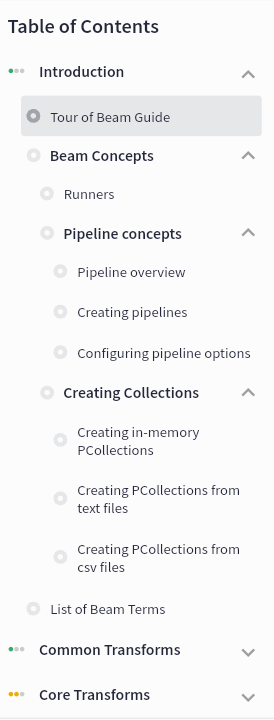

<!--
    Licensed to the Apache Software Foundation (ASF) under one
    or more contributor license agreements.  See the NOTICE file
    distributed with this work for additional information
    regarding copyright ownership.  The ASF licenses this file
    to you under the Apache License, Version 2.0 (the
    "License"); you may not use this file except in compliance
    with the License.  You may obtain a copy of the License at

      http://www.apache.org/licenses/LICENSE-2.0

    Unless required by applicable law or agreed to in writing,
    software distributed under the License is distributed on an
    "AS IS" BASIS, WITHOUT WARRANTIES OR CONDITIONS OF ANY
    KIND, either express or implied.  See the License for the
    specific language governing permissions and limitations
    under the License.
-->

# Apache Tour of Beam Contributors Guide

Welcome to the Apache Tour of Beam Contributors Guide! You can contribute to this project in a variety of ways, such as creating new learning materials or runnable examples and updating existing ones, fixing bugs, or improving documentation. This guide is designed to help you contribute by providing examples and learning materials in a variety of supported programming languages. Contributing to this project will allow you to hone your skills in Apache Beam and big data processing while also making valuable contributions to the open-source community.

## Learning Materials

All of our Tour of Beam learning materials are organized into a folder structure inside the [learning-content](../learning-content/) folder in the Apache Beam repository. Learning materials are built as a tree-like folder structure following a "course" - "module" - "unit" composition of learning materials, where the course is the tree root and units are the tree leaves. Additional grouping of connected units into separate unit groups is also possible. Each folder contains a `*.yaml` metadata files describing the purpose and hierarchy level of the folder and subfolders containing subordinate modules/groups/units. Folders containing units also contain theory and runnable examples as well as hints and solutions for challenges.

Here is a truncated example of the file/folder structure of Tour of Beam learning content:

```
.
├── README.md
├── content-info.yaml                         <-- Course metadata
├── introduction                              <-- Introduction module folder
│    ├── introduction-concepts                <-- Concepts group folder
│    │    ├── group-info.yaml                 <-- Concepts group metadata
│    │    ├── creating-collections            <-- Creating collections group folder
│    │    │     ├── group-info.yaml           <-- Creating collections group metadata
│    │    │     ├── from-memory               <-- Unit folder
│    │    │     │   ├── unit-info.yaml        <-- Unit metadata
│    │    │     │   ├── description.md        <-- Unit learning materials
│    │    │     │   ├── go-example            <-- Golang runnable example folder
│    │    │     │   │   └── from-memory.go    <-- Golang runnable example source file
│    │    │     │   ├── java-example          <-- Java runnable example folder
│    │    │     │   │   └── from-memory.java  <-- Java runnable example source file
│    │    │     │   ├── python-example        <-- Python runnable example folder
│    │    │     │   │   └── from-memory.py    <-- Python runnable example source file
│    │    │     ├── reading-from-csv
│    │    │     │   ├── description.md
│    │    │     │   ├── go-example
│    │    │     │   │   └── csvExample.go
│    │    │     │   └── unit-info.yaml
│    │    │     └── reading-from-text
│    │    │         ├── description.md
│    │    │         ├── go-example
│    │    │         │   └── textIo.go
│    │    │         └── unit-info.yaml
│    │    ├── pipeline-concepts               <-- Pipeline concepts group folder
│    │    │     └── ...
│    │    │
│    │    └── runner-concepts                 <-- Runner concepts unit folder
│    │          ├── description.md
│    │          └── unit-info.yaml
│    ├── introduction-guide                   <-- Introduction guide unit folder
│    │   ├── description.md
│    │   └── unit-info.yaml
│    ├── introduction-terms                   <-- Introduction terms unit folder
│    │   ├── description.md
│    │   └── unit-info.yaml
│    └── module-info.yaml
├── common-transforms                         <-- Common transforms module folder
├── core-transforms                           <-- Core transforms module folder
├── windowing                                 <-- Windowing module folder
└── ...
```

Here, we have a course folder hierarchy with several modules - "Introduction", "Common Transforms", "Core Transforms", "Windowing"... Introduction module is divided into three major parts - "Concepts", "Pipelines" and "Runners", where "Concepts" and "Pipelines" have additional grouping and thus represented as groups, and "Runners" is a simple unit.
This folder structure along with metadata files is used to render a course tree in Tour of Beam.


### YAML Metadata Files

The YAML metadata files provide information about each module, group or unit. These metadata files are also used to create SDK-specific units.
There are four types of metadata files in Tour of Beam:

- content-info.yaml
- module-info.yaml
- group-info.yaml
- unit-info.yaml

#### Course metadata

Course metadata is stored in `content-info.yaml` file in the root folder `./learning/tour-of-beam/learning-content"` and is represented as a yaml object with following content:

```
sdk:
  - Java
  - Python
  - Go
content:
  - introduction
  - windowing
  - triggers
```

**sdk**: list of programming languages this learning content is intended for (available options are "Go", "Java", "Python").
**content**: list of folders with modules which will be included in this course

#### Module metadata

Module metadata is stored in module-info.yaml file in each module folder and is represented as a yaml object with following content:

```
sdk:
  - Java
  - Python
  - Go
id: introduction
name: Introduction
complexity: BASIC
content:
- introduction-guide
- introduction-concepts
- introduction-terms

```

**sdk**: list of programming languages this learning module is intended for (available options are "Go", "Java", "Python").
**content**: list of folders with groups/units which will be included in this module
**id**: unique id of the module within the course
**name**: Short name of the module that will be used in course navigation
**complexity**: Complexity of the module (available options are BASIC, MEDIUM, ADVANCED)

#### Group metadata

Group metadata is stored in group-info.yaml file in each group folder and is represented as a yaml object with following content:

```
sdk:
  - Java
  - Python
  - Go
id: concepts
name: Beam Concepts
content:
- runner-concepts
- pipeline-concepts
- creating-collections
```

Group metadata is used to group several units into a logical unit. Group metadata has the same structure as module metadata.

#### Unit metadata

Unit metadata serves the purpose of grouping theoretical learning materials with accompanying runnable examples and motivating challenges.
Group metadata is stored in unit-info.yaml file in each unit folder and is represented as a yaml object with following content:

```
sdk:
  - Java
  - Python
  - Go
id: windowing-motivating-challenge
name: Windowing motivating challenge
taskName: WindowingChallenge
solutionName: WindowingSolution
```

**sdk**: list of programming languages this learning unit is intended for (available options are "Go", "Java", "Python").
**id**: unique id of the unit within the course
**name**: Short name of the unit that wil be used in course navigation
**taskName**: Name of runnable example or motivating challenge that is accompanies this unit
**solutionName**: Name of solution for motivating challenge

### Unit material structure

Unit learning materials should be stored in the following documents inside the unit folder:

- description.md
- hint.md

**description.md**: Markdown file containing learning unit theoretical materials or description of motivating challenge. All features of markdown are supported in unit learning materials.
**hint\*.md**: Markdown file containing hint for a motivating challenge. There could be up to nine hints for a motivating challenge in files `hint1.md` to `hint9.md`. Hints are shown sequentially in Tour of Beam.

### Multilanguaage template support for learning materials

Learning unit theoretical materials markdown files support go templates for unifying learning materials for different SDK supported languages

```
{{if (eq .Sdk "go")}}
Learning content that should be displayed only for in Go SDK course tree
{{end}}
```

Templates also support sections for several programming languages:

```
{{if (eq .Sdk "go" "java")}}
Learning content that should be displayed only for both Go and Java SDK course tree
{{end}}
```

## Runnable examples and motivating challenges

Each example in this repository is a self-contained code snippet that demonstrates a specific concept or technique. Examples are organized into subfolders by language for convenience, and each example includes embedded tags with metadata that correspond to the information in the YAML metadata files. This makes it easy for contributors to find the examples they need and understand how to use them.
Metadata tag should be embedded in pipeline source file as a commented yaml structure.
There is a degree of flexibility as for where to keep example source files. We propose to keep examples for different SDK's in separate folders. It's also beneficial to separate motivating examples and solutions to separate folders.

Here is a sample of example metadata tag (java comment):

```
// beam-playground:
//   name: KafkaWordCountJson
//   description: Test example with Apache Kafka
//   multifile: false
//   context_line: 55
//   categories:
//     - Filtering
//     - Options
//     - Quickstart
//   complexity: MEDIUM
//   tags:
//     - filter
//     - strings
//     - emulator
//   emulators:
//      - type: kafka
//        topic:
//          id: dataset
//          source_dataset: CountWords
//   datasets:
//     CountWords:
//       location: local
//       format: json
```

**name**: Name/Id of the example that should match the **taskName** or **solutionName** in unit metadata.
The rest of the fields in yaml metadata are processed with Playground. See [Playground README](../../../playground/backend/README.md) for additional details.

# Contributing

We welcome contributions to this repository! If you would like to contribute, please follow these steps:

- Fork the repository
- Create a new branch for your changes
- Make your changes and test them
- Commit your changes and push them to your branch
- Create a pull request
- Check that Example CI workflow status allows merging
- Please make sure that your contributions follow our code of conduct and contributing guidelines.
- New examples/learning materials will be uploaded after PR is merged with a automated CD workflow
