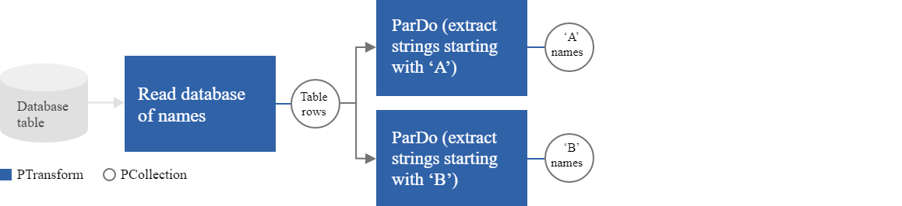

# Branching PCollections

It’s important to understand that transforms do not consume `PCollection`s; instead, they consider each individual element of a `PCollection` and create a new `PCollection` as output. This way, you can do different things to different elements in the same `PCollection`.

Multiple transforms process the same PCollection
You can use the same PCollection as input for multiple transforms without consuming the input or altering it.

The pipeline in figure 2 is a branching pipeline. The pipeline reads its input (first names represented as strings) from a database table and creates a PCollection of table rows. Then, the pipeline applies multiple transforms to the same `PCollection`. Transform A extracts all the names in that `PCollection` that start with the letter ‘A’, and Transform B extracts all the names in that `PCollection` that start with the letter ‘B’. Both transforms A and B have the same input `PCollection`.



_Figure 2: A branching pipeline. Two transforms are applied to a single PCollection of database table rows._

The following example code applies two transforms to a single input collection.

```
PCollection<String> dbRowCollection = ...;

PCollection<String> aCollection = dbRowCollection.apply("aTrans", ParDo.of(new DoFn<String, String>(){
  @ProcessElement
  public void processElement(ProcessContext c) {
    if(c.element().startsWith("A")){
      c.output(c.element());
    }
  }
}));

PCollection<String> bCollection = dbRowCollection.apply("bTrans", ParDo.of(new DoFn<String, String>(){
  @ProcessElement
  public void processElement(ProcessContext c) {
    if(c.element().startsWith("B")){
      c.output(c.element());
    }
  }
}));
```

### A single transform that produces multiple outputs

Another way to branch a pipeline is to have a single transform output to multiple `PCollection`s by using tagged outputs. Transforms that produce more than one output process each element of the input once, and output to zero or more `PCollection`s.

Figure 3 illustrates the same example described above, but with one transform that produces multiple outputs. Names that start with ‘A’ are added to the main output `PCollection`, and names that start with ‘B’ are added to an additional output `PCollection`.


_Figure 3: A pipeline with a transform that outputs multiple PCollections._

If we compare the pipelines in figure 2 and figure 3, you can see they perform the same operation in different ways. The pipeline in figure 2 contains two transforms that process the elements in the same input `PCollection`. One transform uses the following logic:

```
if (starts with 'A') { outputToPCollectionA }
```

while the other transform uses:

```
if (starts with 'B') { outputToPCollectionB }
```

Because each transform reads the entire input `PCollection`, each element in the input `PCollection` is processed twice.

The pipeline in figure 3 performs the same operation in a different way - with only one transform that uses the following logic:

```
if (starts with 'A') { outputToPCollectionA } else if (starts with 'B') { outputToPCollectionB }
```

where each element in the input PCollection is processed once.
The following example code applies one transform that processes each element once and outputs two collections.

```
// Define two TupleTags, one for each output.
final TupleTag<String> startsWithATag = new TupleTag<String>(){};
final TupleTag<String> startsWithBTag = new TupleTag<String>(){};

PCollectionTuple mixedCollection =
    dbRowCollection.apply(ParDo
        .of(new DoFn<String, String>() {
          @ProcessElement
          public void processElement(ProcessContext c) {
            if (c.element().startsWith("A")) {
              // Emit to main output, which is the output with tag startsWithATag.
              c.output(c.element());
            } else if(c.element().startsWith("B")) {
              // Emit to output with tag startsWithBTag.
              c.output(startsWithBTag, c.element());
            }
          }
        })
        // Specify main output. In this example, it is the output
        // with tag startsWithATag.
        .withOutputTags(startsWithATag,
        // Specify the output with tag startsWithBTag, as a TupleTagList.
                        TupleTagList.of(startsWithBTag)));

// Get subset of the output with tag startsWithATag.
mixedCollection.get(startsWithATag).apply(...);

// Get subset of the output with tag startsWithBTag.
mixedCollection.get(startsWithBTag).apply(...);
```

You can use either mechanism to produce multiple output `PCollection`s. However, using additional outputs makes more sense if the transform’s computation per element is time-consuming.

