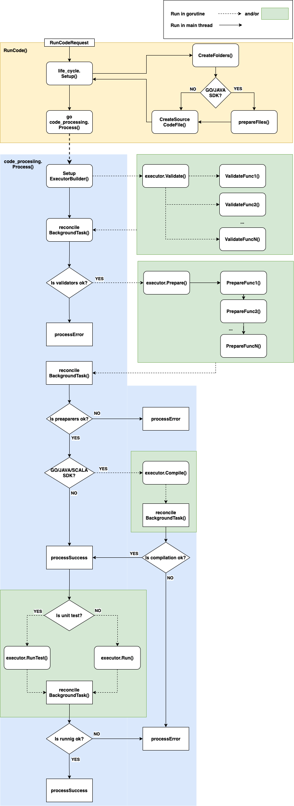
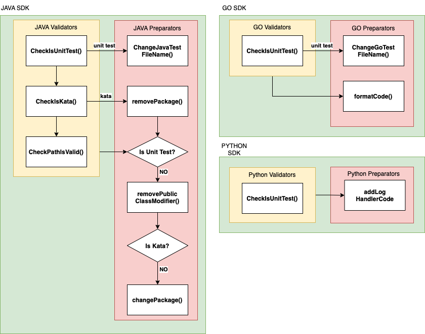

<!--
    Licensed to the Apache Software Foundation (ASF) under one
    or more contributor license agreements.  See the NOTICE file
    distributed with this work for additional information
    regarding copyright ownership.  The ASF licenses this file
    to you under the Apache License, Version 2.0 (the
    "License"); you may not use this file except in compliance
    with the License.  You may obtain a copy of the License at

      http://www.apache.org/licenses/LICENSE-2.0

    Unless required by applicable law or agreed to in writing,
    software distributed under the License is distributed on an
    "AS IS" BASIS, WITHOUT WARRANTIES OR CONDITIONS OF ANY
    KIND, either express or implied.  See the License for the
    specific language governing permissions and limitations
    under the License.
-->

# Apache Beam Playground

## About

Beam Playground helps facilitate trying out and adopting [Apache Beam](https://beam.apache.org/) by providing a very
quick way for prospective Beam users to see and run examples of Apache Beam pipelines in a web interface that requires
no setup.

## Getting Started

See [playground/README.md](../README.md) for details on installing development dependencies.

This section describes what is needed to run the backend application.

- Go commands to run/test the backend locally
- Set up environment variables to run the backend locally
- Running the backend via Docker

## Go commands to run/test application locally

### Run/build
Go to the backend directory:

```shell
cd backend
```

To run backend server on development machine without using docker you'll need first to prepare a working directory anywhere outside of Beam source tree:
```shell
mkdir ~/path/to/workdir
```
and then copy `datasets/` and `configs/` and `logging.properties` from [`playground/backend/`](/playground/backend/) directory:
```shell
cp -r {logging.properties,datasets/,configs/} ~/path/to/workdir
```

In case if you want to start backend for Go SDK you additionally will also need to create a prepared mod dir and export an additional environment variable:
```shell
export PREPARED_MOD_DIR=~/path/to/workdir/prepared_folder
SDK_TAG=2.44.0 bash ./containers/go/setup_sdk.sh $PREPARED_MOD_DIR
```

The following command will build and serve the backend locally:

```shell
SERVER_PORT=<port> \
BEAM_SDK=<beam_sdk_type> \
APP_WORK_DIR=<path_to_workdir> \
DATASTORE_EMULATOR_HOST=127.0.0.1:8888 \
DATASTORE_PROJECT_ID=test \
SDK_CONFIG=../sdks-emulator.yaml \
go run ./cmd/server
```

where `<port>` should be the value of port on which you want to have the backend server available; `<beam_sdk_type>` is a value of desired Beam SDK, possible values are `SDK_UNSPECIFIED`, `SDK_JAVA`, `SDK_PYTHON`, `SDK_GO`, `SDK_SCIO`; `<path_to_workdir>` should be set to path to your work dir, e.g. `~/path/to/workdir`.

Run the following command to generate a release build file:

```shell
go build ./cmd/server/server.go
```

### Test
Playground tests may be run using this command:

```shell
go test ./... -v
```

The full list of commands can be found [here](https://pkg.go.dev/cmd/go).

## Set up environment variables to run the backend locally

These environment variables should be set to run the backend locally:

- `BEAM_SDK` - is the SDK which backend could process (`SDK_GO` / `SDK_JAVA` / `SDK_PYTHON` / `SDK_SCIO` / `SDK_UNSPECIFIED`)
- `APP_WORK_DIR` - is the directory where all folders will be placed to process each code processing request
- `PREPARED_MOD_DIR` - is the directory where prepared go.mod and go.sum files are placed. It is used only for Go SDK

There are also environment variables which are needed for the deployment of Apache Beam Playground. These variables have
default value and there is no need to set them up to launch locally:

- `SERVER_IP` - is the IP address of the backend server (default value = `localhost`)
- `SERVER_PORT` - is the PORT of the backend server (default value = `8080`)
- `CACHE_TYPE` - is a type of the cache service which is used for the backend server. If it is set as a `remote`, then
  the backend server will use Redis to keep all cache values (default value = `local`)
- `CACHE_ADDRESS` - is an address of the Redis server. It is used only when `CACHE_TYPE=remote` (default value
  = `localhost:6379`)
- `BEAM_PATH` - it is the place where all required for the Java SDK libs are placed
  (default value = `/opt/apache/beam/jars/*`)
- `KEY_EXPIRATION_TIME` - is the expiration time of the keys in the cache (default value = `15 min`)
- `PIPELINE_EXPIRATION_TIMEOUT` - is the expiration time of the code processing (default value = `15 min`)
- `PROTOCOL_TYPE` - is the type of the backend server protocol. It could be `TCP` or `HTTP` (default value = `HTTP`)
- `NUM_PARALLEL_JOBS` - is the max number of the code processing requests which could be processed on the backend server
  at the same time (default value = `20`). This value is used to check the readiness of the backend server. If the
  server reaches the max number of concurrent code-processing requests, then the load-balancer will route all other
  incoming requests to other instances while the instance will not ready.
- `LAUNCH_SITE` - is the value to configure log (default value = local). If developers want to use log service on the
  App Engine then need to change this value to `app_engine`.
- `SDK_CONFIG` - is the sdk configuration file path, e.g. default example for corresponding sdk. It will be saved to cloud datastore during application startup (default value = `../sdks.yaml`)
- `DATASTORE_EMULATOR_HOST` - is the datastore emulator address. If it is given in the environment, the application will connect to the datastore emulator.
- `PROPERTY_PATH` - is the application properties path (default value = `.`)
- `CACHE_REQUEST_TIMEOUT` - is the timeout to request data from cache (default value = `5 sec`)

## Application properties

These properties are stored in `backend/properties.yaml` file:

- `playground_salt` - is the salt to generate the hash to avoid whatever problems a collision may cause.
- `max_snippet_size` - is the file content size limit. Since 1 character occupies 1 byte of memory, and 1 MB is approximately equal to 1000000 bytes, then maximum size of the snippet is 1000000.
- `id_length` - is the length of the identifier that is used to store data in the cloud datastore. It's appropriate length to save storage size in the cloud datastore and provide good randomnicity.
- `removing_unused_snippets_cron` - is the cron expression for the scheduled task to remove unused snippets.

## Running the server app via Docker

To run the server using Docker images there are `Docker` files in the `containers` folder for Java, Python and Go
languages. Each of them processes the corresponding SDK, so the backend with Go SDK will work with Go
examples/katas/tests only.

One more way to run the server is to run it locally how it is described above.

## Calling the server from another client

To call the server from another client – models and client code should be generated using the
`playground/api/v1/api.proto` file. More information about generating models and client's code using `.proto`
files for each language can be found [here](https://grpc.io/docs/languages/).

## Running the Beam Code
### RunCode representation
The following diagram represents the execution of beam code at the server:


### Validators/preparators representation
To clarify which validators and preparators used with the code:
