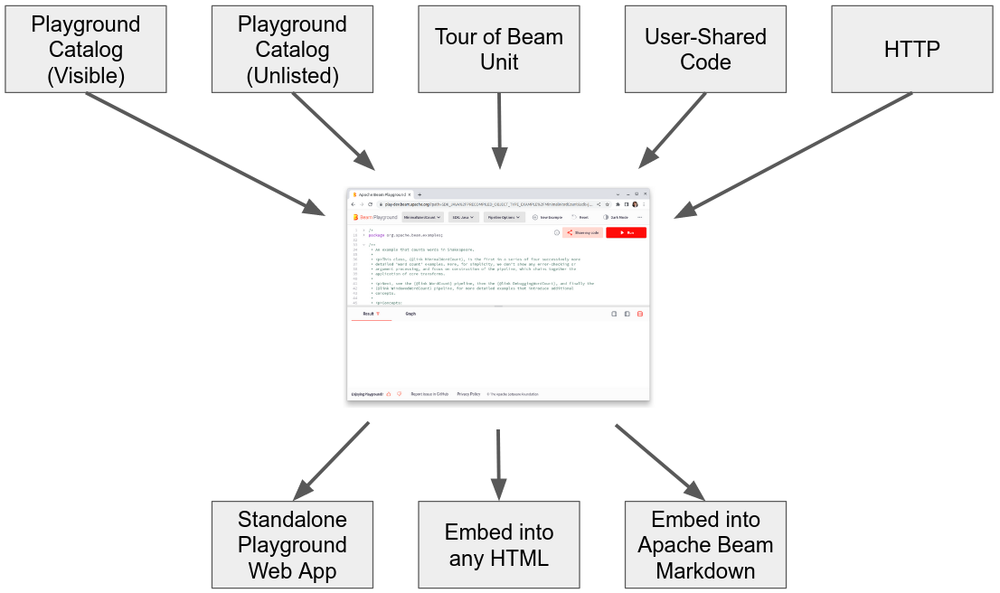

<!--
    Licensed to the Apache Software Foundation (ASF) under one
    or more contributor license agreements.  See the NOTICE file
    distributed with this work for additional information
    regarding copyright ownership.  The ASF licenses this file
    to you under the Apache License, Version 2.0 (the
    "License"); you may not use this file except in compliance
    with the License.  You may obtain a copy of the License at

      http://www.apache.org/licenses/LICENSE-2.0

    Unless required by applicable law or agreed to in writing,
    software distributed under the License is distributed on an
    "AS IS" BASIS, WITHOUT WARRANTIES OR CONDITIONS OF ANY
    KIND, either express or implied.  See the License for the
    specific language governing permissions and limitations
    under the License.
-->

# How to Add an Example/Snippet/Learning Content into Apache Beam Playground

Adding a new example, code snippet or Tour of Beam learning unit into the Playground is a three-step process:

1. Prepare code snippet.
2. Add code snipet to Apache Beam and Playgroud.
3. Create a link to view the code snippet in Playground or to embed in a web site page.


Playground sources and output presentation formats:



The guide will walk through all steps.


# Table of Contents
- [Step 1. Prepare code snippet](#step-1-prepare-code-snippet)
  * [Named Sections](#named-sections)
- [Step 2. Add code snippet to the Apache Beam repo and Playground](#step-2-add-code-snippet-to-the-apache-beam-repo-and-playground)
  * [Source 1. Add an example to Playground Examples Catalog](#source-1-add-an-example-to-playground-examples-catalog)
    + [1. Add the file with example to a directory](#1-add-the-file-with-example-to-a-directory)
    + [2. Add metadata to describe example](#2-add-metadata-to-describe-example)
      - [Kafka emulator](#kafka-emulator)
    + [3. Make a PR](#3-make-a-pr)
    + [4. Save the snippet ID](#4-save-the-snippet-id)
  * [Source 2. Add a snippet](#source-2-add-a-snippet)
  * [Source 3. Add a Tour of Beam unit](#source-3-add-a-tour-of-beam-unit)
  * [Source 4. Add a user-shared snippet](#source-4-add-a-user-shared-snippet)
  * [Source 5. Add a snippet from GitHub or HTTPS URL source](#source-5-add-a-snippet-from-github-or-https-url-source)
- [Step 3. Create a link or embed snippet](#step-3-create-a-link-or-embed-snippet)
  * [Link to a snippet](#link-to-a-snippet)
    + [Link to an example from the Playground Examples Catalog](#link-to-an-example-from-the-playground-examples-catalog)
    + [Link to snippet (unlisted Playground Examples Catalog item)](#link-to-snippet-unlisted-playground-examples-catalog-item)
    + [Link to a Tour of Beam unit](#link-to-a-tour-of-beam-unit)
    + [Link to a user-shared snippet](#link-to-a-user-shared-snippet)
    + [Link to a GitHub or HTTPS URL snippett](#link-to-a-github-or-https-url-snippet)
    + [Link to an empty editor](#link-to-an-empty-editor)
  * [Embedding a snippet into HTMLL](#embedding-a-snippet-into-html)
    + [Embedding a snippet from Playground Examples Catalog](#embedding-a-snippet-from-playground-examples-catalog)
    + [Embedding a user-shared snippet](#embedding-a-user-shared-snippet)
    + [Embedding a snippet from other sources](#embedding-a-snippet-from-other-sources)
    + [Embedding a snippet into the Apache Beam website](#embedding-a-snippet-into-the-apache-beam-website)
  * [Snippet view options](#passing-view-options)
    + [Read-only sections](#read-only-sections)
    + [Folding everything except sections](#folding-everything-except-sections)
    + [Hiding everything except a section](#hiding-everything-except-a-section)
    + [Linking to multiple examples](#linking-to-multiple-examples)


## Step 1. Prepare code snippet

Playground runs example code snippets using Apache Beam Direct Runner and requires that a code snippet is a complete runnable code. Playground provides multiple features to help focus users on certain parts of the code.

Playground automatically applies the following to all snippets:
- Folds a comment if a snippet starts with one.
- Folds imports.

Playground supports *Named Sections* to tag code blocks and provide the following view options:
- Fold all blocks except tagged code blocks. This can be useful to help user focus on specific code blocks and features presented in a snippet.
- Hide all code except tagged code blocks. This can be useful to create runnable snippets illustrating specific concepts or transforms, and hide all non-essential code blocks. Such snippet can be embedded on a website to make examples in documentation and tutorials runnable.
- Make certain code parts read-only. This feature can be useful to create learning units where user modifications are desired only in certain parts of the code.  
Please see [Snippet View Options](#snippet-view-options) section for details how different view options can be used.

If you do not need any of those view options, skip to the [next step](#step-2-commit-you-code-to-directories-loaded-by-playgound-or-other-sources).

### Named Sections

*Named Sections* are defined with the following syntax:

```
// [START section_name]
void method() {
...
}
// [END section_name]
```
Create a named section for each part of your code that you want the above features for. To learn more details about the syntax please see the [README of the editor](https://pub.dev/packages/flutter_code_editor) that Playground uses.

## Step 2. Add code snippet to the Apache Beam repo and Playground
There are several types of code snippets in the Playground:
1. Example - a code snippet displayed in the Playground Examples Catalog. See [how to add a new example here](#source-1-add-an-example-to-playground-examples-catalog).
2. Snippet - a code snippet, that will typically be embedded on a website. Snippets are stored and exucuted by Playground, but not listed in the Examples Catalog. See [how to add a new snippet here](#source-2-add-a-snippet).
3. [Tour of Beam](https://github.com/apache/beam/tree/master/learning/tour-of-beam) learning unit. See [how to add a new Tour of Beam unit here](#source-3-add-a-tour-of-beam-unit).
4. User-shared code snippets - see [how to add a user-shared snippet here](#source-4-add-a-user-shared-snippet).
5. GitHub and HTTPS URL sources - see [how to load a snippet from external GitHub or HTTPS ULR here](#source-5-add-a-snippet-from-github-or-https-url-source).  

### Source 1. Add an example to Playground Examples Catalog

Playground Examples Catalog helps users discover example snippets and is a recommended way to add examples. Playground automatically scans, verifies and deploys example snippets from the directories listed below.

#### 1. Add the file with example to a directory

Playground Java, Python, and Go examples are automatically picked from these predefined directories by the `playground_examples_ci.yml` GitHub workflow after the PR is merged to Beam repo:
- `/examples`
- `/learning/katas`
- `/sdks`.

Addig Scala example snippets automatically is not supported, and Scala example snippets can be added to the catalog manually.

#### 2. Add metadata to describe example

Playground relies on metadata comments block to identify and place an example into the database, and present in the Examples Catalog.
See [this](https://github.com/apache/beam/blob/3e080ff212d8ed7208c8486b515bb73c5d294475/examples/java/src/main/java/org/apache/beam/examples/MinimalWordCount.java#L20-L36) for an example.
Playground automatically removes metadata comments block before storing the example in database and so the metadata is not visible to end users. The block is in the format of a YAML map. 

Example tag metadata quick reference (**required** elements, unless marked **optional**):

| Field                | Description                                      |
| -------------------- | ------------------------------------------------ |
| `beam-playground:` | tag title |
| `name` | string field. Name of the Beam example that will be displayed in the Playground Examples Catalog. |
| `description` | string field. Name of the Beam example that will be displayed in the Playground Examples Catalog. |
| `pipeline_options` | string field (optional). Contains information about pipeline options of the Beam example/test/kata. |
| `context_line` | integer field. The line number to scroll to when the snippet is loaded, line 1 is the line following this metadata tag block. |
| `categories` | list type field. Lists categories this example is included into. Titles of categories to list this snippet in. Non-existent categories will be created. |
| `tags` | list type field. Tags by which this snippet can be found in the Example Catalog. |
| `complexity` | BASIC/MEDIUM/ADVANCED enum. Helps user to identify example's complexity. |
| `default_example` | boolean field (optional). Specifies the example to be loaded as default when its SDE selected in the Playground. Only one example can be set as a default for each SDK. |
| `url_notebook` | string field. If snippet has a Colab notebook, can link the URL of the Colab notebook that is based on this snippet. |
| `multifile` | boolean field. Specifies if the given example consists of multiple files or not. |
| `always_run` | boolean field. Specifies example caching by Playground, by default examples are cached (`False`). |
| `datasets` | enum (optional). Datasets which will be used by emulators. Please see `Dataset` in Tag class model [here](infrastructure/models.py) for reference. |
| `emulators` | list (optional). List of emulators to start during pipeline execution. Currently only `kafka` type is supported. Please see `Emulator` in Tag class model [here](infrastructure/models.py) for reference. |

For metadata reference see fields in "Tag" class [here](infrastructure/models.py).

##### Kafka emulator
Examples which require Kafka server emulator, need to include the `emulator` tag and provide `dataset` in the example's tag. You can refer to an example [here](/examples/java/src/main/java/org/apache/beam/examples/KafkaWordCountJson.java).

1. Add your dataset in either JSON or Avro format into the `playground/backend/datasets` path.

2. Add the following elements to the example's metadata tag:
    ```YAML
    emulators:
      - type: kafka
        topic:
          id: dataset
          source_dataset: <dataset_name>
    datasets:
      <dataset_name>:
        location: local
        format: json # or 'avro'
    ```
    replace `<dataset_name>` with the name of your dataset file without the file name extension.

3. Use exact string `"kafka_server:9092"` as a server name in your code snippet. This string will be replaced by the actual host name and port automatically before the compilation step by Playground.

>**Kafka emulator limitations:** 
> - Playground Kafka emulator currently supports only Beam Java SDK
> - exact string `"kafka_server:9092"` should be present in the code snippet; any other variation like `"kafa_server" + ":9092"` will not work

#### 3. Make a PR

Make a PR with code snippet into [the Apache Beam repository](https://github.com/apache/beam) following the [Contribution guide](https://beam.apache.org/contribute/).
Verify that all pre-commit tests are passing.

Playground CI will verify and deploy the example to Playground Example Catalog when the PR is merged.

#### 4. Save the snippet ID

The snippet will be assigned an ID. You can find it in the address bar of the browser when you select it in the dropdown.

For example, in this URL:

```
https://play.beam.apache.org/?path=SDK_JAVA_MinimalWordCount&sdk=java
```

the ID is: `SDK_JAVA_MinimalWordCount`.

You will need the snippet ID to embed the Playground with snippet into a website page.

### Source 2. Add a snippet

Playground referes to snippets as runnable examples that are prepared in a way to highlight and focus on key concepts, and hides all non-essential code from user. This can be a useful feature to enable runnable examples in documentation, tutorials, and other website-based learning content by displaying just the relevant content while retaining ability to run the snippet. Here is an example how a snippet looks to a user:
TODO: embed an example

Snippets can be added to Playground Examples Catalog with `TODO: unlisted` tag - this is the recommended method for snippets for the Apache Beam website documentation. Advantages:
- Apache Beam repository CI will verify the snippet builds and runs correctly.
- Playground Example Catalog caches the snippet graph and output reducing load time for users.

Proceed the same way as with [Source 1. Playground Examples Catalog](#source-1-add-an-example-to-playground-examples-catalog) except:
1. Use the directory... **TODO**
2. Use an empty list for `categories` attribute: `categories: []`
3. Do not use the following attributes:
   - `default_example`
   - `tags`

The ID of the snippet is a function of the SDK and the `name` attribute from its metadata:

| SDK | ID |
| --- | --- |
| Go | SDK_GO_name |
| Java | SDK_JAVA_name |
| Python | SDK_PYTHON_name |   

**TODO: add example of the name for snippet**

### Source 3. Add a Tour of Beam unit

To add a snippet for a Tour of Beam tutorial, you can add it there as a learning unit. This also requires a textual learning material that your snippet will accompany.

Advantages:

- Anyone can find your snippet in the Tour of Beam tutorial.
- The CI of the Beam repository guarantees your snippet builds and runs correctly.
- Output and graph are cached so the viewers of your snippet will not wait when they run it.

Proceed the same way as with [Source 1. Playground Examples Catalog](#source-1-add-an-example-to-playground-examples-catalog) except:

1. Use the directory `/learning/tour-of-beam/learning-content`
2. Use an empty list for `categories` attribute: `categories: []`
3. Do not use the following attributes:
   - `default_example`
   - `tags`

The ID of the snippet is a function of the SDK and the `name` attribute from its metadata:

| SDK | ID |
| --- | --- |
| Go | TB_EXAMPLES_SDK_GO_name |
| Java | TB_EXAMPLES_SDK_JAVA_name |
| Python | TB_EXAMPLES_SDK_PYTHON_name |

### Source 4. Add a user-shared snippet

Code snippet can be saved to the Playground using **"Share my code"** button in the Playground:


Advantages:

- Easy to use.
- Fast.

>**Share my code** considerations: 
> - A user-shared snippet is immutable. If you edit the code and re-share, a new snippet and link will be generated.
> - Playground automatically applies a 3-month retention policy to shared snippets that are not used. To request a deletion of a snippet, please send an email to [dev@beam.apache.org](mailto:dev@beam.apache.org?subject=[Playground]%20Delete%20a%20snippet) with subject: [Playground] Delete a snippet.
> - Playground does not cache output or graph for user-shared snippets.
> - Playgrount does not verify user-shared snippets.

### Source 5. Add a snippet from GitHub or HTTPS URL source

Playground can load a snippet stored on an HTTPS server using the provided URL, including GitHub direct links to raw file content.

Advantages:
- Easy to use.
- Fast.
- Snipet can be updated without changing a link.

>Loading snippet from HTTPS URL considerations: 
> - Playground does not cache output or graph for HTTPS URL snippets.
> - Playground does not verify HTTPS URL snippets.


For Playground to be able to load the snippet over HTTPS, the HTTPS server needs to allow the access by sending the following header:

```
Access-Control-Allow-Origin: *
```

at least when requested with `*.beam.apache.org` as
[`referer`](https://developer.mozilla.org/en-US/docs/Web/HTTP/Headers/Referer).

This is realated to Cross-Origin Resource Sharing (CORS), to read more about CORS please see
[CORS (Cross-Origin Resource Sharing)](https://developer.mozilla.org/en-US/docs/Web/HTTP/CORS).

Many prefer to host code snippets in their GitHub repositories. GitHub is known to allow cross-origin access on direct links to raw file content. Example loading a GitHub snippet:
```
https://play.beam.apache.org/?sdk=go&url=https://raw.githubusercontent.com/apache/beam-starter-go/main/main.go
```
TODO: verify link above to load a Beam pipeline from an GitHub repo

## Step 3. Create a link or embed snippet

Once you have uploaded your code snippet to Playground, the snippet can be shown in the Playground.
Choose any of the following ways.

### Link to a snippet
#### Link to an example from the Playground Examples Catalog

1. Open your snippet in the dropdown menu.
2. Without changing it, click "Share my code".
3. Copy the link.

The link contains the `path` to your snippet in the database. It is in the following format:
```
https://play.beam.apache.org/?path=SDK_JAVA_MinimalWordCount&sdk=java
```

A special case is the default snippet for an SDK. It can be loaded by the following link:

```
`https://play.beam.apache.org/?sdk=python&default=true`
```

This way if another snippet is ever made default, the links you shared will lead
to the new snippet.

#### Link to snippet (`unlisted` Playground Examples Catalog item)

Link to a snippet can be constucted by providing your snippet ID and SDK in the following URL:
```
https://play.beam.apache.org/?path=ID&sdk=SDK
```

The ID of the snippet is a function of the SDK and the `name` attribute from its metadata:

| SDK | ID |
|---|---|
| Go | SDK_GO_name |
| Java | SDK_JAVA_name |
| Python | SDK_PYTHON_name |

**TODO: add example of the name for snippet**


#### Link to a Tour of Beam unit

Link to a snippet can be constucted by providing your snippet ID and SDK in the following URL:
```
https://play.beam.apache.org/?path=ID&sdk=SDK
```

The ID of the snippet is a function of the SDK and the `name` attribute from its metadata:

| SDK | ID |
|---|---|
| Go | TB_EXAMPLES_SDK_GO_name |
| Java | TB_EXAMPLES_SDK_JAVA_name |
| Python | TB_EXAMPLES_SDK_PYTHON_name |

**TODO: add example of the name for snippet**

#### Link to a user-shared snippet

You get the link when you click "Share my code" button. It is in the following format:

```
https://play.beam.apache.org/?sdk=java&shared=SNIPPET_ID
```

#### Link to a GitHub or HTTPS URL snippet

Add the URL to the `url` parameter, for example:

```
https://play.beam.apache.org/?sdk=go&url=https://raw.githubusercontent.com/apache/beam-starter-go/main/main.go
```

#### Link to an empty editor

You can link to an empty editor to make your users start their snippets from scratch:

```
https://play.beam.apache.org/?sdk=go&empty=true
```


### Embedding a snippet into HTML
Embedded Playground is a simplified interface of the Playground web app designed to be embedded into an `<iframe>` in web pages. It supports most of the Playground web app features. The embedded Playground URLs start with `https://play.beam.apache.org/embedded` and use the same query string parameters as the Playground web app. Additionally the Embedded playground supports `editable=0` parameter to make the editor read-only.

#### Embedding a snippet from Playground Examples Catalog

1. Open your snippet in the dropdown menu.
2. Without changing it, click "Share my code".
3. Go to "Embed" tab.
4. Copy the HTML code and add to your web page.

#### Embedding a user-shared snippet

1. Open your code by the link that you got when you shared it.
2. Again click "Share my code".
3. Go to "Embed" tab.
4. Copy the HTML code and add to your web page.

#### Embedding a snippet from other sources

1. Follow the instructions to [get a link](#link-to-an-example-from-the-playground-examples-catalog) to your code.
2. Optionally make the link to the Embedded Playground by replacing `play.beam.apache.org/?...`
   with `play.beam.apache.org/embedded?...` because the embedded interface is simpler.
3. Insert this link into an `<iframe>` HTML element as follows:

```html
<iframe
  src="https://play.beam.apache.org/embedded?sdk=go&url=https://raw.githubusercontent.com/apache/beam-starter-go/main/main.go"
  width="90%"
  height="600px"
  allow="clipboard-write"
/>
```

### Embedding a snippet into the Apache Beam website

Apache Beam website uses [Hugo Markdown preprocessor](https://gohugo.io). Custom Hugo shortcodes were added to Apache Beam website to embed Playground snippets. Use the custom shortcodes to embed Playground into the Apache Beam website:

- `playground` shortcode, see [this comment](https://github.com/apache/beam/blob/master/website/www/site/layouts/shortcodes/playground.html) for a complete example.
- `playground_snippet` shortcode, see [this comment](https://github.com/apache/beam/blob/master/website/www/site/layouts/shortcodes/playground_snippet.html) for all supported options.

These shortcodes generate an `iframe` with the URLs described above.

## Snippet view options

If your code contains named sections as described in the [Step 1. Prepare Your Code](#step-1-prepare-your-code), you can apply view options to those sections. Otherwise skip this.

### Read-only sections

Add `readonly` parameter with comma-separated section names:

`https://play.beam.apache.org/?sdk=go&url=https://raw.githubusercontent.com/GoogleCloudPlatform/golang-samples/main/iam/snippets/roles_get.go&readonly=iam_get_role`

### Folding everything except named sections

Add `unfold` parameter with comma-separated section names:

`https://play.beam.apache.org/?sdk=go&url=https://raw.githubusercontent.com/GoogleCloudPlatform/golang-samples/main/iam/snippets/roles_get.go&unfold=iam_get_role`

This folds all foldable blocks that do not overlap with any of the given sections.

### Hiding everything except a named section

Add `show` parameter with a single section name:

`https://play.beam.apache.org/?sdk=go&url=https://raw.githubusercontent.com/GoogleCloudPlatform/golang-samples/main/iam/snippets/roles_get.go&show=iam_get_role`

It is still the whole snippet that is sent for execution although only the given section is visible.

This also makes the editor read-only so the user cannot add code that conflicts with the hidden text.

### Linking to multiple examples

The above URLs load a snippet that you want. But what happens if the user switches SDK? Normally this will be shown:
- The catalog default example for the new SDK in the Standalone Playground.
- The empty editor for the new SDK in the Embedded Playground.

This can be changed by linking to multiple examples, up to one per SDK.

For this purpose, make a JSON array with any combination of parameters that
are allowed for loading single examples, for instance:

```json
[
  {
    "sdk": "java",
    "path": "SDK_JAVA_AggregationMax"
  },
  {
    "sdk": "go",
    "url": "https://raw.githubusercontent.com/GoogleCloudPlatform/golang-samples/main/iam/snippets/roles_get.go",
    "readonly": "iam_get_role"
  }
]
```

Then pass it in`examples` query parameter like this:

`https://play.beam.apache.org/?sdk=go&examples=[{"sdk":"java","path":"SDK_JAVA_AggregationMax"},{"sdk":"go","url":"https://raw.githubusercontent.com/GoogleCloudPlatform/golang-samples/main/iam/snippets/roles_get.go","readonly":"iam_get_role"}]`

This starts with the Go example loaded from the URL. If SDK is then switched to Java, the `AggregationMax` catalog example is loaded for it. If SDK is switched to any other one, the default example for that SDK is loaded because no override was provided.
