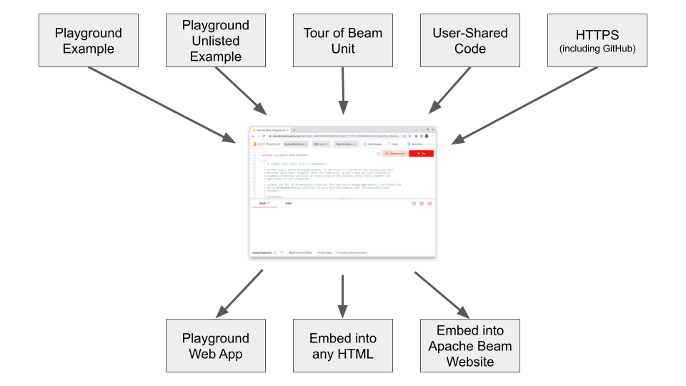

<!--
    Licensed to the Apache Software Foundation (ASF) under one
    or more contributor license agreements.  See the NOTICE file
    distributed with this work for additional information
    regarding copyright ownership.  The ASF licenses this file
    to you under the Apache License, Version 2.0 (the
    "License"); you may not use this file except in compliance
    with the License.  You may obtain a copy of the License at

      http://www.apache.org/licenses/LICENSE-2.0

    Unless required by applicable law or agreed to in writing,
    software distributed under the License is distributed on an
    "AS IS" BASIS, WITHOUT WARRANTIES OR CONDITIONS OF ANY
    KIND, either express or implied.  See the License for the
    specific language governing permissions and limitations
    under the License.
-->

# How to Add an Example/Snippet/Learning Content into Apache Beam Playground

Adding a new example, code snippet, or Tour of Beam learning unit into the Playground is a three-step process:

1. Prepare a code snippet.
2. Add the code snippet to Apache Beam and/or Playground.
3. Create a link to view the code snippet in Playground or to embed in a website page.


Playground sources and output presentation formats:



This guide will walk through all steps.


# Table of Contents

- [Step 1. Prepare a code snippet](#step-1-prepare-a-code-snippet)
  * [Code snippet data sources and dependencies](#code-snippet-data-sources-and-dependencies)
  * [Emphasizing parts of code](#emphasizing-parts-of-code)
  * [Named Sections](#named-sections)
- [Step 2. Add the code snippet to the Apache Beam repo and/or Playground](#step-2-add-the-code-snippet-to-the-apache-beam-repo-andor-playground)
  * [Source 1. How to add an example to Playground Examples Catalog](#source-1-how-to-add-an-example-to-playground-examples-catalog)
    + [1. Add the file with example to a directory](#1-add-the-file-with-example-to-a-directory)
    + [2. Add metadata to describe example](#2-add-metadata-to-describe-the-example)
      - [Kafka emulator](#kafka-emulator)
    + [3. Submit a PR](#3-submit-a-pr)
    + [4. Save the snippet ID](#4-save-the-snippet-id)
  * [Source 2. How to add an unlisted example to Playground](#source-2-how-to-add-an-unlisted-example-to-playground)
  * [Source 3. How to add a Tour of Beam unit](#source-3-how-to-add-a-tour-of-beam-unit)
  * [Source 4. How to add a snippet with the app alone](#source-4-how-to-add-a-snippet-with-the-app-alone)
  * [Source 5. How to load code from GitHub or other HTTPS URL](#source-5-how-to-load-code-from-github-or-other-https-url)
- [Step 3. Create a link or embed the snippet](#step-3-create-a-link-or-embed-the-snippet)
  * [Link to a snippet](#link-to-a-snippet)
    + [Link to an example from the Playground Examples Catalog](#link-to-an-example-from-the-playground-examples-catalog)
    + [Link to an unlisted example](#link-to-an-unlisted-example)
    + [Link to a snippet from a Tour of Beam unit](#link-to-a-snippet-from-a-tour-of-beam-unit)
    + [Link to a user-shared snippet](#link-to-a-user-shared-snippet)
    + [Link to a GitHub or HTTPS URL snippet](#link-to-a-github-or-other-https-url-snippet)
    + [Link to an empty editor](#link-to-an-empty-editor)
  * [Link to multiple snippets](#link-to-multiple-snippets)
  * [Embedding a snippet into HTML](#embedding-a-snippet-into-html)
    + [Embedding a snippet from Playground Examples Catalog](#embedding-a-snippet-from-playground-examples-catalog)
    + [Embedding a user-shared snippet](#embedding-a-user-shared-snippet)
    + [Embedding a snippet from other sources](#embedding-a-snippet-from-other-sources)
  * [Embedding a snippet into the Apache Beam website](#embedding-a-snippet-into-the-apache-beam-website)
- [Snippet view options](#snippet-view-options)
  * [Read-only sections](#read-only-sections)
  * [Folding everything except named sections](#folding-everything-except-named-sections)
  * [Hiding everything except a named section](#hiding-everything-except-a-named-section)


## Step 1. Prepare a code snippet

Playground runs example code snippets using Apache Beam Direct Runner
and requires that a code snippet is a complete runnable code.

### Code snippet data sources and dependencies

Code snippets can use data sources to demonstrate transforms and concepts. Playground restricts code access to Internet for security reasons. Following are the recommend ways for code snippet's data sources and dependecies:

| Source/Dependency   | Notes                                                     |
|----------|-----------------------------------------------------------|
| File     | Store code snippet's data file in a GCS bucket in `apache-beam-testing` project.     |
| BigQuery | Create a BigQuery dataset/table in `apache-beam-testing` project. |
| Python package | Python packages accessible by Playground are located in a [Beam Python SDK container](https://github.com/apache/beam/tree/master/sdks/python/container) and in [Playground Python container](https://github.com/apache/beam/tree/master/playground/backend/containers/python). Add required packages to [Playground Python container](https://github.com/apache/beam/tree/master/playground/backend/containers/python). Please submit pull request with changes to the container or contact [dev@beam.apache.org](mailto:dev@beam.apache.org)   |
| GitHub repo | If your example clones or dependes on files in a GitHub repo, copy required files to a GCS bucket in `apache-beam-testing` project and use the GCS files. |


### Emphasizing parts of code

Playground provides multiple features to help focus users on certain parts of the code.

Playground automatically applies the following to all snippets:
- Folds a comment if a snippet starts with one.
- Folds imports.

### Named Sections

Playground supports *Named Sections* to tag code blocks and provide the following view options:
- Fold all blocks except tagged code blocks.
  This can be useful to help user focus on specific code blocks and features presented in a snippet.
- Hide all code except tagged code blocks.
  This can be useful to create runnable snippets illustrating specific concepts or transforms,
  and hide all non-essential code blocks.
  Such snippet can be embedded on a website to make examples in documentation and tutorials runnable.
- Make certain code parts read-only.
  This feature can be useful to create learning units where user modifications are desired
  only in certain parts of the code.

Please see [Snippet View Options](#snippet-view-options) section for details how different view options can be used.

If you do not need any of those view options, skip to the [next step](#step-2-add-the-code-snippet-to-the-apache-beam-repo-andor-playground).

*Named Sections* are defined with the following syntax:

```
// [START section_name]
void method() {
...
}
// [END section_name]
```

Create a named section for each part of your code that you want the above features for.
To learn more details about the syntax please see
the [README of the editor](https://pub.dev/packages/flutter_code_editor) that Playground uses.

## Step 2. Add the code snippet to the Apache Beam repo and/or Playground

There are several types of code snippets in the Playground:

1. Example — a code snippet displayed in the Playground Examples Catalog.
   See [how to add a new example here](#source-1-how-to-add-an-example-to-playground-examples-catalog).
2. Unlisted Example — the same as an example, but is not listed in the example dropdown
   and can only be accessed by direct linking. These are typically embedded on a website.
   See [how to add a new unlisted example here](#source-2-how-to-add-an-unlisted-example-to-playground).
3. [Tour of Beam](https://github.com/apache/beam/tree/master/learning/tour-of-beam) learning unit.
   See [how to add a new Tour of Beam unit here](#source-3-how-to-add-a-tour-of-beam-unit).
4. User-shared code snippets do not require a PR and should be used for code
   not displayed on Beam resources.
   See [how to add a snippet with the app alone here](#source-4-how-to-add-a-snippet-with-the-app-alone).
5. GitHub or other HTTPS URL sources.
   See [how to load a snippet from external GitHub or other HTTPS URL here](#source-5-how-to-load-code-from-github-or-other-https-url).

See the [workflow above](#how-to-add-an-examplesnippetlearning-content-into-apache-beam-playground) how artifacts map to these sources.

### Source 1. How to add an example to Playground Examples Catalog

Playground Examples Catalog helps users discover example snippets
and is the recommended way to add examples. Playground automatically scans,
verifies and deploys example snippets from the directories listed below.

> **Note:** SCIO examples are stored in a separate repository. To add support for a new SCIO example, please refer to [this section of `TASKS.md`](TASKS.md#obtaining-scio-examples).

#### 1. Add the file with example to a directory

Playground Java, Python, and Go examples are automatically picked from these
predefined directories by the `playground_examples_ci.yml` GitHub workflow
after a PR is merged to Beam repo:
- `/examples`
- `/learning/katas`
- `/sdks`.

Adding Scala example snippets automatically is not supported,
and Scala example snippets can be added to the catalog manually.

#### 2. Add metadata to describe the example

Playground relies on metadata comments block to identify and place an example into the database,
which is required for an example to show in the Examples Catalog.
See [this](https://github.com/apache/beam/blob/3e080ff212d8ed7208c8486b515bb73c5d294475/examples/java/src/main/java/org/apache/beam/examples/MinimalWordCount.java#L20-L36) for an example.
Playground automatically removes metadata comments block before storing the example in database,
so the metadata is not visible to end users. The block is in the format of a YAML map:

```yaml
beam-playground:
  # Name of the Beam example that will be displayed in the Playground Examples Catalog. Required.
  name: ""
  # Description of the Beam example that will be displayed in the Playground Examples Catalog. Required.
  description: ""
  # Contains information about pipeline options of the Beam example/test/kata. Optional.
  pipeline_options: "--name1 value1 --name2 value2"
  # The line number to scroll to when the snippet is loaded.
  # Note that lines of the metadata block are cut so line numbers after it are shifted.
  # Optional, defaults to 1 (the first line).
  context_line: 1
  # Categories this example is included into. See below for the supported values.
  # Optional, defaults to no categories making the example unlisted.
  categories:
    - "Combiners"
    - "Core Transforms"
  # Tags by which this snippet can be found in the Example Catalog. Optional.
  tags:
    - "numbers"
    - "count"
  # Helps user to identify example's complexity. Values: BASIC|MEDIUM|ADVANCED. Required.
  complexity: BASIC
  # Specifies the example to be loaded as default when its SDK selected in the Playground.
  # See section "Default examples" below. Optional, defaults to false.
  default_example: true
  # If the snippet has a Colab notebook, can link the URL of the Colab notebook that is based on this snippet.
  url_notebook: "https://colab.research.google.com/github/apache/beam/blob/master/examples/notebooks/documentation/transforms/python/elementwise/filter-py.ipynb"
  # Specifies if the given example consists of multiple files or not. Optional, defaults to false.
  multifile: true
  # Specifies example caching by Playground. Optional, defaults to false (the output is cached).
  always_run: true
  # Datasets which will be used by emulators. Optional.
  # Please see section "Kafka emulator" for more information.
  datasets:
    # Dataset name
    CountWords:
      # Dataset location. Only "local" is supported. Required.
      location: local
      # Dataset format. Supported values are "avro" and "json". Required.
      format: avro
  # List of emulators to start during pipeline execution. Currently only `kafka` type is supported. Optional.
  emulators:
     - type: kafka
       topic:
         # Dataset id. Will be used as a topic name.
         id: dataset
         # Name of dataset specified in "datasets" section.
         source_dataset: "CountWords"
```

For metadata reference, see the fields in the `Tag` class [here](infrastructure/models.py).

##### Categories

The list of supported categories for an example is
[here](https://github.com/apache/beam/blob/master/playground/categories.yaml).
To add a new category, submit a PR that adds a category to the [categories.yaml](https://github.com/apache/beam/blob/master/playground/categories.yaml).
When it is merged, the new category can be used in an example.

##### Default examples

Each SDK must have a single default example.
If there is none, the user will see an error in the app and a blank editor.
If there are more than one, it is not defined which one will be selected.

##### Kafka emulator

Examples which require Kafka server emulator need to include the `emulators` tag
and provide `dataset` in the example's tag. You can refer to an example
[here](/examples/java/src/main/java/org/apache/beam/examples/KafkaWordCountJson.java).

1. Add your dataset in either JSON or Avro format into the `playground/backend/datasets` path.

2. Add the following elements to the example's metadata tag:
    ```YAML
    emulators:
      - type: kafka
        topic:
          id: dataset
          source_dataset: <dataset_name>
    datasets:
      <dataset_name>:
        location: local
        format: json # or 'avro'
    ```
    replace `<dataset_name>` with the name of your dataset file without the file name extension.

3. Use the exact string `"kafka_server:9092"` as the server name in your code snippet.
   This string will be replaced by the actual host name and port automatically
   before the compilation step by Playground.

>**Kafka emulator limitations:**
> - Playground Kafka emulator currently supports only Beam Java SDK.
> - The exact string `"kafka_server:9092"` should be present in the code snippet;
    any other variation like `"kafa_server" + ":9092"` will not work.

#### 3. Submit a PR

Create and submit a PR with the code snippet into [the Apache Beam repository](https://github.com/apache/beam)
following the [Contribution guide](https://beam.apache.org/contribute/).
Verify that all pre-commit tests are passing.

Playground CI will verify and deploy the example to Playground Example Catalog when the PR is merged.

#### 4. Save the snippet ID

The snippet will be assigned an ID.
You can find it in the address bar of the browser when you select it in the dropdown.

For example, in this URL:

```
https://play.beam.apache.org/?path=SDK_JAVA_MinimalWordCount&sdk=java
```

the ID is: `SDK_JAVA_MinimalWordCount`.

You will need the snippet ID to embed the Playground with the snippet into a website page.

### Source 2. How to add an unlisted example to Playground

Not all examples must be visible in the example dropdown.
Some examples are best in the context of Apache Beam documentation.
To embed them into the documentation, use unlisted examples.
They work and are checked and cached the same way as the examples displayed in the Playground catalog.

Proceed the same way as with [Source 1. Playground Examples Catalog](#source-1-how-to-add-an-example-to-playground-examples-catalog) except:
1. Use the directory `/learning/beamdoc`
2. Do not use the following attributes:
   - `categories`
   - `default_example`
   - `tags`

The ID of the snippet is a function of the SDK and the `name` attribute from its metadata:

| SDK    | ID              |
|--------|-----------------|
| Go     | SDK_GO_name     |
| Java   | SDK_JAVA_name   |
| Python | SDK_PYTHON_name |

### Source 3. How to add a Tour of Beam unit

"Tour of Beam" is a separate project that combines learning materials with runnable snippets
and allows students to track their learning progress.
It uses the Playground engine, and so its content is added in a similar way.

A Tour of Beam unit consists of learning materials and an optional runnable snippet.
See [the learning content README](../learning/tour-of-beam/learning-content/README.md) on how to add units and link snippets to them.

#### Adding a snippet

Tour of Beam snippets are checked and cached the same way as Playground examples.

Proceed the same way as with [Source 1. Playground Examples Catalog](#source-1-how-to-add-an-example-to-playground-examples-catalog) except:

1. Use the directory `/learning/tour-of-beam/learning-content`.
   It is recommended to follow the directory hierarchy as described in
   [the learning content README](../learning/tour-of-beam/learning-content/README.md).
2. Do not use the following attributes:
   - `categories`
   - `default_example`
   - `tags`

The ID of the snippet is a function of the SDK and the `name` attribute from its metadata:

| SDK    | ID                          |
|--------|-----------------------------|
| Go     | TB_EXAMPLES_SDK_GO_name     |
| Java   | TB_EXAMPLES_SDK_JAVA_name   |
| Python | TB_EXAMPLES_SDK_PYTHON_name |

For instance, for the Go the example `CSV` it is `TB_EXAMPLES_SDK_GO_CSV`.

### Source 4. How to add a snippet with the app alone

A code snippet can be saved to the Playground using **"Share my code"** button in the Playground:


This is easy and fast. It does not require any interaction with the Beam team.

>**Share my code** considerations:
> - A user-shared snippet is immutable.
    If you edit the code and re-share, a new snippet and a new link will be generated.
> - Playground automatically applies a 3-month retention policy to shared snippets that are not used.
    To request a deletion of a snippet, please send an email to
    [dev@beam.apache.org](mailto:dev@beam.apache.org?subject=[Playground]%20Delete%20a%20snippet)
    with subject: *[Playground] Delete a snippet*.
> - Playground does not cache output or graph for user-shared snippets.
> - Playground does not verify user-shared snippets.

### Source 5. How to load code from GitHub or another HTTPS URL

Playground can load a snippet stored on an HTTPS server using the provided URL,
including GitHub direct links to raw file content.

This is as easy and fast as using *Share my code* button, but also allows you to modify a snippet
after it is published without changing a link.

>Loading snippet from HTTPS URL considerations:
> - Playground does not cache output or graph for HTTPS URL snippets.
> - Playground does not verify HTTPS URL snippets.

#### Cross-Origin Resource Sharing

For Playground to be able to load the snippet over HTTPS, the HTTPS server needs to allow
the access by sending the following header:

```
Access-Control-Allow-Origin: *
```

at least when requested with `*.beam.apache.org` as
[`referer`](https://developer.mozilla.org/en-US/docs/Web/HTTP/Headers/Referer).

This is related to Cross-Origin Resource Sharing (CORS), to read more about CORS please see
[CORS (Cross-Origin Resource Sharing)](https://developer.mozilla.org/en-US/docs/Web/HTTP/CORS).

Many prefer to host code snippets in their GitHub repositories.
GitHub is known to allow cross-origin access on direct links to raw file content.
An example of loading a GitHub snippet:

```
https://play.beam.apache.org/?sdk=go&url=https://raw.githubusercontent.com/apache/beam-starter-go/main/main.go
```

## Step 3. Create a link or embed the snippet

The snippet can now be shown in the Playground.
Choose any of the following ways.

### Link to a snippet

#### Link to an example from the Playground Examples Catalog

1. Open your snippet in the dropdown menu.
2. Without changing it, click "Share my code".
3. Copy the link.

The link contains the `path` to your snippet in the database. It is in the following format:
```
https://play.beam.apache.org/?path=SDK_JAVA_MinimalWordCount&sdk=java
```

A special case is the default snippet for an SDK. It can be loaded by the following link:

```
https://play.beam.apache.org/?sdk=python&default=true
```

This way if another snippet is ever made default, the links you shared will lead
to the new snippet.

#### Link to an unlisted example

Link to an unlisted example can be constructed by providing your snippet ID and SDK in the following URL:
```
https://play.beam.apache.org/?path=<ID>&sdk=<SDK>
```

The ID of the snippet is a function of the SDK and the `name` attribute from its metadata:

| SDK    | ID              |
|--------|-----------------|
| Go     | SDK_GO_name     |
| Java   | SDK_JAVA_name   |
| Python | SDK_PYTHON_name |

#### Link to a snippet from a Tour of Beam unit

Link to a snippet can be constructed by providing your snippet ID and SDK in the following URL:
```
https://play.beam.apache.org/?path=<ID>&sdk=<SDK>
```

The ID of the snippet is a function of the SDK and the `name` attribute from its metadata:

| SDK    | ID                          |
|--------|-----------------------------|
| Go     | TB_EXAMPLES_SDK_GO_name     |
| Java   | TB_EXAMPLES_SDK_JAVA_name   |
| Python | TB_EXAMPLES_SDK_PYTHON_name |

For instance, for the Go the example `CSV` it is `TB_EXAMPLES_SDK_GO_CSV`, and the link is
```
https://play.beam.apache.org/?path=TB_EXAMPLES_SDK_GO_CSV&sdk=go
```

#### Link to a user-shared snippet

You get the link when you click "Share my code" button. It is in the following format:

```
https://play.beam.apache.org/?sdk=java&shared=SNIPPET_ID
```

#### Link to a GitHub or other HTTPS URL snippet

Add the URL to the `url` parameter, for example:

```
https://play.beam.apache.org/?sdk=go&url=https://raw.githubusercontent.com/apache/beam-starter-go/main/main.go
```

#### Link to an empty editor

You can link to an empty editor to make your users start their snippets from scratch:

```
https://play.beam.apache.org/?sdk=go&empty=true
```

### Link to multiple snippets

The above URLs load snippets that you want. But what happens if the user switches SDK? Normally this will be shown:
- The catalog default example for the new SDK.
- The empty editor for the new SDK if the Playground is embedded.

This can be changed by linking to multiple examples, up to one per SDK.

For this purpose, make a JSON array with any combination of parameters that
are allowed for loading single examples, for instance:

```json
[
  {
    "sdk": "java",
    "path": "SDK_JAVA_AggregationMax"
  },
  {
    "sdk": "go",
    "url": "https://raw.githubusercontent.com/apache/beam-starter-go/main/main.go"
  }
]
```

Then pass it in`examples` query parameter like this:

`https://play.beam.apache.org/?sdk=go&examples=[{"sdk":"java","path":"SDK_JAVA_AggregationMax"},{"sdk":"go","url":"https://raw.githubusercontent.com/apache/beam-starter-go/main/main.go"}]`

This starts with the Go example loaded from the URL.
If SDK is then switched to Java, the `AggregationMax` catalog example is loaded for it.
If SDK is switched to any other one, the default example for that SDK is loaded, because no override was provided.


### Embedding a snippet into HTML

Embedded Playground is a simplified interface of the Playground web app designed to be embedded
into an `<iframe>` in web pages. It supports most of the Playground web app features.
The embedded Playground URLs start with `https://play.beam.apache.org/embedded`
and use the same query string parameters as the Playground web app.
Additionally, the Embedded playground supports `editable=0` parameter to make the editor read-only.

#### Embedding a snippet from Playground Examples Catalog

1. Open your snippet in the dropdown menu.
2. Without changing it, click "Share my code".
3. Go to "Embed" tab.
4. Copy the HTML code and add to your web page.

#### Embedding a user-shared snippet

1. Open your code by the link that you got when you shared it.
2. Again click "Share my code".
3. Go to "Embed" tab.
4. Copy the HTML code and add to your web page.

#### Embedding a snippet from other sources

1. Follow the instructions to [get a link](#link-to-an-example-from-the-playground-examples-catalog) to your code.
2. Optionally make the link to the Embedded Playground by replacing `play.beam.apache.org/?...`
   with `play.beam.apache.org/embedded?...` because the embedded interface is simpler.
3. Insert this link into an `<iframe>` HTML element as follows:

```html
<iframe
  src="https://play.beam.apache.org/embedded?sdk=go&url=https://raw.githubusercontent.com/apache/beam-starter-go/main/main.go"
  width="90%"
  height="600px"
  allow="clipboard-write"
/>
```

### Embedding a snippet into the Apache Beam website

Apache Beam website uses [Hugo Markdown preprocessor](https://gohugo.io).
Custom Hugo shortcodes were added to Apache Beam website to embed Playground snippets.
Use the custom shortcodes to embed Playground into the Apache Beam website:

- `playground` shortcode, see [this comment](https://github.com/apache/beam/blob/master/website/www/site/layouts/shortcodes/playground.html) for a complete example.
- `playground_snippet` shortcode, see [this comment](https://github.com/apache/beam/blob/master/website/www/site/layouts/shortcodes/playground_snippet.html) for all supported options.

These shortcodes generate an `iframe` with the URLs described above.

## Snippet view options

If your code contains named sections as described in the
[Step 1. Prepare a code snippet](#step-1-prepare-a-code-snippet),
you can apply view options to those sections. Otherwise skip this.

### Read-only sections

Add `readonly` parameter with comma-separated section names:

`https://play.beam.apache.org/?sdk=go&url=...&readonly=section_name`

### Folding everything except named sections

Add `unfold` parameter with comma-separated section names:

`https://play.beam.apache.org/?sdk=go&url=...&unfold=section_name`

This folds all foldable blocks that do not overlap with any of the given sections.

### Hiding everything except a named section

Add `show` parameter with a single section name:

`https://play.beam.apache.org/?sdk=go&url=...&show=section_name`

It is still the whole snippet that is sent for execution, although only the given section is visible.

This also makes the editor read-only so the user cannot add code that conflicts with the hidden text.
