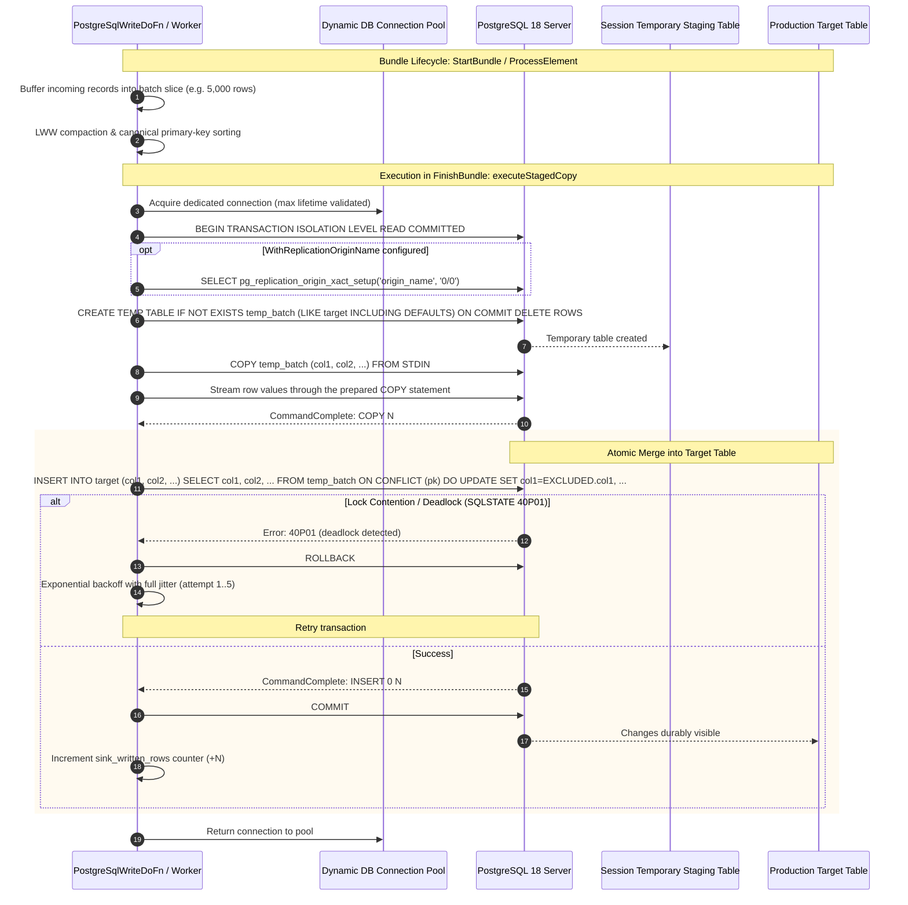

<!--
    Licensed to the Apache Software Foundation (ASF) under one
    or more contributor license agreements.  See the NOTICE file
    distributed with this work for additional information
    regarding copyright ownership.  The ASF licenses this file
    to you under the Apache License, Version 2.0 (the
    "License"); you may not use this file except in compliance
    with the License.  You may obtain a copy of the License at

      http://www.apache.org/licenses/LICENSE-2.0

    Unless required by applicable law or agreed to in writing,
    software distributed under the License is distributed on an
    "AS IS" BASIS, WITHOUT WARRANTIES OR CONDITIONS OF ANY
    KIND, either express or implied.  See the License for the
    specific language governing permissions and limitations
    under the License.
-->

# Contributing to Apache Beam Go `postgresio`

This guide details the system architecture, design invariants, cross-language expansion conventions, and testing protocols for contributors to the Apache Beam Go PostgreSQL I/O connector (`postgresio`).

---

## 1. System Architecture & Lifecycle Diagrams

The Go PostgreSQL connector provides a high-throughput runtime engine:
1. **Staged COPY Upsert Engine**: Session-scoped staging tables loaded with `COPY ... FROM STDIN`, then applied to the target with an atomic `ON CONFLICT` merge.

### 1.1 High-Throughput Staged COPY Upsert Engine



---

## 2. Engineering Invariants & Coding Guidelines

1. **Pure Go Without JNI or JVM Wrappers**:
   The Go connector is completely self-contained (`CGO_ENABLED=0` invariant). It does not require a Java runtime or expansion service for native Go pipelines.
2. **Upstream Database Guardrails**:
   * Connection pool bounding: `WriteOptions.MaxConnections` defaults to 2 per worker to eliminate connection exhaustion under large worker autoscaling.
   * Last-Write-Wins (LWW) compaction & primary key sorting: Prevents duplicate updates and eliminates PostgreSQL `40P01` deadlock errors on concurrent batches.
   * Dynamic IAM Token Expiration: Pooled connections enforce token lifetime limits to renew short-lived cloud credentials before socket expiration.
3. **Factual and Objective Tone**:
   Documentation, code comments, commit messages, and PR descriptions must remain strictly factual, describing concrete engineering behaviors, algorithms, and latency/throughput metrics without promotional modifiers.

---

## 3. Local Development & Testing

### Prerequisites
* Go 1.21 or higher
* Docker or native PostgreSQL 15–18
* Git

### Unit & Integration Testing
```bash
# Run all unit tests with data race detector
go test -v -race ./pkg/beam/io/postgresio/...
```

### Verification Checklist Before Submitting PR
- [ ] `go test -v -race ./...` passes with zero race detector warnings.
- [ ] Code is formatted with `gofmt -s -w .`.
- [ ] Zero personal usernames or credentials in repository code, tests, docs, or roles (use `beam_navigator`, `scotty`, or `beam_transporter` exclusively).
- [ ] Apache 2.0 license header is present on every newly created file.
- [ ] Conformance tests pass against PostgreSQL 15, 16, 17, and 18.
