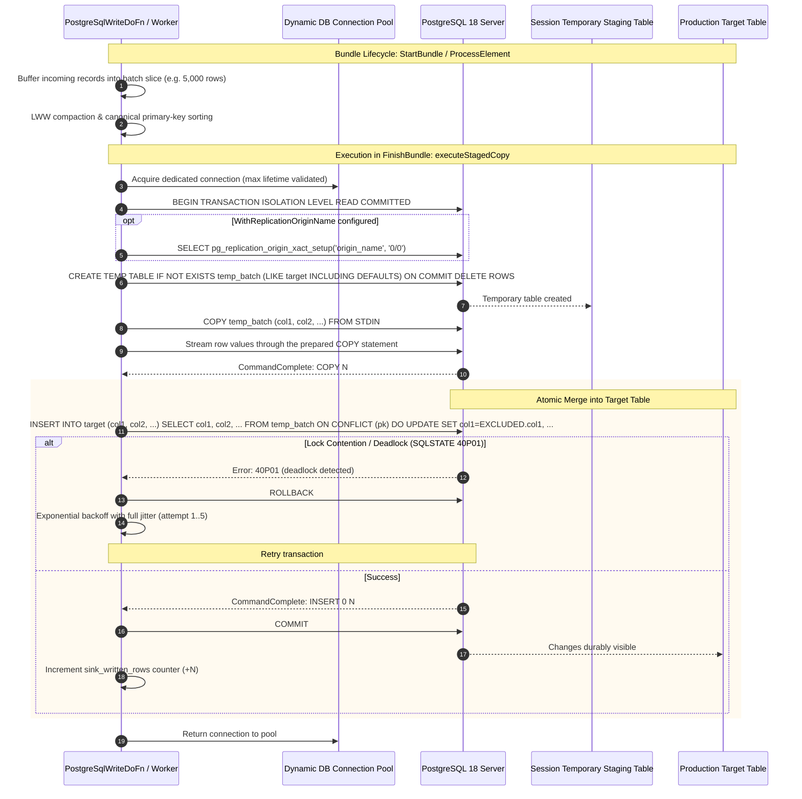

<!--
    Licensed to the Apache Software Foundation (ASF) under one
    or more contributor license agreements.  See the NOTICE file
    distributed with this work for additional information
    regarding copyright ownership.  The ASF licenses this file
    to you under the Apache License, Version 2.0 (the
    "License"); you may not use this file except in compliance
    with the License.  You may obtain a copy of the License at

      http://www.apache.org/licenses/LICENSE-2.0

    Unless required by applicable law or agreed to in writing,
    software distributed under the License is distributed on an
    "AS IS" BASIS, WITHOUT WARRANTIES OR CONDITIONS OF ANY
    KIND, either express or implied.  See the License for the
    specific language governing permissions and limitations
    under the License.
-->

# Apache Beam Go SDK: PostgreSQLIO (`postgresio`)

`postgresio` is a native Apache Beam Go SDK I/O connector providing high-throughput writing and upserts for PostgreSQL. It operates without Java Virtual Machine (JVM) dependencies or cross-language serialization overhead.

> [!NOTE]
> **Status: feature-complete with remediation stack applied.**
>
> Core operational guardrails are active and verified: TLS defaults to `verify-full` with custom root CA and client cert auth, authentication supports native SCRAM-SHA-256 and IAM tokens, and deadlocks are prevented via in-memory batch compaction and canonical primary key sorting.
>
> Read [Security & TLS Configuration](#security--tls-configuration) for production configuration best practices.
---

## Table of Contents

1. [Architectural Overview](#1-architectural-overview)
2. [Subsystem Architecture](#2-subsystem-architecture)
   - [A. High-Throughput Write Engine](#a-high-throughput-write-engine)
3. [Quickstart & Getting Started](#3-quickstart--getting-started)
   - [Native Go Write & Upsert](#native-go-write--upsert)
4. [Configuration Reference](#4-configuration-reference)
   - [WriteOptions](#writeoptions)
   - [Security & TLS Configuration](#security--tls-configuration)
   - [Known Limitations](#known-limitations)
5. [Contributor Guide: Codebase Map & Invariants](#5-contributor-guide-codebase-map--invariants)
   - [File Inventory & Responsibilities](#file-inventory--responsibilities)
   - [Life of a Write Mutation](#life-of-a-write-mutation)
   - [Serialization & Struct Tag Invariants](#serialization--struct-tag-invariants)
   - [Memory Model & Allocation Constraints](#memory-model--allocation-constraints)
6. [Testing & Verification Runbook](#6-testing--verification-runbook)
   - [Unit Testing](#unit-testing)

---

## 1. Architectural Overview

```
+-----------------------------------------------------------------------------------+
|                            PostgreSQL Primary Database                            |
|                  (WAL Logs, Logical Replication Slot, Tables)                     |
+--------------------+---------------------------------------+----------------------+
                     |                                       ^
        Logical CDC  | (pgoutput)                            | Parameterized
        Replication  |                                       | UNNEST ($1::type[])
                     v                                       | Upserts
+--------------------+-------------------+   +---------------+----------------------+
|       postgresio.ReadCDC Source        |   |        postgresio.Write Sink         |
|  - Decoupled Heartbeat Goroutine       |   |  - BatchCompactor (LWW deduplication)|
|  - pgoutput Binary Message Parser      |   |  - Canonical Composite PK Sorter     |
|  - In-Flight XID Transaction Spooler   |   |  - Pool Clamping (2 conns default)   |
|  - Bundle Checkpointing (FlushLSN)     |   |  - Dead-Letter Queue (FailedRow)     |
+--------------------+-------------------+   +---------------+----------------------+
                     |                                       ^
                     v                                       |
+--------------------+---------------------------------------+----------------------+
|                      Apache Arrow Columnar Vectorized Engine                      |
|  - ArrowRecordBatch zero-copy conversion (0 allocs/op, amortized)                 |
|  - Schema Reflection & Go Type Unnesting (cdc_range, arrays, jsonb)               |
+-----------------------------------------------------------------------------------+
                     |                                       ^
                     v                                       |
+--------------------+---------------------------------------+----------------------+
|                     Beam Go SchemaTransform & Expansion Service                   |
|  - URN: beam:schematransform:org.apache.beam:postgres_write:v1                    |
|  - URN: beam:schematransform:org.apache.beam:postgres_read:v1                     |
|  - URN: beam:schematransform:org.apache.beam:postgres_read_cdc:v1                 |
|  - Cross-Language Portability (Beam YAML, Python SDK)                             |
+-----------------------------------------------------------------------------------+
```

### Staged COPY Upsert Sequence Diagram



---

## 2. Subsystem Architecture

### A. High-Throughput Write Engine
* **Staged COPY Upsert (`WriteMethodStagedCopy`, Default)**: Streams micro-batched tuples through a prepared `COPY <staging> (<columns>) FROM STDIN` into a session-scoped temporary table (`CREATE TEMP TABLE IF NOT EXISTS <staging> (LIKE target INCLUDING DEFAULTS) ON COMMIT DELETE ROWS`). The staging table is created once per session and emptied at each commit rather than created and dropped per batch, so steady-state flushes execute no catalog DDL. Once streamed, an atomic set-based merge (`INSERT INTO target SELECT ... FROM <staging> ON CONFLICT DO UPDATE SET ...`) applies the batch, so per-row statements are never parsed or planned.
* **Parameterized `UNNEST` Array Upsert (`WriteMethodUnnest`)**: Executes batch inserts and upserts via vectorized array parameters with explicit type casts (`UNNEST($1::bigint[], $2::text[], ...)`), providing fallback execution when temporary table creation is restricted.
* **In-Memory Batch Compaction & Deadlock Prevention**: The `BatchCompactor` applies Last-Write-Wins (LWW) deduplication within micro-batches and sorts records canonically by composite primary key prior to database execution. This guarantees uniform row-lock acquisition order across distributed parallel workers, eliminating `SQLState 40P01` deadlocks.
* **Declarative Replication Origin Stamping**: Users can configure `.WithReplicationOriginName("beam_origin")`. Write transactions are tagged via `SELECT pg_replication_origin_xact_setup('beam_origin', '0/0')`, preventing cyclic feedback loops in active-active bidirectional database synchronization.
* **Connection Pool Management & CVE-2018-1058 Mitigation**: Clamps worker connection pools to 2 connections by default to prevent connection storms. Automatically injects `search_path=pg_catalog,pg_temp` into every connection DSN, closing search-path hijacking vulnerabilities across all pool connections.
* **Dead-Letter Queue (DLQ)**: Separates successfully committed rows from rejected records, appending sanitized error messages and PostgreSQL SQL states without credential leakage.

## 3. Quickstart & Getting Started

### Native Go Write & Upsert

```go
package main

import (
	"context"
	"flag"

	"github.com/apache/beam/sdks/v2/go/pkg/beam"
	"github.com/apache/beam/sdks/v2/go/pkg/beam/io/postgresio"
	"github.com/apache/beam/sdks/v2/go/pkg/beam/x/beamx"
)

type Order struct {
	OrderID     int64   `beam:"order_id" db:"order_id"`
	CustomerID  string  `beam:"customer_id" db:"customer_id"`
	Amount      float64 `beam:"amount" db:"amount"`
	Status      string  `beam:"status" db:"status"`
}

func main() {
	flag.Parse()
	beam.Init()

	p, s := beam.NewPipelineWithRoot()

	orders := []Order{
		{OrderID: 101, CustomerID: "CUST-1", Amount: 250.50, Status: "COMPLETED"},
		{OrderID: 102, CustomerID: "CUST-2", Amount: 89.00, Status: "PENDING"},
	}
	input := beam.CreateList(s, orders)

	opts := postgresio.NewWriteOptions(
		postgresio.WithHost("localhost"),
		postgresio.WithPort(5432),
		postgresio.WithDatabase("postgres"),
		postgresio.WithUsername("beam_navigator"),
		postgresio.WithPassword("beam_password"),
		postgresio.WithPrimaryKeyColumns("order_id"),
		postgresio.WithWriteMode(postgresio.WriteModeUpsert),
		postgresio.WithBatchSize(5000),
	)

	result := postgresio.Write(s, "test_pipelines.target_orders", opts, input)

	if err := beamx.Run(context.Background(), p); err != nil {
		panic(err)
	}
}
```

## 4. Configuration Reference

### `WriteOptions`

| Option | Default | Purpose |
| :--- | :--- | :--- |
| `WithHost(string)` | `""` | Target PostgreSQL host or IP |
| `WithPort(int)` | `5432` | Target PostgreSQL port |
| `WithDatabase(string)` | `""` | Target database name |
| `WithUsername(string)` | `""` | Database user role |
| `WithPassword(string)` | `""` | Database password |
| `WithWriteMode(WriteMode)` | `WriteModeUpsert` | Mutation strategy: `WriteModeInsert`, `WriteModeUpsert`, `WriteModeUpdate` |
| `WithPrimaryKeyColumns(...string)` | `nil` | Primary key columns used for `ON CONFLICT` resolution |
| `WithBatchSize(int)` | `5000` | Maximum rows per micro-batch flush |
| `WithMaxBatchBytes(int)` | `8388608` (8 MB) | Maximum bytes per micro-batch flush |
| `WithFlushInterval(Duration)` | `1s` | Maximum time between micro-batch flushes |
| `WithPgBouncer(bool)` | `false` | Disables prepared statement caching for PgBouncer transaction pooling |
| `WithDialFunc(DialFunc)` | `nil` | Custom network dialer (e.g., Cloud SQL Go Connector, AWS RDS IAM socket) |

### Security & TLS Configuration

`NewCDCOptions` defaults `sslmode` to `verify-full`. `verify-ca` is available
for deployments whose DNS topology makes hostname verification impractical,
such as private endpoints; it is not a performance optimization.

Supported modes and what each one actually guarantees:

| `sslmode` | Encrypted | Chain verified | Hostname verified | Use when |
| :--- | :---: | :---: | :---: | :--- |
| `disable` | No | No | No | Unix socket, or an already-encrypted overlay network. Must be a deliberate choice. |
| `require` | Yes | No | No | Encryption only. Does not authenticate the server, so it does not stop a man-in-the-middle. |
| `verify-ca` | Yes | Yes | No | Hostname verification is impossible for topology reasons — private endpoints, connecting by IP, a proxy or PgBouncer presenting a different name, SSH tunnels, Kubernetes service names. |
| `verify-full` | Yes | Yes | Yes | **Everything else. This is the correct default.** |

**Why `verify-full` rather than `verify-ca`.** The two modes cost the same. Both perform the same handshake, key exchange, certificate chain validation, and symmetric bulk encryption; `verify-full` additionally matches the hostname against the certificate's SAN entries, which is one comparison performed once at handshake. PostgreSQL's own documentation assigns the two modes identical overhead. Because the CDC source holds a single replication connection for the lifetime of the pipeline, even that one-time cost amortizes to nothing.

The security difference is not small. Managed PostgreSQL providers sign every tenant's server certificate with a shared regional CA, so under `verify-ca` a certificate issued to **any other customer of the same provider** passes validation. The PostgreSQL documentation states the case directly: *"If a public CA is used, `verify-ca` allows connections to a server that somebody else may have registered with the CA. In this case, `verify-full` should always be used."* Hostname verification is the control that closes this, and it is precisely the part `verify-ca` omits.

Google Cloud SQL documents `sslmode=verify-full` and added per-instance CAs and custom SAN values specifically to support it. Azure Database for PostgreSQL recommends full certificate and hostname verification, offering `verify-ca` only where Private Endpoint DNS makes hostname matching impossible. The `prefer` default in libpq is inherited backwards compatibility, and upstream explicitly describes it as *"not recommended in secure deployments."*

### Known Limitations

The connector is unreleased and experimental. The list below is what is still open.

| Area | Limitation | Impact |
| :--- | :--- | :--- |
| **`search_path`** | The write path pins `search_path=pg_catalog,pg_temp` on every pooled connection to close CVE-2018-1058, so an unqualified table name cannot resolve. | Table names must be written as `schema.table`. `postgresio.Write` rejects an unqualified name when the pipeline is constructed. |
| **Replication origin on the write path** | The staged `COPY` path sets a replication origin; the `UNNEST` fallback does not. | In a bi-directional topology, rows written through the fallback path are not distinguishable from user writes and can be replicated back. |
| **Driver** | Built on `lib/pq`. | Protocol features not implemented in `lib/pq` are unavailable. |

## 5. Contributor Guide: Codebase Map & Invariants

This section details internal design invariants for contributors maintaining or extending the package.

### File Inventory & Responsibilities

| File | Subsystem | Responsibility |
| :--- | :--- | :--- |
| [`write.go`](write.go) | Sink | `writeFn` implementation, `buildUnnestQuery`, parameterized `UNNEST` array upsert execution. |
| [`compactor.go`](compactor.go) | Sink | `BatchCompactor` micro-batch accumulator, LWW deduplication, composite primary key canonical sort. |
| [`options.go`](options.go) | Config | `WriteOptions` definition, functional options, identifier sanitization. |

### Life of a Write Mutation

```
PCollection<T>
      |
      v
+-------------------------------------------------------+
| [writeFn.ProcessElement]                              |
| 1. Intercept incoming record                          |
| 2. Add to in-memory BatchCompactor                    |
| 3. If size >= BatchSize or bytes >= MaxBatchBytes:    |
|    Flush active batch                                 |
+-------------------------------------------------------+
      |
      v
+-------------------------------------------------------+
| [BatchCompactor.CompactAndSort]                       |
| 1. Deduplicate by composite primary key (LWW)         |
| 2. Canonical lexicographical sort by primary key      |
|    (Eliminates concurrent worker row-lock deadlocks)  |
+-------------------------------------------------------+
      |
      v
+-------------------------------------------------------+
| [writeFn.buildUnnestQuery]                            |
| 1. Reflect column types from struct tags (db, beam)   |
| 2. Map Go types to PG array casts (bigint[], text[])  |
| 3. Construct:                                         |
|    INSERT INTO <table> (<cols>)                       |
|    SELECT * FROM UNNEST($1::type[], $2::type[], ...)  |
|    ON CONFLICT (<pks>) DO UPDATE SET <cols>           |
+-------------------------------------------------------+
      |
      v
+-------------------------------------------------------+
| [writeFn.flushBatch]                                  |
| 1. Execute query via pgxpool / database/sql           |
| 2. On success: Emit rows to SuccessfulRows            |
| 3. On failure: Wrap in FailedRow and emit to DLQ      |
+-------------------------------------------------------+
```

### Serialization & Struct Tag Invariants

When working with Beam Go DoFns and schema-registered types:

1. **Interface and Function Exclusion**:
   Beam Go tries to reconcile struct fields into Beam schemas at pipeline submission time (`beam.Init()`). Any struct field containing an interface (e.g. `TokenProvider`, `DialFunc`, `StreamFactory`) or a `func` **cannot be serialized into a Beam schema**.
   * **Rule**: All interface, function, and dialer fields **must** include both `beam:"-"` and `json:"-"` struct tags.
   ```go
   type WriteOptions struct {
       Host     string
       DialFunc DialFunc `beam:"-" json:"-"`
   }
   ```
2. **Struct Field Names vs Database Columns**:
   `writeFn` resolves PostgreSQL table column names using the following fallback order:
   1. `db:"col_name"`
   2. `beam:"col_name"`
   3. `json:"col_name"`
   4. `strings.ToLower(field.Name)`
   * **Rule**: When defining custom structs, always supply `db:"<column_name>"` or `beam:"<column_name>"` matching the exact snake_case name of the PostgreSQL column.

3. **Types with Custom Coders**:
   Types containing dynamic `any` fields (such as `ColumnValue` or `ChangeEvent`) must be registered using `beam.RegisterCoder`, **not** `beam.RegisterType`. `beam.RegisterType` instructs Beam to treat the type as a fixed-schema Row, which fails when encountering `interface{}`.

### Memory Model & Allocation Constraints

* **Connection Pool Bounding**: `WriteOptions.MaxConnections` defaults to 2 per worker, so that a pipeline scaling out to hundreds of Beam workers does not exhaust the server's `max_connections`. `WithMaxConnections` raises it; raise the server's budget to match before doing so.

---

## 6. Testing & Verification Runbook

### Unit Testing

Run the full package unit test suite with the Go race detector enabled:

```bash
cd sdks/go/pkg/beam/io/postgresio
go test -v -race -count=1 ./...
```

This includes unit tests for identifier sanitization against SQL injection, credential redaction, batch compaction collapse and deadlock-avoiding sort order, and primary key determinism.

