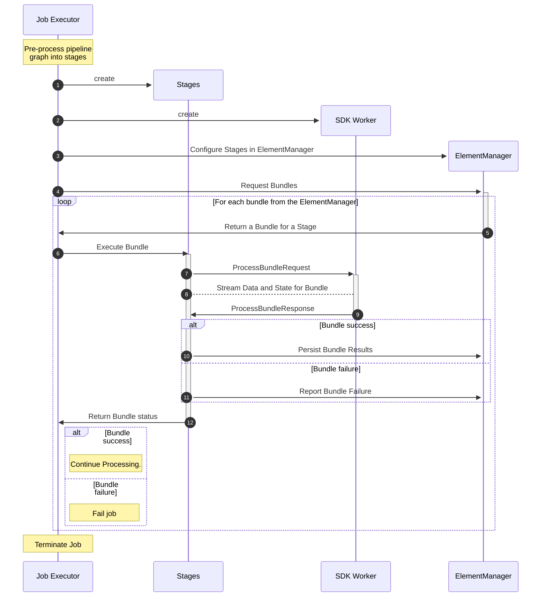
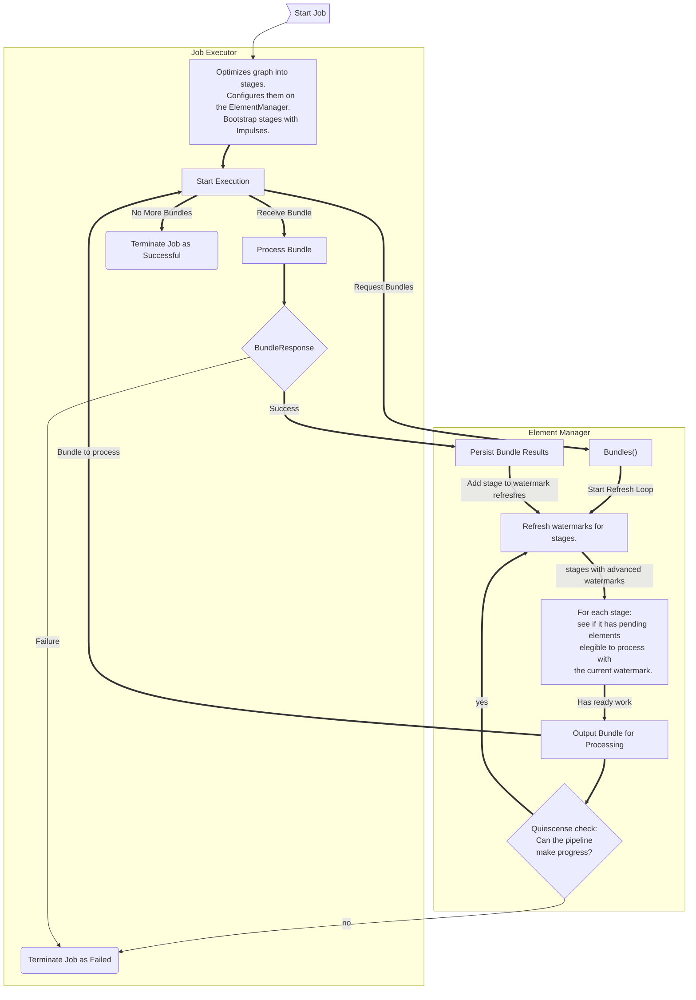

<!--
    Licensed to the Apache Software Foundation (ASF) under one
    or more contributor license agreements.  See the NOTICE file
    distributed with this work for additional information
    regarding copyright ownership.  The ASF licenses this file
    to you under the Apache License, Version 2.0 (the
    "License"); you may not use this file except in compliance
    with the License.  You may obtain a copy of the License at

      http://www.apache.org/licenses/LICENSE-2.0

    Unless required by applicable law or agreed to in writing,
    software distributed under the License is distributed on an
    "AS IS" BASIS, WITHOUT WARRANTIES OR CONDITIONS OF ANY
    KIND, either express or implied.  See the License for the
    specific language governing permissions and limitations
    under the License.
-->

The following refers to the current state of Prism, and is subject to change.

# Prism internal packages

Go has a mechanism for ["internal" packages](https://go.dev/doc/go1.4#internalpackages)
to prevent use of implementation details outside of their intended use.

This mechanism is used thoroughly for Prism to ensure we can make changes to the
runner's internals without worrying about the exposed surface changes breaking
non-compliant users.

## Structure

Here's a loose description of the current structure of the runner. Leaf packages should
not depend on other parts of the runner. Runner packages can and do depend on other
parts of the SDK, such as for Coder handling.

`config` contains configuration parsing and handling. Leaf package.
Handler configurations are registered by dependant packages.

`urns` contains beam URN strings pulled from the protos. Leaf package.

`engine` contains the core manager for handling elements, watermarks, windowing strategies,
timers, and state. Determines bundle readiness, and stages to execute. Leaf package.
Should never depend on the protocol buffers.

`jobservices` contains GRPC service handlers for job management and submission.
Should only depend on the `config` and `urns` packages.

`worker` contains interactions with FnAPI services to communicate with worker SDKs. Leaf package
except for dependency on `engine.TentativeData` which will likely be removed at some point.

`internal` AKA the package in this directory root. Contains the job execution
flow. Jobs are sent to it from `jobservices`, through the Job Executor function,
and those jobs are then executed by coordinating with the `engine` and `worker` packages.
Handles the pipeline protos directly.
Most configurable behavior is determined here.

`web` contains a web server to visualize aspects of the runner, and should never be
depended on by the other packages for the runner.
It will primarily abstract access to pipeline data through a JobManagement API client.
If no other option exists, it may use direct access to exported data from the other packages.

## Testing

The sub packages should have reasonable Unit Test coverage in their own directories, but
most features will be exercised via executing pipelines in the internal package, and engine
package. To avoid overly re-implementing tests, use of the "_test" formalism to validate
coverage through re-using tests from sdks/go/tests is recommended.

For the time being test DoFns should be added to standard build in order to validate execution
coverage, in particular for Combine and Splittable DoFns.

Eventually these behaviors should be covered by using Prism in the main SDK tests.

# Deep Dive

This section covers how Prism operates just above the code level, and addresses the
questions of "how it works".

## Job Execution

When a job is submitted to Prism, and has been accepted by Job Management,
it is then passed to the Job Executor function. The Job's pipeline graph is
then preprocessed to handle performance improvements like Graph Fusion, and
Combiner Lifting, but also to do other substitutions such as breaking down
SplittableDoFns into their executable components. Preprocessing returns
a set of stateless executable stages.

Stages in hand, the job executor produces SDK workers for each environment,
and configures an ElementManager with the stage information, so it can
begin to produce and manage bundles. Those bundles are then handed to
appropriate workers for processing.

The ElementManager will produce as many bundles as are ready for execution,
WRT necessary restrictions on processing. For example, stateful stages may
require that only a single inprogress bundle may operate on a given user key
at a time, while aggregations like GroupByKey will only execute when their
windowing strategy dictates, and DoFns with side inputs can only execute when
all approprate side inputs are ready.

Architecturally, the ElementManager is only aware of the properties of the
fused stages, and not their actual relationships with the Beam Protocol Buffers.
The ElementManager is not aware of individual transforms.

Interfacing with SDK workers is left to the stateless job executore stages as
needed for bundle processing.

### How are bundles produced?

Work is divided into Bundles for execution, typically, on end user DoFns within
SDK workers.

Producing bundles is the ElementManager's job. The ElementManager is the heart
of Prism. The element manager tracks the state for each stage, which includes a
stage's relationships with others, the pending input elements, the various watermarks, 
whether it is stateful or aggregating.

Each executing pipeline has it's own instance of the ElementManager which
manages all element data for the pipeline.
The core loop of the engine is to produce bundles for stages to process.
A bundle represents some number of elements as well as a stage to process them on.
Each stage is associated with an environment that can execute them, and
can assign work over the FnAPI to an SDK worker.

Prism does this by tracking the event time watermark for each
stage, as well as the set of pending elements and state per stage.

Pending Elements are elements that have been received as input by the stage
but have not yet been processed.

## Threading and Concurrency Model

Prism leverages Go's lightweight threading primitive, called goroutines, to handle
concurrent processing of bundles. Go handles scheduling execution of goroutines onto
operating system threads for execution, and it's reasonably effective at this.
Goroutines allow prism to distribute multiple bundles to SDK workers simultaneously.
There are some benefits to re-use Goroutines, but not critically so.
Generally the goal is to strategically limit parallelism to avoid
wasting time in the goroutine scheduler. 

For a single Job Goroutines are initialized to the following cardinatlities
Per Job, Per Environment, and Per Bundle.

This section will attempt to outline the threads associated with Prism when
executing a job. This will not include SDK side threads, such as those
within containers, or started by an external worker service.

As a rule of thumb, each Bundle is processed on
an independant goroutine, with a few exceptions.

jobservices.Server implements a beam JobManagmenent GRPC services. GRPC servers
have goroutines managed by GRPC itself. Call this G goroutines.

When RunJob is called, the server starts a goroutine with the Job Executor function.

The Job Executor function will start goroutines for each worker Environment in order
to manage workers. One for managing the Environment itself, such as a docker container,
and one for the FnAPI server for that Environment, to communicate with the SDK Worker
in that Environment. These will persist for the lifetime of the job.

After producing stages for the job the Job Executor goroutine will wait on Bundles
from the ElementManager, and execute them in parallel.
Each bundle has it's own goroutine. 
This is by default configured to a maximum of 8 simultaneous Bundles.

The bundle goroutine will communicate with the worker associated with the bundle's stage.
This handles sending the bundle for execution on the SDK worker, managing progress and
split requests, and persisting data and other results after the bundle completes.

The FnAPI server side worker will have several goroutines to handle requests and responses
from the SDK worker. FnAPI services are typically bi directional streaming RPCs.
There will be one goroutine handling requests being sent to the SDK, and another for responses
from the SDK.
So there will be a pair of goroutines for each of the Control, Data, and State streams, and a
single one for Logging.

The ElementManager returns a channel to the Job Executor in order to relay those bundles, and
starts two goroutines in order to populate that channel with bundles.
One goroutine is tasked with evaluating and refreshing the watermark whenever a stage persists
a bundle. This goroutine sends bundles on the channel when appropriate. This goroutine waits on
a condition variable for changes from processed bundles.
The other goroutine blocks until there are no more pending elements, at which point it
cancels the watermark evaluating goroutine, and unblocks the condition variable, in that order.

Prism's main thread when run as a stand alone command will block forever after
initializing the beam JobManagment services. Similarly, a built in prism instance
in the Go SDK will start a Job Management instance, and the main thread is blocked
while the job is executing through the "Universal" runner handlers for a pipeline.

A job thus has the following number of persistent goroutines in execution:

For a Prism instance: 
* G for the job services.

For each Job:
* 1 for the Job Executor 
* 2 for the ElementManager

For each Environment:
* 2 for the Environment itself
* 3*2 + 1 for the FnAPI Control, Data, State, and Logging Streams
* G for the worker's GRPC server.

For each Bundle:
* 1 to handle bundle execution, up to the configured maxium parallel bundles (default 8)

Letting E be the number of environments in the job, and B maximum number of parallel bundles:

Total Goroutines = G + (1 + 2) + E*(3*2 +1 + 2 + G) + B(1)

Total Goroutines = G + 3 + 9E + E*G + B

Total Goroutines = G(E + 1) + 9E + B + 3

So for a job J with 1 eviroment, and the default maximum parallel bundles, 8:

Total Goroutines for Job J = G((1) + 1) + 9(1) + (8) + 3

Total Goroutines for Job J = 2G + 9 + 8 + 3

Total Goroutines for Job J = 2G + 20

2 GRPC servers + 20 goroutines may sound like a lot, but most processes in a Prism instance
are waiting for some trigger to execute. They are not busy waiting or spin looping.
FnAPI messages are multiplexed so the expectation is the data service goroutines will
be the busiest moving data back and forth from the SDK.

A consequence of this approach is the need to take care in locking shared resources and data
when they may be accessed by multiple goroutines. In particular, is all done in the ElementManager
which has locks for each stage in order to serialze access to it's state. This state is notably
accessed by the Bundle goroutines on persisting data back to the Element manager.

For best performance, we do as much work as possible in the Bundle Goroutines since they are
what can most dynamically scale out, as bundle generation is handled by the single watermark
evaluation thread. This may include migrating handling of data responses away from the Data
received goroutine and into the Bundle processing goroutine, so bundles are less likely to 
block each other.

As one G of goroutines is the single Job Management instance for prism itself, and the other is
for the worker endpoint, these are no wasted either. Prism can assign uniques names to workers
to be able to identify which job they're a part of, so it's possible to avoid the per job and
worker grpc service, and multiplex from there.  (See https://github.com/apache/beam/issues/32167)

A channel is being used to move ready to execute bundles from the ElementManager to the Job Executor.
This may be unbuffered (the default) which means
serializing how bundles are generated for execution,
and there being at most a single "readyToExecute"
bundle at a time. An unbufferred channel puts a
bottleneck on the job since there may be additional
ready work to execute. On the other hand, it also
allows for bundles to be made larger as more data
may have arrived. 

The channel could be made to be buffered, to allow
multiple bundles to be prepared for execution. 
This would lead to lower latency as bundles could be made smaller, and faster to execute, as it would
permit pipelineing in work generation, but may lead
to higher lock contention and variability in execution.

## Durability Model

Prism keeps all data in memory, and doesn't write anything durably to disk.
Recommended only for testing purposes. It's not suitable for any long term production
work due to the risk of dataloss or recomputing.

SDK side code however may be make durable changes or side effects in external systems.
Prism cannot restrict such behavior.

Prism doesn't retry failed bundle, and simply fails the job instead.

## Execution Distribution Model

Prism is intended to be single machine, local runner. If it does start up docker containers
for SDK environments, they'll be on the same machine as Prism.

# Glossary

* Element: A single value of data to be processed, or a timer to trigger.
* Stage: A fused grouping of one or more transforms with a single parallel input PCollection,
   zero or more side input PCollecitons, and zero or more output PCollections.
   The engine is unaware of individual user transforms, and relies on the calling
   job executor to configure how stages are related.
* Bundle: An arbitrary non-empty set of elements, to be executed by a stage.
* Watermark: An event time which relates to the the readiness to process data in the engine. 
   Each stage has several watermarks it tracks: Input, Output, and Upstream.
* Quiescense: Wether the pipeline is or is able to perform work.
  * The pipeline will try to advance all watermarks to infinity, and attempt to
    process all pending elements.
  * A pipeline will successfully terminate when there are no pending elements to process,
    and no outstanding in progress bundles.
