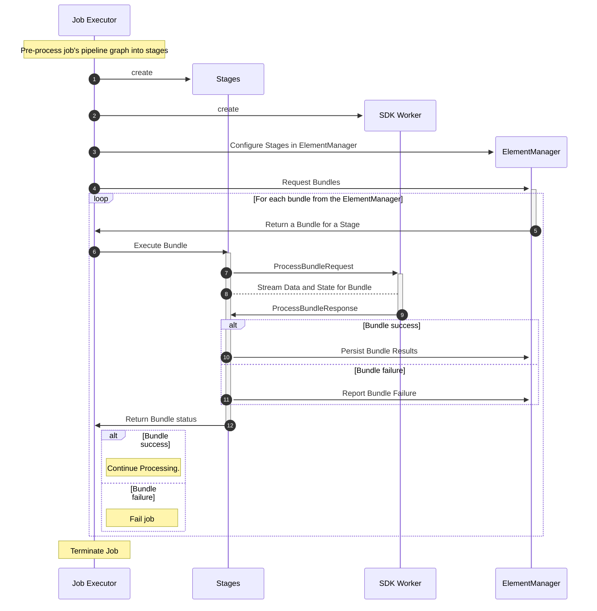
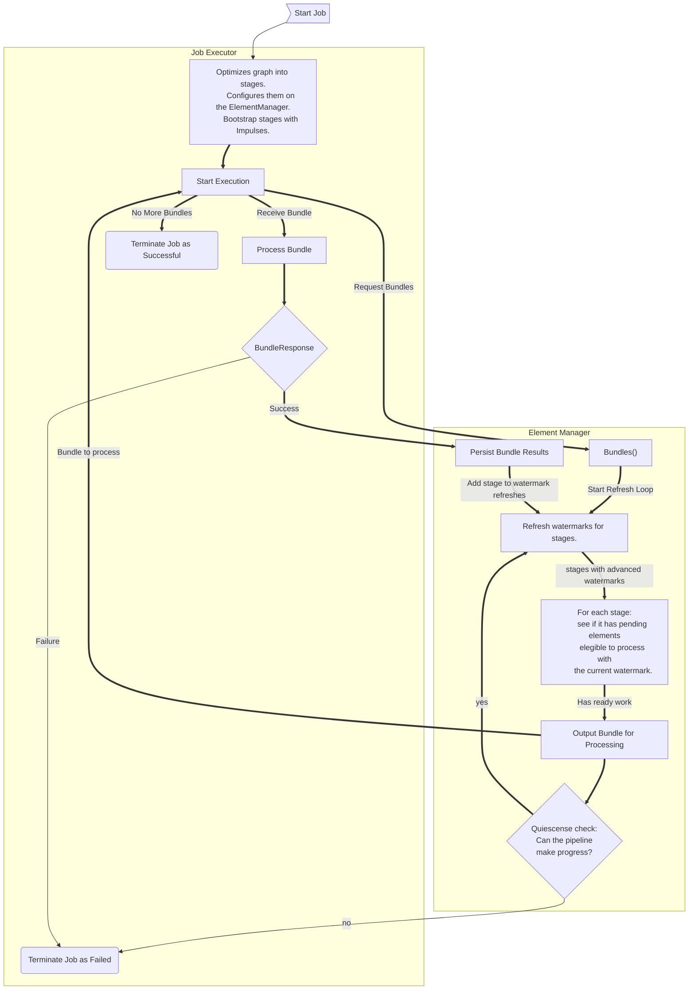

# Prism ElementManager Overview

This README documents in broad strokes how Prism executes a pipeline.

## Job Execution

When a job is submitted to Prism, and has been accepted by Job Management,
it is then passed to the Job Executor function. The Job's pipeline graph is
then preprocessed to handle performance improvements like Graph Fusion, and
Combiner Lifting, but also to do other substitutions such as breaking down
SplittableDoFns into their executable components. Preprocessing returns
a set of stateless executable stages.

Stages in hand, the job executor produces SDK workers for each environment,
and configures an ElementManager with the stage information, so it can
begin to produce and manage bundles. Those bundles are then handed to
appropriate workers for processing.

The ElementManager will produce as many bundles as are ready for execution,
WRT necessary restrictions on processing. For example, stateful stages may
require that only a single inprogress bundle may operate on a given user key
at a time, while aggregations like GroupByKey will only execute when their
windowing strategy dictates, and DoFns with side inputs can only execute when
all approprate side inputs are ready.

Architecturally, the ElementManager is only aware of the properties of the
fused stages, and not their actual relationships with the Beam Protocol Buffers.
The ElementManager is not aware of individual transforms.

Interfacing with SDK workers is left to the stateless job executore stages as
needed for bundle processing.

## How are bundles produced?

Work is divided into Bundles for execution, typically, on end user DoFns within
SDK workers.

Producing bundles is the ElementManager's job. The ElementManager is the heart
of Prism. The element manager tracks the state for each stage, which includes a
stage's relationships with others, the pending input elements, the various watermarks, 
whether it is stateful or aggregating.

Each executing pipeline has it's own instance of the ElementManager which
manages all element data for the pipeline.
The core loop of the engine is to produce bundles for stages to process.
A bundle represents some number of elements as well as a stage to process them on.
Each stage is associated with an environment that can execute them, and
can assign work over the FnAPI to an SDK worker.

Prism does this by tracking the event time watermark for each
stage, as well as the set of pending elements and state per stage.

Pending Elements are elements that have been received as input by the stage
but have not yet been processed.

## Glossary

* Element: A single value of data to be processed, or a timer to trigger.
* Stage: A fused grouping of one or more transforms with a single parallel input PCollection,
   zero or more side input PCollecitons, and zero or more output PCollections.
   The engine is unaware of individual user transforms, and relies on the calling
   job executor to configure how stages are related.
* Bundle: An arbitrary non-empty set of elements, to be executed by a stage.
* Watermark: An event time which relates to the the readiness to process data in the engine. 
   Each stage has several watermarks it tracks: Input, Output, and Upstream.
* Quiescense: Wether the pipeline is or is able to perform work.
  * The pipeline will try to advance all watermarks to infinity, and attempt to
    process all pending elements.
  * A pipeline will successfully terminate when there are no pending elements to process,
    and no outstanding in progress bundles.
