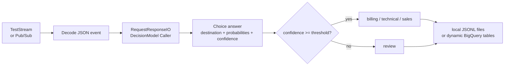

<!--
    Licensed to the Apache Software Foundation (ASF) under one
    or more contributor license agreements.  See the NOTICE file
    distributed with this work for additional information
    regarding copyright ownership.  The ASF licenses this file
    to you under the Apache License, Version 2.0 (the
    "License"); you may not use this file except in compliance
    with the License.  You may obtain a copy of the License at

      http://www.apache.org/licenses/LICENSE-2.0

    Unless required by applicable law or agreed to in writing,
    software distributed under the License is distributed on an
    "AS IS" BASIS, WITHOUT WARRANTIES OR CONDITIONS OF ANY
    KIND, either express or implied.  See the License for the
    specific language governing permissions and limitations
    under the License.
-->

# Beam decision model examples

This small proof of concept connects Beam's Python `RequestResponseIO` with
structured decision models. The main example routes a short stream of support
messages with a Choice question. A second example uses a Noul question to flag
messages that deserve fraud review.

The examples keep the Beam graph independent of a model vendor. A decision
model accepts JSON-like `state` and a set of typed questions, then returns
typed answers plus request metadata. `JevDecisionModel` is the TypeSafe adapter
used by the live path. `LocalDecisionModel` is a deterministic adapter for
running the graph without a network call. Future Laya or Kev integrations can
implement the same adapter contract; this PoC makes no claims about APIs for
those systems.

## Architecture



The rendered graph below was generated from the same pipeline with
`--graph-only --bq-dataset=PROJECT:DATASET`. Graph-only mode constructs and
renders the BigQuery sink but does not contact BigQuery or write rows.


`RequestResponseIO` isolates the external call behind Beam's request/response
boundary. The pipeline remains responsible for policy: it validates the
returned label, applies the confidence threshold, and chooses the sink. This
is useful for a decision model because the selected label answers *what* the
model thinks, while confidence answers whether the application should act.
Choice and Score also expose the full probability distribution. Noul exposes
the probability of a yes/true answer and does not have a separate confidence
field.

## Install

From a Beam checkout, in an activated Python virtual environment, install the
Python SDK and the optional Jev client:

```sh
python3 -m pip install -e sdks/python
python3 -m pip install -r sdks/python/apache_beam/examples/inference/decision_models/requirements.txt
```

The `typesafe-sdk` requirement is only needed for `--model=jev`. The local
adapter does not make an API request and is useful for graph and sink checks.
Install Beam's GCP extra before using `--bq-dataset`, including graph-only mode:

```sh
python3 -m pip install -e 'sdks/python[gcp]'
```

## Main demo: route messages with Choice

The default source is a three-element `TestStream`, so the demo finishes
quickly. The local adapter produces the same typed response shape without
credentials:

```sh
output_dir="$(mktemp -d /tmp/beam-decision-model-output.XXXXXX)"
python3 -m apache_beam.examples.inference.decision_models.message_router \
  --model=local \
  --output-dir="$output_dir" \
  --graph="$output_dir/pipeline.svg"
find "$output_dir" -name '*.jsonl' -print -exec sed -n '1,3p' {} \;
```

The graph is exported by Beam's Python `RenderRunner` while the pipeline is
constructed. Use a `.svg` or `.png` extension when Graphviz's `dot` executable
is installed. A `.dot` output is useful when only the raw graph is available.
This is a graph of the DirectRunner-compatible pipeline construction, not a
runtime profile.

To render the graph without making Jev or BigQuery calls, use
`--graph-only`. The sink option is still required because it is part of the
constructed graph:

```sh
python3 -m apache_beam.examples.inference.decision_models.message_router \
  --model=jev --graph-only \
  --bq-dataset=PROJECT:DATASET \
  --graph=/tmp/beam-decision-model.dot
```

The `.dot` export works without Graphviz. SVG and PNG exports require `dot` on
`PATH`.

For the Jev path, put the key in the environment and run the same short
stream:

```sh
export TYPESAFE_API_KEY='replace-with-your-key'
jev_output_dir="$(mktemp -d /tmp/beam-decision-model-jev-output.XXXXXX)"
python3 -m apache_beam.examples.inference.decision_models.message_router \
  --model=jev \
  --min-confidence=0.65 \
  --output-dir="$jev_output_dir" \
  --graph="$jev_output_dir/pipeline.svg"
```

One three-message Beam DirectRunner smoke run against Jev measured the
following caller wall time with the local JSONL sink:

| message | routed destination | caller latency |
| --- | --- | ---: |
| billing message | `billing` | 406.26 ms |
| technical message | `technical` | 249.70 ms |
| sales message | `sales` | 226.34 ms |

These are observations from one local environment with `n=3` Choice calls and
one local file sink, not a latency guarantee or a benchmark. They include the
provider call inside the Beam caller and exclude BigQuery write latency.

The key is read by the SDK through `TYPESAFE_API_KEY`; it is never a pipeline
element or a command-line argument. Do not put it in source, shell history,
logs, or a checked-in options file.

To use a real streaming source, provide a Pub/Sub subscription containing JSON
objects with `event_id` and `message` string fields:

```sh
python3 -m apache_beam.examples.inference.decision_models.message_router \
  --model=jev \
  --pubsub-subscription=projects/PROJECT/subscriptions/SUBSCRIPTION \
  --bq-dataset=PROJECT:DATASET
```

With `--bq-dataset=PROJECT:DATASET`, the destination is selected in code and
rows are appended to `messages_billing`, `messages_technical`,
`messages_sales`, or `messages_review` in that dataset. The process needs
Application Default Credentials with Pub/Sub subscriber access and permission
to create/write the BigQuery tables. BigQuery has not been live-verified by
this PoC. For a local run, omit `--bq-dataset` and use `--output-dir` instead.
The sink uses streaming inserts and Beam's normal at-least-once delivery
behavior. A production design needs an idempotency key and an explicit
retry/dead-letter policy.

## Smaller demo: fraud review with Noul

Noul asks one yes/no question and returns the probability that the answer is
yes. The example uses that value as a deliberately visible policy threshold:

```sh
python3 -m apache_beam.examples.inference.decision_models.fraud_review \
  --model=local --primitive=noul

export TYPESAFE_API_KEY='replace-with-your-key'
python3 -m apache_beam.examples.inference.decision_models.fraud_review \
  --model=jev --primitive=noul
```

Rows include `fraud_review_probability` and `needs_review`. A probability near
0.5 is uncertainty, not confidence: Noul has no separate confidence value.
For comparison, run `--primitive=score` or `--primitive=both` to see a rubric
score, its probability distribution, and its confidence. Combining several
atomic questions in one request is the intended way to add policy dimensions
without asking one broad, ambiguous question.

A three-element Beam DirectRunner Jev run with both questions produced Noul
probabilities `0.46` for the billing-address message, `0.32` for the
duplicate-charge message, and `0.97` for the request to bypass verification.
With the `0.7` threshold, only the last row was flagged. The Score answers
were `0.80`, `0.88`, and `3.00`, respectively. These are sample values.

## Short benchmark

Each demo records request elapsed time in `latency_ms`. Run only the small
`TestStream` to measure a handful of calls and inspect the generated JSONL:

```sh
benchmark_dir="$(mktemp -d /tmp/beam-decision-model-benchmark.XXXXXX)"
time python3 -m apache_beam.examples.inference.decision_models.message_router \
  --model=jev \
  --output-dir="$benchmark_dir"
rg -I -o '"latency_ms": [0-9.]*' "$benchmark_dir" \
  | sort -t: -k2n
```

This is an illustrative smoke benchmark, not a performance claim. It mixes
API/network latency, SDK work, and one local runner invocation, and three
messages are too few for a stable percentile. For a meaningful comparison,
repeat with a fixed corpus, record the model and request IDs, and report the
sample size and percentile method. Do not commit credentials or benchmark
output.

## Scope and next steps

This PoC demonstrates the adapter boundary and one Beam integration point. It
does not provide multi-message batching, model warmup, circuit breaking,
schema evolution, or production deduplication. The Beam repeater is disabled;
the Jev SDK handles provider retries. A follow-up can add quota controls,
route metrics, and a runner-specific integration test before a production sink.
