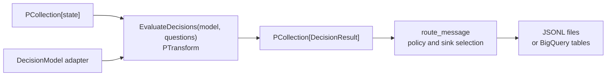
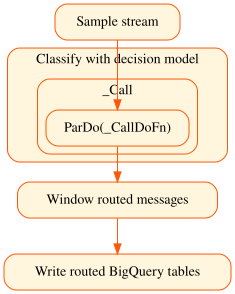

<!--
    Licensed to the Apache Software Foundation (ASF) under one
    or more contributor license agreements.  See the NOTICE file
    distributed with this work for additional information
    regarding copyright ownership.  The ASF licenses this file
    to you under the Apache License, Version 2.0 (the
    "License"); you may not use this file except in compliance
    with the License.  You may obtain a copy of the License at

      http://www.apache.org/licenses/LICENSE-2.0

    Unless required by applicable law or agreed to in writing,
    software distributed under the License is distributed on an
    "AS IS" BASIS, WITHOUT WARRANTIES OR CONDITIONS OF ANY
    KIND, either express or implied.  See the License for the
    specific language governing permissions and limitations
    under the License.
-->

# Beam decision models

These examples use the reusable decision primitives in
`apache_beam.ml.inference.decision`. A model evaluates named, typed questions
for each Beam element. `EvaluateDecisions` returns the original state,
normalized answers, provider metadata, and request latency. Policy and sinks
remain ordinary Beam transforms after evaluation.

## Public API

The core module contains `ChoiceQuestion`, `BooleanQuestion`, and
`ScoreQuestion`, their typed answers (`ChoiceAnswer`, `BooleanAnswer`, and
`ScoreAnswer`), the `DecisionModel` ABC, and the `EvaluateDecisions`
`PTransform`.

| Question | Normalized answer |
| --- | --- |
| `ChoiceQuestion(instructions, criteria)` | `ChoiceAnswer.choice`, with optional label probabilities and confidence |
| `BooleanQuestion(instructions)` | `BooleanAnswer.probability` in `[0, 1]` |
| `ScoreQuestion(instructions, criteria)` | `ScoreAnswer.score` and `ScoreAnswer.probabilities`, keyed by zero-based integer level, with optional confidence |

`JevDecisionModel` maps `BooleanQuestion` to Jev's `Noul`, returning
`BooleanAnswer.probability`; a missing confidence is `None`.

`DecisionModel` is the adapter ABC. A subclass implements
`evaluate(state, questions)` and returns one matching typed answer per named
question in a `DecisionResponse`. Override `__enter__` and `__exit__` to reuse
a client, connection pool, or model weights. The transform enters the model
during DoFn setup and closes it during teardown for each DoFn instance.

`EvaluateDecisions(model, questions)` is a `PTransform` from input states to
`DecisionResult`. Evaluation is synchronous, timestamps and windows are
preserved, exceptions propagate to the runner, and request, failure, and
latency metrics are recorded.

## Architecture





The optional Jev adapter lives in
`apache_beam.ml.inference.typesafe_inference`; the deterministic
`LocalDecisionModel` stays in
`apache_beam.examples.inference.decision_models.local_model`. Both implement
the same core contract.

## Integration

Questions and events are regular Python values. The model is the only
provider-specific argument to `EvaluateDecisions`:

```python
import apache_beam as beam

from apache_beam.ml.inference.decision import ChoiceQuestion
from apache_beam.ml.inference.decision import EvaluateDecisions
from apache_beam.examples.inference.decision_models.local_model import (
    LocalDecisionModel,
)
from apache_beam.ml.inference.typesafe_inference import JevDecisionModel

questions = {
    'team': ChoiceQuestion('Which team should handle this message?', {
        'billing': 'Invoices', 'technical': 'Technical problems'}),
}

def select_team(result):
  return result.response.answers['team'].choice

model = LocalDecisionModel()
# model = JevDecisionModel()

with beam.Pipeline() as pipeline:
  events = pipeline | 'Events' >> beam.Create(
      [{'message': 'The API returns 503 after I rotated my key.'}])
  decisions = events | 'Evaluate decisions' >> EvaluateDecisions(
      model, questions)
  rows = decisions | 'Apply downstream policy' >> beam.Map(select_team)
```

The downstream policy stays unchanged when swapping adapters. The Jev client
is optional; install the existing example requirements and set
`TYPESAFE_API_KEY` when running it.

## Install

From a Beam checkout, activate a virtual environment and install the core SDK:

```sh
python3 -m pip install -e sdks/python
```

Install the optional Jev client for `--model=jev`:

```sh
python3 -m pip install -r \
  sdks/python/apache_beam/examples/inference/decision_models/requirements.txt
```

Install Beam's GCP extra for Pub/Sub or BigQuery sinks:

```sh
python3 -m pip install -e 'sdks/python[gcp]'
```

## Run examples

The main demo uses a three-element `TestStream` and writes one JSONL file per
destination:

```sh
output_dir="$(mktemp -d /tmp/beam-decision-model-output.XXXXXX)"
python3 -m apache_beam.examples.inference.decision_models.message_router \
  --model=local \
  --output-dir="$output_dir" \
  --graph="$output_dir/message_router.svg"
find "$output_dir" -name '*.jsonl' -print -exec sed -n '1,3p' {} \;
```

Render the graph without running the job. The sink stays in the graph:

```sh
python3 -m apache_beam.examples.inference.decision_models.message_router \
  --model=jev \
  --graph-only \
  --bq-dataset=PROJECT:DATASET \
  --graph=/tmp/beam-decision-model.svg
```

The `.dot` export works without Graphviz; SVG and PNG require `dot` on `PATH`.

Run the Jev path against the same stream with `TYPESAFE_API_KEY` set:

```sh
export TYPESAFE_API_KEY='replace-with-your-key'
jev_output_dir="$(mktemp -d /tmp/beam-decision-model-jev-output.XXXXXX)"
python3 -m apache_beam.examples.inference.decision_models.message_router \
  --model=jev \
  --min-confidence=0.65 \
  --output-dir="$jev_output_dir" \
  --graph="$jev_output_dir/message_router.svg"
```

For a streaming source, provide a Pub/Sub subscription containing JSON objects
with `event_id` and `message` fields:

```sh
python3 -m apache_beam.examples.inference.decision_models.message_router \
  --model=jev \
  --pubsub-subscription=projects/PROJECT/subscriptions/SUBSCRIPTION \
  --bq-dataset=PROJECT:DATASET
```

With `--bq-dataset=PROJECT:DATASET`, rows go to `messages_billing`,
`messages_technical`, `messages_sales`, or `messages_review`; `--output-dir`
writes local JSONL files. A normal run accepts one sink option.

The fraud example prints one JSON row per sample message. Noul supplies the
boolean probability; values at or above `0.7` are flagged:

```sh
python3 -m apache_beam.examples.inference.decision_models.fraud_review \
  --model=local --primitive=noul
python3 -m apache_beam.examples.inference.decision_models.fraud_review \
  --model=local --primitive=both
python3 -m apache_beam.examples.inference.decision_models.fraud_review \
  --model=jev --primitive=both
```

A final three-element DirectRunner run returned these values. Beam may print
the rows in a different order:

| message | Noul probability | Score |
| --- | ---: | ---: |
| billing address | 0.42 | 0.80 |
| duplicate charge | 0.32 | 0.85 |
| bypass verification | 0.97 | 3.00 |

Only the bypass verification message crossed the `0.7` review threshold.

## Tests

Install Beam's test dependencies in the same virtual environment:

```sh
python3 -m pip install -e 'sdks/python[test]'
```

The unit tests cover the shared API, routing policy, and mocked Jev responses:

```sh
python3 -m pytest -q \
  sdks/python/apache_beam/ml/inference/decision_test.py \
  sdks/python/apache_beam/ml/inference/typesafe_inference_test.py \
  sdks/python/apache_beam/examples/inference/decision_models/message_router_test.py
```

With the optional Jev SDK installed and `TYPESAFE_API_KEY` set, run the live
integration test:

```sh
python3 -m pytest -q -rs -m it_postcommit \
  sdks/python/apache_beam/ml/inference/typesafe_inference_it_test.py
```

It sends one streaming event through `EvaluateDecisions`, asking Choice,
Boolean/Noul, and Score questions together. It checks the normalized answer
types and ranges, and skips when the SDK or API key is missing. The mocked
adapter tests run with the SDK installed and require no API key.

## Jev benchmark

These measurements were captured on September 22, 2026 with Jev 1.13.0,
TypeSafe SDK 0.7.1, and DirectRunner. The final trace used exactly one SDK
client, one TCP connection, and one TLS handshake for three events:

| event | request latency |
| --- | ---: |
| billing | 408.27 ms |
| technical | 217.50 ms |
| sales | 190.43 ms |

Total pipeline time was `986.68 ms`, including pipeline construction.

### Standalone transport experiment, September 22, 2026

An earlier standalone experiment compared fresh clients with one pooled client:

| client setup | observations |
| --- | --- |
| fresh client, `n=3` | 602.44 ms, 433.56 ms, 537.60 ms |
| one pooled client | first 416.77 ms; next five 170.98 ms, 211.24 ms, 222.02 ms, 240.40 ms, 226.82 ms |

The trace showed no TCP/TLS spans on reused calls. Reuse pays connection setup
once. Warm-call delay is response wait plus network and service time.
