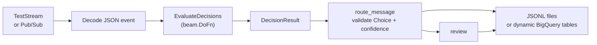

<!--
    Licensed to the Apache Software Foundation (ASF) under one
    or more contributor license agreements.  See the NOTICE file
    distributed with this work for additional information
    regarding copyright ownership.  The ASF licenses this file
    to you under the Apache License, Version 2.0 (the
    "License"); you may not use this file except in compliance
    with the License.  You may obtain a copy of the License at

      http://www.apache.org/licenses/LICENSE-2.0

    Unless required by applicable law or agreed to in writing,
    software distributed under the License is distributed on an
    "AS IS" BASIS, WITHOUT WARRANTIES OR CONDITIONS OF ANY
    KIND, either express or implied.  See the License for the
    specific language governing permissions and limitations
    under the License.
-->

# Beam decision model examples

These examples connect Beam pipelines to typed decision models. The main
pipeline uses Choice to route support messages. The fraud pipeline uses Noul
and optionally Score. `LocalDecisionModel` runs the graph without a network
call, while `JevDecisionModel` adapts the TypeSafe SDK.

## Architecture



`EvaluateDecisions` accepts a model and typed questions. `setup` enters the
model context and `teardown` closes it. Each DoFn instance owns one context.
For Jev, that context creates one TypeSafe SDK client with a persistent HTTP
connection pool used across elements and bundles. `process` calls `evaluate`
synchronously and yields `DecisionResult(state, response, latency_ms)`,
preserving Beam backpressure without a per-element executor.

`JevDecisionModel` uses a 10 second HTTP operation timeout and the SDK's retry
behavior. The SDK keepalive default is 5 seconds, and connection reuse follows
the SDK pool lifecycle.

`route_message` checks that the Choice answer is `billing`, `technical`, or
`sales`. A missing or low confidence answer goes to `review`. The selected
destination controls the JSONL file name or BigQuery table name.


## Install

From a Beam checkout, activate a Python virtual environment and install the
core SDK:

```sh
python3 -m pip install -e sdks/python
```

Install the optional Jev client for `--model=jev`:

```sh
python3 -m pip install -r \
  sdks/python/apache_beam/examples/inference/decision_models/requirements.txt
```

Install Beam's GCP extra for Pub/Sub or BigQuery, including graph-only renders
that contain a BigQuery sink:

```sh
python3 -m pip install -e 'sdks/python[gcp]'
```

## Main demo: route messages with Choice

The default source is a three element `TestStream`. The local adapter writes
one JSONL file per destination:

```sh
output_dir="$(mktemp -d /tmp/beam-decision-model-output.XXXXXX)"
python3 -m apache_beam.examples.inference.decision_models.message_router \
  --model=local \
  --output-dir="$output_dir" \
  --graph="$output_dir/message_router.svg"
find "$output_dir" -name '*.jsonl' -print -exec sed -n '1,3p' {} \;
```

The checked-in SVG uses Beam's `RenderRunner`. Regenerate it with the
graph-only command below and a `.svg` path when Graphviz's `dot` is on `PATH`.

Use `--graph-only` to render before the pipeline starts. The sink remains part
of the graph, so the command includes a BigQuery dataset:

```sh
python3 -m apache_beam.examples.inference.decision_models.message_router \
  --model=jev \
  --graph-only \
  --bq-dataset=PROJECT:DATASET \
  --graph=/tmp/beam-decision-model.svg
```

The `.dot` export works without Graphviz. SVG and PNG exports require `dot` on
`PATH`.

Run the Jev path against the same short stream with `TYPESAFE_API_KEY` set:

```sh
export TYPESAFE_API_KEY='replace-with-your-key'
jev_output_dir="$(mktemp -d /tmp/beam-decision-model-jev-output.XXXXXX)"
python3 -m apache_beam.examples.inference.decision_models.message_router \
  --model=jev \
  --min-confidence=0.65 \
  --output-dir="$jev_output_dir" \
  --graph="$jev_output_dir/message_router.svg"
```

For a streaming source, provide a Pub/Sub subscription containing JSON objects
with `event_id` and `message` string fields:

```sh
python3 -m apache_beam.examples.inference.decision_models.message_router \
  --model=jev \
  --pubsub-subscription=projects/PROJECT/subscriptions/SUBSCRIPTION \
  --bq-dataset=PROJECT:DATASET
```

With `--bq-dataset=PROJECT:DATASET`, rows go to `messages_billing`,
`messages_technical`, `messages_sales`, or `messages_review`. Application
Default Credentials need Pub/Sub subscriber access and permission to create and
write BigQuery tables. `WriteToBigQuery` uses streaming inserts and appends
rows. For deployment, add an idempotency key and explicit retry and dead-letter
policy.

Use `--output-dir` instead of `--bq-dataset` for local JSONL files. A normal
run accepts exactly one sink option.

## Smaller demo: fraud review with Noul

The fraud example prints one JSON row per sample message. Noul supplies the
probability of a yes answer, and values at or above `0.7` are flagged:

```sh
python3 -m apache_beam.examples.inference.decision_models.fraud_review \
  --model=local --primitive=noul
```

Add `--primitive=score` for the rubric score, or `--primitive=both` for both
questions. Run the Jev version with `--model=jev` after setting the key:

```sh
python3 -m apache_beam.examples.inference.decision_models.fraud_review \
  --model=jev --primitive=both
```

A final three element DirectRunner run returned these values. Beam may print
the rows in a different order:

| message | Noul probability | Score |
| --- | ---: | ---: |
| billing address | 0.45 | 0.86 |
| duplicate charge | 0.31 | 0.87 |
| bypass verification | 0.97 | 3.00 |

Only the bypass verification message crossed the `0.7` review threshold.

## Measured Jev performance

These measurements were captured on September 22, 2026 with Jev 1.13.0,
TypeSafe SDK 0.7.1, and DirectRunner. The final trace used one SDK client, one
TCP connection, and one TLS handshake for the three events:

| event | request latency |
| --- | ---: |
| billing | 439.72 ms |
| technical | 169.52 ms |
| sales | 292.01 ms |

Total pipeline time was `1052.15 ms`, including pipeline construction.

A separate transport experiment compared fresh clients with one pooled client:

| client setup | observations |
| --- | --- |
| fresh client, `n=3` | 602.44 ms, 433.56 ms, 537.60 ms |
| one pooled client | first 416.77 ms; next five 170.98 ms, 211.24 ms, 222.02 ms, 240.40 ms, 226.82 ms |

The trace showed no TCP/TLS spans on reused calls. Reuse pays connection setup
once. Warm-call delay is response wait plus network and service time.

Each output row includes `latency_ms`. Provider adapters implement the
`DecisionModel` protocol with `__enter__`, `__exit__`, and `evaluate`. Laya and
Kev adapters can implement the same protocol. Beam owns the question flow,
policy gate, and destination sinks.
