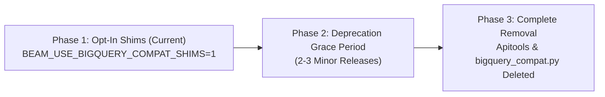

<!---
Licensed to the Apache Software Foundation (ASF) under one
or more contributor license agreements.  See the NOTICE file
distributed with this work for additional information
regarding copyright ownership.  The ASF licenses this file
to you under the Apache License, Version 2.0 (the
"License"); you may not use this file except in compliance
with the License.  You may obtain a copy of the License at

  http://www.apache.org/licenses/LICENSE-2.0

Unless required by applicable law or agreed to in writing,
software distributed under the License is distributed on an
"AS IS" BASIS, WITHOUT WARRANTIES OR CONDITIONS OF ANY
KIND, either express or implied.  See the License for the
specific language governing permissions and limitations
under the License.
-->

# BigQuery Compatibility Shims Usage & Migration Guide

## Overview

Apache Beam's Python SDK has migrated its BigQuery I/O connector from the legacy, apitools-generated client (`apache_beam.io.gcp.internal.clients.bigquery`) to Google's official [`google-cloud-bigquery`](https://cloud.google.com/python/docs/reference/bigquery/latest) client library (version `3.0.0` or higher).

To facilitate a smooth transition for pipelines that interact with internal or legacy BigQuery data structures, Beam provides temporary compatibility shims in `apache_beam.io.gcp.bigquery_compat`.

---

## Enabling the Compatibility Shims (Explicit Opt-In)

The compatibility shims are **disabled by default** to encourage modern client adoption. If your pipeline or test code directly imports or depends on legacy `bigquery_v2_client` or `bigquery_client_messages` interfaces, you must explicitly opt in.

### Setting the Environment Variable

Set `BEAM_USE_BIGQUERY_COMPAT_SHIMS=1` in your environment before importing Beam BigQuery modules:

#### Shell / Terminal:
```bash
export BEAM_USE_BIGQUERY_COMPAT_SHIMS=1
python my_pipeline.py
```

#### In Python Code (before importing Beam BigQuery modules):
```python
import os
os.environ["BEAM_USE_BIGQUERY_COMPAT_SHIMS"] = "1"

from apache_beam.io.gcp import bigquery_compat
```

### What Happens Without Opt-In?

Attempting to import `apache_beam.io.gcp.bigquery_compat` without this environment variable will raise an `ImportError`:

```text
ImportError: BigQuery compatibility shims in apache_beam.io.gcp.bigquery_compat are disabled by default and require explicit opt-in. Set the environment variable BEAM_USE_BIGQUERY_COMPAT_SHIMS=1 to enable them.
```

When enabled, a `BeamDeprecationWarning` is emitted to remind users that these shims will be removed in a future release.

---

## What the Compatibility Layer Provides

When opted in, `bigquery_compat` provides:

### 1. Dynamic Attribute Bridging (Monkey-Patching)
Augments modern `google.cloud.bigquery` classes with legacy camelCase property accessors:

| Modern Class | Modern Attribute (snake_case) | Compatibility Accessor (camelCase) |
| :--- | :--- | :--- |
| `TableReference` | `.project` | `.projectId` |
| `TableReference` | `.dataset_id` | `.datasetId` |
| `TableReference` | `.table_id` | `.tableId` |
| `DatasetReference` | `.project` | `.projectId` |
| `DatasetReference` | `.dataset_id` | `.datasetId` |
| `SchemaField` | `.field_type` | `.type` |
| `Table` | `.reference` | `.tableReference` |
| `Table` | `.num_rows` | `.numRows` |
| `Table` | `.num_bytes` | `.numBytes` |
| `Table` | `.time_partitioning` | `.timePartitioning` (also accepts raw dicts) |
| `Table` | `.range_partitioning` | `.rangePartitioning` (also accepts raw dicts) |
| `Table` | `.clustering_fields` | `.clustering` (also accepts raw dicts/lists) |
| `_AsyncJob` | `.job_id`, `.project`, `.location` | `.jobReference` |
| `_AsyncJob` | `.state`, `.error_result` | `.status.state`, `.status.errorResult` |
| `_AsyncJob` | `.total_bytes_billed` | `.statistics.query.totalBytesBilled` |

### 2. Client Emulation
Wraps modern `google.cloud.bigquery.Client` instances to support legacy apitools method patterns:
* `client.tables.Get(request)` $\rightarrow$ delegates to `client.get_table(...)`
* `client.tables.Insert(request)` $\rightarrow$ delegates to `client.create_table(...)`
* `client.datasets.Get(request)` $\rightarrow$ delegates to `client.get_dataset(...)`
* `client.jobs.GetQueryResults(request)` $\rightarrow$ delegates to `client.list_rows(...)` or `job.result(...)`
* `client.jobs.Insert(request)` $\rightarrow$ delegates to `client.query`, `client.load_table_from_uri`, `client.copy_table`, or `client.extract_table`

### 3. Standalone Compatibility Models
When `google-cloud-bigquery` is not installed or when running in lightweight environments:
* `JobReference(jobId=..., projectId=..., location=...)`
* `TableReference(projectId=..., datasetId=..., tableId=...)`
* `TableSchema(fields=[...])`, `TableFieldSchema(name=..., type=...)`

---

## Migration Guide: Modernizing Your Code

To future-proof your pipeline and prepare for the removal of the compatibility shims, update your code according to the patterns below.

### 1. Table References

#### Legacy (Deprecated):
```python
from apache_beam.io.gcp.internal.clients.bigquery import TableReference

table_ref = TableReference(projectId='my-project', datasetId='my_dataset', tableId='my_table')
print(table_ref.projectId)
```

#### Modern (Recommended):
```python
from google.cloud.bigquery import DatasetReference
from google.cloud.bigquery import TableReference

# Using from_string (easiest):
table_ref = TableReference.from_string("my-project.my_dataset.my_table")

# Or constructor:
table_ref = TableReference(DatasetReference("my-project", "my_dataset"), "my_table")

# Modern snake_case attributes:
print(table_ref.project)
print(table_ref.dataset_id)
print(table_ref.table_id)
```

---

### 2. Table Schemas

#### Legacy (Deprecated):
```python
from apache_beam.io.gcp.internal.clients.bigquery import TableFieldSchema
from apache_beam.io.gcp.internal.clients.bigquery import TableSchema

schema = TableSchema(fields=[
    TableFieldSchema(name='id', type='INTEGER', mode='REQUIRED'),
    TableFieldSchema(name='name', type='STRING', mode='NULLABLE'),
])
```

#### Modern (Recommended):
```python
from google.cloud.bigquery import SchemaField

# Modern SchemaField list:
schema = [
    SchemaField("id", "INTEGER", mode="REQUIRED"),
    SchemaField("name", "STRING", mode="NULLABLE"),
]

# Or pass a simple string schema to Beam transforms:
# schema = "id:INTEGER, name:STRING"
```

---

### 3. Additional Table Parameters (Partitioning & Clustering)

In `WriteToBigQuery(additional_bq_parameters=...)`, you can continue passing dictionaries or use modern classes:

```python
from google.cloud.bigquery import PartitionRange
from google.cloud.bigquery import RangePartitioning
from google.cloud.bigquery import TimePartitioning

# Native Time Partitioning:
time_partitioning = TimePartitioning(type_="DAY", field="timestamp")

# Native Range Partitioning:
range_partitioning = RangePartitioning(
    field="customer_id",
    range_=PartitionRange(start=0, end=100000, interval=100)
)
```

---

### 4. Exception Handling

#### Legacy (Deprecated):
```python
from apitools.base.py.exceptions import HttpError
from apitools.base.py.exceptions import HttpForbiddenError

try:
  ...
except HttpError as e:
  if e.status_code == 404:
    ...
```

#### Modern (Recommended):
```python
from google.api_core import exceptions

try:
  ...
except exceptions.NotFound:
  # Resource not found (404)
  ...
except exceptions.Forbidden:
  # Permission denied (403)
  ...
except exceptions.GoogleAPICallError as e:
  # Base class for all Google Cloud API call errors
  ...
```

---

## Deprecation & Removal Roadmap



1. **Current Release**:
   * Modern `google-cloud-bigquery` is the default execution engine.
   * `bigquery_compat.py` provides opt-in shims via `BEAM_USE_BIGQUERY_COMPAT_SHIMS=1`.
   * `apache_beam.io.gcp.internal.clients.bigquery` is deprecated.
2. **Upcoming Release (Target: Beam 2.80.0)**:
   * `apache_beam.io.gcp.internal.clients.bigquery` will be deleted.
   * `apache_beam.io.gcp.bigquery_compat` and its test suite will be deleted.
   * The `BEAM_USE_BIGQUERY_COMPAT_SHIMS` environment variable will be decommissioned.
